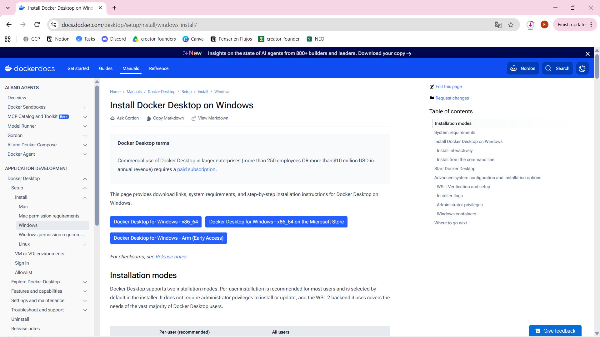

# Setup inicial alumnos - LOCAL

### 1. Herramientas Necesarias

Antes de comenzar, asegúrate de tener instalado en tu equipo:

**Docker Desktop** [https://docs.docker.com/desktop/setup/install/windows-install/](https://docs.docker.com/desktop/setup/install/windows-install/)

<figure><figcaption></figcaption></figure>

Descargamos Docker Desktop for Windows\
Ejecutamos el exe

<figure><figcaption></figcaption></figure>

Configuración por Usuario\
Esperamos a que termine\
Más adelante veremos cómo se utiliza&#x20;


**Cliente de Base de Datos** (opcional pero recomendado: DBeaver, pgAdmin) para inspeccionar PostgreSQL. [https://dbeaver.io/download/](https://dbeaver.io/download/)

<figure><figcaption></figcaption></figure>

Descargar la versión zip\
Extraer todo

<figure><figcaption></figcaption></figure>

El dbeaver.exe ya nos ejectua el cliente\
Seguimos la configuración inicial a nuestro gusto

<figure><figcaption></figcaption></figure>

***

### 2. Suite Ignition Maker

Esta opción te permite tener una réplica exacta del servidor de formación en tu propia máquina para desarrollar y practicar fuera de las sesiones online.

<figure><figcaption></figcaption></figure>

***

#### Paso 1: Crear el archivo `docker-compose.yml`

Crea una carpeta en tu ordenador llamada ignition-demo y dentro de ella un archivo denominado docker-compose-yml con el siguiente contenido: [https://drive.google.com/file/d/1UOb6wr7\_f6C7qTcrCv5iAT8betSdxtMA/view?usp=sharing](https://drive.google.com/file/d/1UOb6wr7_f6C7qTcrCv5iAT8betSdxtMA/view?usp=sharing)

<figure><figcaption></figcaption></figure>

SUSTITUIR ESTA PARTE DEL docker-compose.yml CON UN EDITOR DE TEXTO PLANO

```
  - IGNITION_LICENSE_KEY=license-key
  - IGNITION_ACTIVATION_TOKEN=activation-token
```

PARA ELLO SE NECESITA CUENTA EN [https://inductiveautomation.com/](https://inductiveautomation.com/)

Arriba a la derecha gestionamos la cuenta

<figure><figcaption></figcaption></figure>

Iniciamos sesión o creamos cuenta nueva

<figure><figcaption></figcaption></figure>

Administrar cuenta

<figure><figcaption></figcaption></figure>

Maker licenses y abajo a la derecha darle a Add/Añadir

<figure><figcaption></figcaption></figure>

Seleccionamos la licencia y le damos arriva a Generar token

<figure><figcaption></figcaption></figure>

Copiamos los tokens y los pegamos en docker-compose.yml

<figure><figcaption></figcaption></figure>

Os debería quedar algo así:<br>

<figure><figcaption></figcaption></figure>

***

#### Paso 2: Script de Inicialización de Base de Datos (`init.sql`)

<figure><figcaption></figcaption></figure>

\
Dentro de la carpeta ignition-demo, crea una subcarpeta llamada init-db y dentro de ella un archivo llamado init.sql.

[https://drive.google.com/file/d/1lnm7bsZsbh9\_B5EBxlRXQa9Xc1O0dDF0/view?usp=sharing](https://drive.google.com/file/d/1lnm7bsZsbh9_B5EBxlRXQa9Xc1O0dDF0/view?usp=sharing)

Este script genera las tablas requeridas para simular exactamente los casos de producción del proyecto.

***

#### Paso 3: Levantar el Entorno Local

Abre una terminal de powershell en la carpeta ignition-demo y ejecuta:

```bash
docker compose up -d
```

<figure><figcaption></figcaption></figure>

<figure><figcaption></figcaption></figure>

***

#### Paso 4: Configurar la Conexión de Base de Datos en el Gateway Local

1. Abre en tu navegador: `http://localhost:8088`
2. Inicia sesión con el usuario `admin` y contraseña `AdminMasterPass123!`.
3. Dirígete a **Config > Databases > Connections**.
4. Pulsa en **Create new Database Connection...**
5. Selecciona **PostgreSQL JDBC Driver** y pulsa **Next**.
6. Introduce los siguientes parámetros:
   * **Name:** `SandboxDB` _(respetar mayúsculas/minúsculas)_
   * **Connect URL:** `jdbc:postgresql://postgres:5432/sandbox_db`
   * **Username:** `ignition_user`
   * **Password:** `DBPassword123!`
7. Pulsa **Create New Database Connection**.
8.  Confirma que el estado en la columna _Status_ figure como **`Valid`**.<br>

    <figure><figcaption></figcaption></figure>

<figure><figcaption></figcaption></figure>

#### Paso 5: Descargar y configurar el Designer

Click en Get Designer. Descargamos y ejecutamos el .exe

<figure><figcaption></figcaption></figure>

Configuramos el Designer con Add Designer

* Inicia sesión con el usuario `admin` y contraseña `AdminMasterPass123!`.

<figure><figcaption></figcaption></figure>

Seleccionamos el Gateway de localhost

<figure><figcaption></figcaption></figure>

SandboxDB como default y le damos nombre y título al proyecto

<figure><figcaption></figcaption></figure>

Validamos en Tools > Database Query Browser que vemos las siguientes tablas:

<figure><figcaption></figcaption></figure>

#### Paso 6: Añadir nuestra Base de Datos a DBeaver

Le damos a añadir conexión arriba a la izquierda<br>

<figure><figcaption></figcaption></figure>

* **Database:** sandbox\_db
* **Connect URL:** `jdbc:postgresql://localhost:5432/sandbox_db`
* **Username:** `ignition_user`
* **Password:** `DBPassword123!`

<figure><figcaption></figcaption></figure>

Al darle al test connection instalará los drives y saldrá OK. Le damos a Finish y revisamos si vemos las siguientes tablas:

<figure><figcaption></figcaption></figure>
