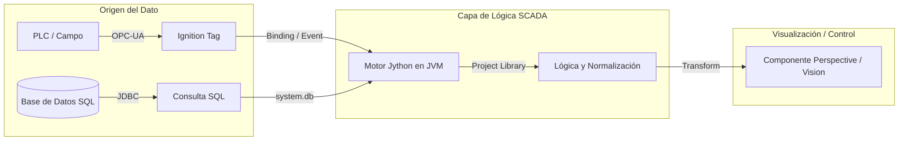
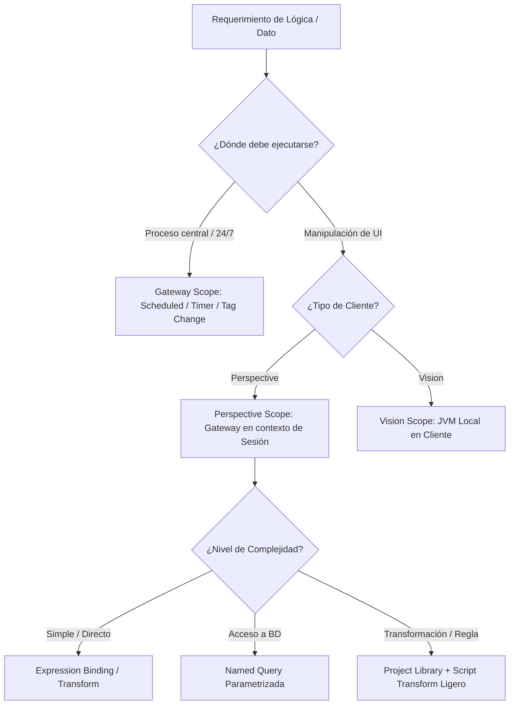

# Sesión 1

### 1. Presentación del Curso y Validación del Entorno

#### Objetivos

* Exponer la metodología de trabajo, los criterios de diseño y las normas de seguridad del curso.
* Verificar la conectividad de todos los alumnos al Designer, base de datos sandbox y herramientas de soporte.

#### Contenidos

* Metodología de desarrollo guiado y buenas prácticas en scripting industrial.
* Directrices de seguridad en entornos de control: aislamiento del sandbox frente a redes de producción.
* Comprobación de acceso a Ignition Designer y base de datos relacional de pruebas.

#### Resultado esperado

* Todos los participantes disponen de acceso verificado al Designer y a la base de datos de pruebas sin bloqueos de red o credenciales.

***

### 2. Tema 1: Introducción al Scripting en Ignition - Del Dato de Planta al Script Útil

#### Objetivos

* Comprender el ciclo de vida del dato industrial desde su adquisición en campo hasta su presentación al usuario.
* Identificar los puntos exactos donde el scripting aporta valor frente a configuraciones nativas.
* Diferenciar las responsabilidades de SQL, Jython y los componentes de visualización.

#### Contenidos

* Recorrido de una variable operativa: Tag OPC-UA / Registro SQL -> Motor de procesamiento -> Vista de usuario.
* Identificación de puntos de inserción de scripts: Bindings, Script Transforms, Eventos y Tareas de Gateway.
* Criterios técnicos de legibilidad, mantenibilidad y rendimiento en código de planta.
* Separación de responsabilidades: cuándo procesar en base de datos, en motor SCADA o en interfaz.

#### Resultado esperado

* Capacidad para trazar el flujo completo de una variable de proceso y seleccionar el mecanismo de scripting adecuado según el requerimiento funcional.

***

### 3. Laboratorio 1.1: Trazabilidad y Normalización de Telemetría de Planta

#### Objetivos

* Construir una función de normalización que valide la calidad y límites físicos de una lectura de velocidad de cinta transportadora.
* Transformar unidades de ingeniería brutas (m/min a m/s) y clasificar el estado operativo con código de color dinámico.

#### Resultado esperado

* Función validada en consola que recibe valor crudo y estado de calidad, devolviendo una estructura normalizada con valor en m/s, estado textual ('RUNNING', 'SLOW', 'STOPPED', 'OUT\_OF\_RANGE', 'SENSOR\_ERROR') y código de color hexadecimal.

***

### 4. Tema 2: Analizando y Estructurando Tipos de Scripts en Ignition

#### Objetivos

* Comprender la arquitectura de Scopes de ejecución en Ignition y sus limitaciones técnicas.
* Establecer un criterio de decisión para elegir entre Expression Bindings, Script Transforms, Named Queries y funciones de librería.
* Prevenir la degradación de rendimiento por sobrecarga de lógica en componentes de interfaz.

#### Contenidos

* Matriz de Scopes de Ejecución:
  * Gateway Scope (Servidor, desatendido, 24/7).
  * Perspective Session Scope (Gateway con contexto de sesión web).
  * Vision Client Scope (JVM local en equipo cliente Swing).
* Tipos de disparadores: scripts por evento, scripts cíclicos, scripts bajo demanda.
* Matriz de decisión técnica:
  * Expression Binding para operaciones lógicas y matemáticas simples.
  * Named Queries para acceso estructurado a datos.
  * Script Transforms para adaptación de estructuras JSON/Datasets.
  * Project Library para centralización de lógica de negocio.
* Regla arquitectónica contra la dispersión: evitar código embebido en eventos de componentes.

#### Resultado esperado

* Identificación precisa del scope de ejecución de cualquier script en el proyecto y correcta selección del recurso para cada lógica.

***

### 5. Tema 3: Python, Jython e Ignition - Parecidos, Diferencias y Límites

#### Objetivos

* Asimilar las particularidades de Jython 2.7 sobre la JVM frente a entornos CPython modernos (Python 3.x).
* Identificar incompatibilidades sintácticas para evitar errores comunes de migración.
* Aprovechar la interoperabilidad directa con el ecosistema de clases nativas de Java.

#### Contenidos

* Arquitectura de Jython 2.7: ejecución de código Python compilado a bytecode de Java.
* Diferencias críticas respecto a Python 3.x:
  * Sentencia `print` frente a función `print()`.
  * Tipado de texto: cadenas de bytes (`str`) vs. cadenas Unicode (`unicode`).
  * División por defecto: comportamiento de división entera en enteros (`5 / 2 = 2`).
  * Ausencia de f-strings, type hints, async/await y librerías C-extension (NumPy nativo, Pandas C).
* Interoperabilidad con Java: importación de paquetes `java.lang`, `java.util`, `java.text`.
* Uso del módulo nativo `system.*` de Ignition.

#### Resultado esperado

* Capacidad para escribir código Jython 2.7 sintácticamente válido, libre de patrones incompatibles de Python 3 y con capacidad de invocar utilidades estándar de la JVM.

***

### 6. Laboratorio 1.2: Adaptación a Jython 2.7 e Interoperabilidad con Clases Java

#### Objetivos

* Implementar un formateador de duraciones y marcas de tiempo utilizando clases nativas de Java (`java.text.SimpleDateFormat`, `java.util.Date`) desde la Script Console.
* Gestionar codificación Unicode y sustitución de formateo tradicional compatible con Jython 2.7.

#### Resultado esperado

* Script verificado en la Script Console que procesa marcas temporales en milisegundos y devuelve resúmenes en formato Unicode (`u"Parada de Xh Ym registrada el DD/MM/YYYY..."`) consumiendo clases Java.

***

### 7. Tema 4: Fundamentos de Lenguaje Aplicados a Casos SCADA

#### Objetivos

* Dominar la manipulación de tipos de datos, estructuras de control y acumuladores en contextos operativos.
* Implementar un tratamiento defensivo ante valores ausentes, nulos (`None`) o lecturas erróneas.
* Construir funciones puras con firmas claras y documentación estandarizada.

#### Contenidos

* Declaración y tipado de variables operativas: contadores, tiempos de ciclo, estados y límites.
* Manejo de valores nulos (`None`), cadenas vacías y conversiones seguras de tipo (`int`, `float`, `str`).
* Estructuras condicionales (`if/elif/else`) para validación de enclavamientos y rangos.
* Bucles `for` y `while`: reglas de uso prudente para evitar bloqueos de hilos en la JVM.
* Acumuladores industriales: conteos, sumatorios de producción, cálculo de medias y detección de extremos (mínimos/máximos).

#### Resultado esperado

* Dominio de la sintaxis base y diseño de algoritmos de cálculo industrial con control estricto de tipos y nulos.

***

### 8. Tema 5 (Parte 1): Estructuras de Datos - Listas, Diccionarios, Datasets y PyDataSets

#### Objetivos

* Diferenciar las estructuras nativas de Python (`list`, `dict`) de las estructuras tabulares de Ignition (`Dataset`, `PyDataSet`).
* Comprender la inmutabilidad de los objetos `Dataset` y el funcionamiento de las funciones de manipulación tabular.
* Iterar datasets de forma eficiente mediante `PyDataSet` extrayendo columnas por nombre o índice.

#### Contenidos

* Tipos de datos estructurados:
  * Listas y diccionarios como base para objetos dinámicos y estructuras JSON en Perspective.
  * `BasicDataset` (Java): estructura tabular inmutable de alto rendimiento.
  * `PyDataSet`: capa de adaptación en Jython (`system.dataset.toPyDataSet`) para iteraciones seguras.
* Inmutabilidad del `Dataset`: comprensión de por qué funciones como `system.dataset.addRow` retornan una nueva instancia en lugar de mutar el origen.
* Patrones de recorrido fila por fila y agregación de métricas.

#### Resultado esperado

* Comprensión operativa de la inmutabilidad de los Datasets de Ignition y capacidad para transformar y consultar datos tabulares con `PyDataSet`.

***

### 9. Laboratorio 1.3: Manipulación e Inmutabilidad de Datasets vs. PyDataSets

#### Objetivos

* Procesar un `Dataset` de telemetría de producción de varias máquinas.
* Iterar sobre la estructura utilizando `PyDataSet` para agregar piezas conformes, scrap y calcular la tasa porcentual de rechazo por máquina.
* Reconstruir un nuevo `Dataset` inmutable con los resultados agregados apto para alimentar una tabla de visualización.

#### Resultado esperado

* Algoritmo probado en la Script Console que recibe un `Dataset` tabular con múltiples lotes por máquina y genera un nuevo `Dataset` con cabeceras `["Machine", "Good Units", "Scrap Units", "Scrap Rate (%)"]` y filas consolidadas.

***

### 10. Test de Conceptos de la Sesión 1

#### Objetivos

* Evaluar la asimilación conceptual de los módulos de la jornada (Scopes, diferencias Jython/Python 3, inmutabilidad y estructuras de datos).
* Detectar y corregir dudas técnicas antes de la Sesión 2.

#### Contenidos

* Cuestionario de validación técnica individual con preguntas de respuesta múltiple y razonamiento de casos prácticos.

#### Resultado esperado

* Comprobación del nivel de comprensión del grupo sobre los fundamentos del motor de scripting y fijación de conceptos clave.

***

### 11. Feedback Individual y Cierre de la Sesión

#### Objetivos

* Revisar el estado individual de ejecución de los laboratorios en la consola de cada alumno.
* Solventar errores sintácticos o de configuración encontrados durante la jornada.
* Introducir el temario y requisitos de la Sesión 2.

#### Contenidos

* Rondas de comprobación de código en la Script Console de los participantes.
* Resolución de dudas puntuales sobre manejo de nulos y conversión de estructuras.
* Resumen de conexión con la Sesión 2: continuación de estructuras de datos complejas y diseño modular en `Project Library`.

#### Resultado esperado

* Cada alumno finaliza la sesión con sus tres laboratorios validados, su entorno operativo y claridad sobre la base técnica requerida para la siguiente jornada.
