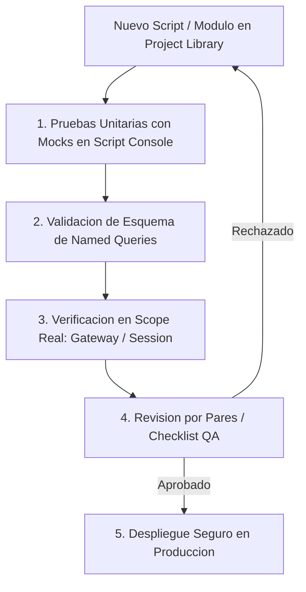

# Sesión 10

### 1. Repaso Inicial y Resolución de Dudas de la Sesión 9

#### Objetivos

* Consolidar los conceptos de procesamiento asíncrono (`system.util.invokeAsynchronous`), seguridad RBAC en backend y clientes REST con fallback resiliente.
* Revisar la metodología de refactorización de código heredado (_Legacy_) aplicada en los laboratorios previos.

#### Contenidos

* Repaso de las consultas sobre el diseño de tareas programadas de Gateway bajo el principio de idempotencia.
* Revisión de las dudas en la configuración de timeouts de red y gestión de cabeceras de autorización en `system.net.httpClient`.
* Comprobación del correcto aislamiento de funciones puras en `Project Library` tras los ejercicios de refactorización.

#### Resultado esperado

* Fijación de los criterios de desarrollo asíncrono y seguridad defensiva, preparando la base para la automatización de pruebas y la estandarización corporativa.

***

### 2. Tema 24: Testing Funcional de Scripts y Consultas en Entornos SCADA

#### Objetivos

* Comprender la metodología de aseguramiento de la calidad (QA) y pruebas funcionales aplicada al desarrollo de software industrial en Ignition.
* Diseñar baterías de pruebas unitarias que sometan a la lógica a casos nominales, valores límite, entradas nulas y errores de comunicación forzados.
* Validar la integridad de los esquemas y contratos de datos devueltos por las Named Queries antes de su conexión a componentes visuales.

#### Contenidos

* Cultura de pruebas en sistemas de control y supervisión:
  * El peligro del despliegue directo sin validación formal: cómo errores de tipado no detectados en Designer provocan excepciones en tiempo de ejecución en planta.
  * Estrategia de testing en 4 niveles: Casos Nominales (_Happy Path_), Casos Límite (_Boundary Cases_), Casos Nulos/Anómalos y Casos de Fallo Forzado.
* Validación de esquemas en Named Queries:
  * Verificación de la coincidencia exacta de nombres de columnas y tipos de datos entre el motor SQL y los componentes de visualización.
  * Prevención de roturas silenciosas por renombrado de columnas en base de datos.
* Verificación en el Scope correcto:
  * Por qué un script que ejecuta correctamente en la Script Console (Designer Scope) puede fallar en un Gateway Scheduled Script o en una sesión de Perspective si depende de variables de contexto inexistentes.
* Checklist de pre-despliegue en Gateway:
  * Verificación sistemática de 6 puntos: Seguridad (RBAC/SQLi), Rendimiento (sin I/O en transforms), Captura Dual de Excepciones, Logging Contextual, Manejo de Nulos y No-Bloqueo de UI.

#### Resultado esperado

* Capacidad para construir bancos de pruebas funcionales automatizados en la Script Console y validar contratos de datos antes de publicar cambios en el Gateway.

***

### 3. Laboratorio 10.1: Suite de Testing Automatizado en Script Console

#### Objetivos

* Construir una clase runner de pruebas unitarias en Jython (`SCADATestSuite`) dentro de la Script Console que permita registrar y evaluar aserciones automáticas.
* Diseñar una batería de tests que valide una función crítica de clasificación de calidad de lotes ante casos nominales, tolerancias límite, producción cero, valores `None` y escenarios de inconsistencia lógica.

#### Resultado esperado

* Script de testing operativo en la Script Console que ejecuta automáticamente un conjunto de 6 pruebas sobre la función de calidad, emitiendo un informe consolidado con el estado de cada test (`PASS` / `FAIL`) y el recuento total de verificaciones superadas.

***

### 4. Tema 25: Estilo de Código, Documentación y Estándares de Equipo

#### Objetivos

* Asimilar las directrices de la guía de estilo PEP 8 adaptadas a las particularidades de Jython 2.7 y la arquitectura de Ignition.
* Dominar la documentación formal de módulos y funciones mediante el estándar canónico de _docstrings_.
* Establecer la matriz de patrones permitidos vs. prohibidos y el protocolo de revisión de código por pares (_Peer Review_) en equipos de ingeniería SCADA.

#### Contenidos

* Convenciones de nomenclatura corporativa:
  * Funciones y variables locales: `snake_case` estricto (ej. `calculate_oee_metrics`, `target_speed`).
  * Constantes de módulo: `UPPER_SNAKE_CASE` (ej. `MAX_PRESSURE_LIMIT = 10.5`).
  * Named Queries, UDTs y tipos de datos: `PascalCase` (ej. `Production/GetShiftSummary`, `MotorDriveUDT`).
  * Prohibición terminante de nombres ambiguos o de una sola letra (salvo índices de bucle `i`, `j`).
* Estándar de Documentación mediante Docstrings:
  * Bloque de documentación estructurado obligatorio en toda función pública: descripción del propósito funcional, argumentos tipados (`Args`), formato del retorno (`Returns`) y excepciones controladas (`Raises`).
* Matriz de Patrones Permitidos vs. Prohibidos:
  * Prohibido: SQL concatenado, llamadas a tags en bucles, lógica extensa en transforms, supresión silenciosa con `except: pass`, paquetes de scripts nombrados por autor.
  * Permitido: Named Queries con _Value Parameters_, lecturas de tags por lote, delegación a funciones puras en `Project Library`, captura dual de excepciones, organización de paquetes por dominio de planta.
* Protocolo de Revisión por Pares (_Peer Review_):
  * Criterios de auditoría interna de código antes de guardar cambios definitivos en proyectos de producción.

#### Resultado esperado

* Dominio de las normas de estilo, documentación y arquitectura modular requeridas para mantener repositorios de scripts legibles, consistentes y mantenibles por cualquier miembro del equipo.

***

### 5. Laboratorio 10.2: Implementación de Plantilla Canónica de Módulo para Project Library

#### Objetivos

* Construir un módulo modelo en `Project Library` (`project.templates.service_template`) que integre constantes, logger contextual, funciones puras privadas de cálculo y funciones públicas de servicio con control de excepciones duales y retornos estructurados.
* Validar la plantilla desde la Script Console verificando su adhesión al estándar de desarrollo del curso.

#### Resultado esperado

* Módulo canónico creado en el árbol de `Project Library` que sirve como plantilla arquitectónica reutilizable para futuros desarrollos de lógica de negocio en Ignition SCADA.

***

### 6. Presentación del Proyecto Final Integrador (Tema 26 - Enunciado y Rúbrica)

#### Objetivos

* Exponer los requisitos funcionales, la arquitectura técnica esperada y la rúbrica de evaluación del Proyecto Final Integrador.
* Asignar los escenarios de trabajo individuales en el sandbox para el desarrollo del proyecto.

#### Contenidos

* Alcance del Proyecto Integrador:
  * Modelado relacional en base de datos (tablas de máquinas, lotes y auditoría).
  * Capa de acceso a datos con Named Queries parametrizadas (CRUD y analítica).
  * Lógica de negocio en `Project Library` (funciones puras de OEE/calidad, validación RBAC, captura dual de excepciones, logging contextual).
  * Integración en Perspective (Script Transforms ligeros y Message Handlers desacoplados).
  * Tarea programada en Gateway (Scheduled Script idempotente de fin de turno).
  * Suite de testing funcional ejecutable en Script Console.
* Rúbrica de evaluación técnica:
  * Seguridad (0 SQL injection, control de roles en servidor).
  * Rendimiento (0 bloqueos de UI, sin bucles unitarios de tags).
  * Robustez (tolerancia a nulos y excepciones Java).
  * Calidad de código (docstrings y adhesión al estándar).

#### Resultado esperado

* Todos los alumnos comprenden en detalle el alcance del proyecto integrador, la arquitectura multicapa requerida y los criterios que se evaluarán en la sesión final.

***

### 7. Test de Conceptos de la Sesión 10

#### Objetivos

* Validar la comprensión de los niveles de pruebas funcionales y la importancia de validar scripts en su scope real de ejecución.
* Evaluar el dominio de las convenciones de nomenclatura, docstrings y la matriz de patrones permitidos/prohibidos.
* Comprobar la asimilación de los requisitos arquitectónicos del Proyecto Final Integrador.

#### Contenidos

* Cuestionario técnico individual de opción múltiple y resolución de casos de testing y estándares de código.

#### Resultado esperado

* Comprobación del aprendizaje sobre control de calidad de software industrial y fijación de los estándares corporativos para el desarrollo del proyecto integrador.

***

### 8. Feedback Individual y Cierre de la Sesión

#### Objetivos

* Revisar individualmente la suite de pruebas y la plantilla canónica de módulo implementadas por cada alumno.
* Resolver dudas sobre el enunciado y arquitectura del Proyecto Final Integrador.
* Coordinar la dinámica de trabajo de la Sesión 11 (Cierre del Curso).

#### Contenidos

* Rondas de revisión individual del código en la Script Console y en `Project Library`.
* Validación del acceso a los esquemas de base de datos y recursos necesarios para el proyecto final.
* Avance de la Sesión 11: Desarrollo, tutorización, entrega, presentación de proyectos (_Code Review_ en vivo), test global de certificación y consejos finales de ingeniería para producción real.

#### Resultado esperado

* Cada alumno concluye la jornada con sus módulos de prueba y plantilla canónica validados, su entorno preparado y total claridad sobre el trabajo a desarrollar en la sesión final.
