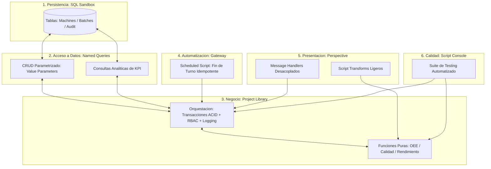

# Sesión 11

### 1. Apertura y Encuadre de la Sesión Final

#### Objetivos

* Revisar el estado de partida de los entornos individuales y verificar los requisitos del Proyecto Final Integrador.
* Establecer la dinámica de integración, presentación técnica y evaluación global del curso.

#### Contenidos

* Repaso de las dudas pendientes sobre testing funcional, plantillas canónicas de módulo y directrices de estilo.
* Verificación de la disponibilidad del esquema de base de datos sandbox y del proveedor de tags para la integración final.
* Presentación del cronograma de la sesión de cierre: desarrollo asistido, defensa de proyectos (_Code Review_), evaluación teórica final y conclusiones.

#### Resultado esperado

* Alineación de todos los participantes sobre los entregables y preparación para la fase de integración y defensa técnica.

***

### 2. Tema 26: Arquitectura e Integración del Proyecto Final Integrador

#### Objetivos

* Integrar de forma coherente y desacoplada todas las capas de desarrollo abordadas durante las 35 horas de formación.
* Aplicar el flujo completo: modelo relacional DDL, Named Queries parametrizadas, librerías puras y de orquestación, transforms ligeros, tareas programadas en Gateway y suite de validación funcional.
* Consolidar el proyecto como un estándar corporativo de referencia para futuros desarrollos en la planta.

#### Contenidos

* Arquitectura multicapa del sistema de control de lotes y OEE:
  * **Capa 1 (Persistencia Relacional):** Tablas de máquinas, lotes transaccionales y pistas de auditoría inmutables.
  * **Capa 2 (Acceso a Datos):** Named Queries parametrizadas mediante _Value Parameters_ (lectura analítica y escrituras protegidas).
  * **Capa 3 (Lógica de Negocio en `Project Library`):**
    * Funciones puras de cálculo matemático (disponibilidad, calidad, rendimiento, OEE).
    * Funciones de servicio y orquestación con control transaccional ACID, validación RBAC en servidor, logging contextual y captura dual de excepciones.
  * **Capa 4 (Presentación en Perspective):** Script Transforms puros que delegan la lógica y Message Handlers desacoplados.
  * **Capa 5 (Automatización Desatendida):** Gateway Scheduled Script basado en expresión CRON con diseño idempotente para cierre automático de turno.
  * **Capa 6 (Aseguramiento de Calidad - QA):** Test Runner en Script Console para verificación de no-regresión.

#### Resultado esperado

* Dominio de la arquitectura integral de scripting en Ignition SCADA, demostrando la capacidad de estructurar soluciones robustas, escalables y ciberseguras.

***

### 3. Laboratorio 11.1: Desarrollo e Integración Multicapa del Proyecto Final

#### Objetivos

* Implementar y ensamblar la totalidad de los componentes del Proyecto Final Integrador en el entorno sandbox: tablas SQL, Named Queries, módulos en `Project Library`, vistas en Perspective, tarea programada en Gateway y suite de pruebas en consola.
* Verificar la ejecución satisfactoria del flujo de extremo a extremo: desde la adquisición y cálculo de telemetría hasta el cierre transaccional auditado y la consolidación de fin de turno.

#### Resultado esperado

* Solución SCADA completamente operativa en el entorno del alumno, que cumple con todos los requerimientos funcionales y pasa con éxito la suite de pruebas unitarias en la Script Console.

***

### 4. Laboratorio 11.2: Presentación Técnica de Proyectos y Code Review en Vivo

#### Objetivos

* Exponer la arquitectura implementada por cada alumno ante el grupo, justificando las decisiones de diseño adoptadas.
* Realizar una sesión de revisión de código (_Peer Code Review_) en vivo sobre los proyectos, analizando el cumplimiento de los estándares de seguridad, rendimiento, manejo de errores y estilo.

#### Resultado esperado

* Presentación y validación técnica individual de cada proyecto, con retroalimentación inmediata sobre la calidad del código, robustez de la arquitectura y áreas de optimización.

***

### 5. Test Final de Conceptos Global (Evaluación de Certificación)

#### Objetivos

* Evaluar el grado de asimilación global de los contenidos teóricos y prácticos impartidos a lo largo de las 11 sesiones (35 horas).
* Certificar la adquisición de competencias en Scopes de ejecución, interoperabilidad Jython/Java, transacciones ACID, optimización SQL, seguridad RBAC y diseño modular.

#### Contenidos

* Cuestionario técnico integrador de opción múltiple y resolución de casos de arquitectura de software industrial.

#### Resultado esperado

* Certificación individual del aprovechamiento técnico del curso y acreditación de los conocimientos exigidos para el desarrollo profesional en Ignition SCADA.

***

### 6. Decálogo de Buenas Prácticas y Consejos Finales para Producción Real

#### Objetivos

* Sintetizar las 10 reglas de oro de la ingeniería de scripting en Ignition para su aplicación directa en proyectos de planta en producción.
* Proveer pautas de mantenimiento, gobernanza y evolución de sistemas SCADA a largo plazo.

#### Contenidos

* Las 10 Reglas de Oro de Scripting en Ignition:
  *
    1. Cero SQL concatenado: uso exclusivo de Named Queries o Prepared Statements con marcadores posicionales.
  *
    2. Cero I/O en bucles: agrupación de lecturas y escrituras de tags en llamadas por lote (`batch`).
  *
    3. Transforms livianos y puros: prohibición de consultas SQL y escrituras de tags en Script Transforms de Perspective.
  *
    4. Captura dual de excepciones: interceptar tanto errores de Jython como `java.lang.Exception`.
  *
    5. Logging contextual: registro centralizado con `system.util.getLogger` identificando módulo, usuario, máquina y error; erradicación de `print` en Gateway.
  *
    6. Seguridad en servidor: validación estricta de roles (RBAC) en las funciones de backend y no solo en la interfaz gráfica.
  *
    7. Idempotencia en tareas automáticas: diseño de procesos desatendidos que toleren reintentos sin duplicar registros.
  *
    8. Consultas SQL sargables: filtrado por rangos temporales indexados directos sin aplicar funciones sobre columnas en cláusulas `WHERE`.
  *
    9. Organización por dominios de planta: estructuración de `Project Library` por áreas funcionales y no por nombres de desarrollador.
  *
    10. Testing antes de desplegar: validación de algoritmos en la Script Console con bancos de pruebas y datos simulados (_Mocks_) previo al guardado en Gateway.

#### Resultado esperado

* Asimilación de un marco metodológico y técnico consolidado que guíe el desarrollo de futuros proyectos industriales en entornos reales.

***

### 7. Feedback Individual, Balance y Cierre del Curso

#### Objetivos

* Comunicar a cada alumno la evaluación de su proyecto final y el balance de su desempeño durante la formación.
* Resolver dudas avanzadas sobre casos particulares de las plantas de los asistentes.
* Clausurar formalmente el curso de 35 horas.

#### Contenidos

* Rondas de feedback individual sobre la arquitectura, código y resultados del Proyecto Final.
* Turno abierto de consultas sobre despliegues en producción, arquitecturas redundantes y escalabilidad.
* Cierre de la formación y entrega de materiales de referencia y plantillas de desarrollo.

#### Resultado esperado

* Finalización formal del curso con todos los alumnos evaluados, proyectos validados y un conjunto de herramientas y estándares listos para su aplicación inmediata en planta.
