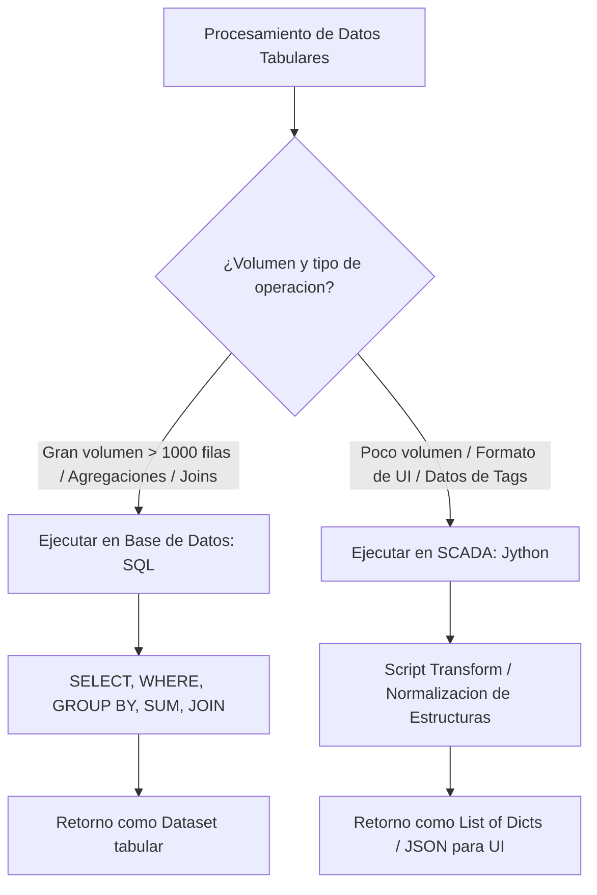
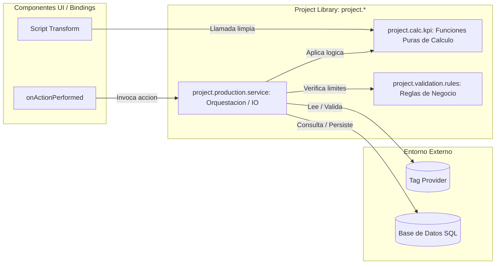

# Sesión 2

### 1. Repaso Inicial y Resolución de Dudas de la Sesión 1

#### Objetivos

* Consolidar los conceptos de Scopes de ejecución, limitaciones de Jython 2.7 en la JVM e inmutabilidad de los Datasets.
* Resolver incidencias detectadas en la ejecución de scripts base durante la primera sesión.

#### Contenidos

* Revisión de dudas sobre la diferencia de comportamiento entre la Script Console y los scripts en Gateway.
* Repaso del coste de memoria al reconstruir Datasets en bucles frente a listas nativas de Jython.
* Comprobación del estado del entorno de trabajo individual.

#### Resultado esperado

* Fijación de los conceptos fundacionales y alineación técnica de todos los alumnos para abordar estructuras de datos complejas.

***

### 2. Tema 5 (Continuación): Estructuras de Datos Avanzadas e Interoperabilidad

#### Objetivos

* Dominar la transformación bidireccional entre Datasets tabulares de Ignition y listas de diccionarios JSON para componentes de Perspective.
* Aplicar técnicas de programación defensiva para tolerar columnas ausentes, cambios de esquema y valores nulos.
* Establecer criterios claros de rendimiento para decidir si un procesamiento debe ejecutarse en SQL o en Jython.

#### Contenidos

* Transformación bidireccional de datos:
  * Dataset a lista de diccionarios: serialización para tablas, repetidores (_Flex Repeaters_) y desplegables en Perspective.
  * Lista de diccionarios a Dataset: reconstrucción estructurada para componentes de Vision, reportes o inserciones SQL.
* Manejo de inconsistencias y robustez ante fallos:
  * Extracción defensiva de claves en diccionarios mediante `.get(clave, valor_defecto)`.
  * Detección de columnas existentes en Datasets antes de indexar mediante `.getColumnIndex()`.
  * Conversión y sustitución de nulos SQL (`None`) para evitar excepciones en operaciones matemáticas.
* Matriz de decisión técnica: ¿Cuándo procesar en SQL y cuándo en Jython?:
  * SQL: Agregaciones masivas, ordenación sobre miles de registros, cruce de tablas relacionales.
  * Jython: Transformaciones específicas para interfaz de usuario, lógica dependiente de tags en tiempo real, integración con estructuras JSON complejas.

#### Resultado esperado

* Capacidad para convertir fluidamente estructuras tabulares en formatos compatibles con Perspective y aplicar el criterio correcto de reparto de carga entre base de datos y Gateway.

***

### 3. Laboratorio 2.1: Transformador Universal y Agrupador Jerárquico para Perspective

#### Objetivos

* Construir una función que transforme un `Dataset` de órdenes de fabricación en una lista de diccionarios enriquecida para componentes visuales de Perspective.
* Implementar validaciones defensivas ante columnas ausentes, divisiones por cero en objetivos de producción y cálculo de propiedades de estilo dinámicas.

#### Resultado esperado

* Función probada en la Script Console que recibe un `Dataset` tabular con órdenes de producción y genera una lista de diccionarios lista para Perspective con progreso porcentual calculado, estados normalizados ('FINALIZADA', 'EN PROCESO', 'PENDIENTE') y objetos de estilo asociados.

***

### 4. Tema 6: Funciones Reutilizables y Arquitectura en Project Library

#### Objetivos

* Comprender la arquitectura de centralización de código dentro del árbol de `Project Library` (`project.*`).
* Aplicar el principio de separación entre _Funciones Puras_ (lógica matemática testeable) y _Funciones Impuras_ (operaciones con I/O de tags y base de datos).
* Estandarizar firmas de funciones, retornos defensivos y documentación técnica formal mediante docstrings.

#### Contenidos

* Organización modular y jerárquica en `Project Library`:
  * Estructuración por dominios de planta (`project.data.*`, `project.calc.*`, `project.validation.*`, `project.util.*`).
  * Eliminación del anti-patrón de autoría (prohibición de paquetes nombrados por desarrollador).
* Principio de Funciones Puras vs. Funciones con Efectos Secundarios:
  * Funciones Puras: Deterministas, sin dependencias externas (sin lecturas de tags directas ni queries), completamente testeables en la Script Console.
  * Funciones de Orquestación (I/O): Encargadas exclusivas de leer/escribir en planta o persistir en BD.
* Contratos de función y manejo de retornos:
  * Uso de tuplas estructuradas de estado `(bool_exito, resultado_o_error)` para evitar excepciones no controladas en bindings.
  * Documentación estándar de funciones mediante docstrings (descripción, parámetros `Args`, retornos `Returns`).
* Ciclo de vida y actualización en caliente:
  * Impacto de modificar funciones compartidas y persistencia de cambios en el Gateway tras guardar el proyecto.

#### Resultado esperado

* Capacidad para diseñar arquitecturas de scripts modulares, desacopladas de la interfaz gráfica y organizadas bajo paquetes semánticos dentro de `Project Library`.

***

### 5. Laboratorio 2.2: Modularización en Project Library y Pruebas en Script Console

#### Objetivos

* Crear un módulo en `Project Library` (`project.calc.kpi`) con funciones puras para el cálculo de disponibilidad técnica de maquinaria y tasa de calidad industrial.
* Implementar contratos de retorno estructurados `(success, value_or_message)` y validar el módulo mediante llamadas de prueba en la Script Console.

#### Resultado esperado

* Módulo creado en el árbol del proyecto con funciones documentadas mediante docstrings y verificado desde la Script Console ante casos nominales, valores límite y escenarios de error (paradas superiores al tiempo planificado, rechazos superiores al total producido).

***

### 6. Test de Conceptos de la Sesión 2

#### Objetivos

* Validar la comprensión de las ventajas de las listas de diccionarios en Perspective frente a Datasets nativos.
* Evaluar el criterio de diseño entre funciones puras y de orquestación, así como la distribución de responsabilidades entre SQL y Jython.

#### Contenidos

* Evaluación conceptual breve de opción múltiple y análisis de casos arquitectónicos.

#### Resultado esperado

* Comprobación del dominio de los patrones de modularización y asimilación de los criterios de rendimiento en el manejo de datos.

***

### 7. Feedback Individual y Cierre de la Sesión

#### Objetivos

* Validar la correcta estructura de paquetes creada por cada alumno en su Designer.
* Corregir errores típicos en firmas de función, retornos estructurados y docstrings.
* Presentar la planificación de la Sesión 3.

#### Contenidos

* Revisión guiada de los módulos implementados en `Project Library`.
* Resolución de dudas sobre la invocación de funciones `project.*` desde distintos puntos del sistema.
* Avance de la Sesión 3: Técnicas avanzadas de uso de la `Script Console`, depuración sistemática de errores y creación de bancos de pruebas con datos simulados (_Mocks_).

#### Resultado esperado

* Cada participante finaliza la sesión con sus módulos de librería operativos, probados en consola y con claridad sobre el flujo de depuración que se trabajará en la siguiente sesión.
