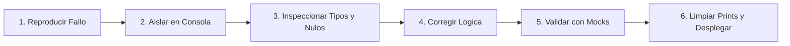

# Sesión 3

### 1. Repaso Inicial y Resolución de Dudas de la Sesión 2

#### Objetivos

* Consolidar los conceptos de transformación de datos (`Dataset` a listas de diccionarios JSON) y estructuración modular en `Project Library`.
* Revisar el impacto del desacoplamiento entre funciones puras y funciones impuras con I/O.

#### Contenidos

* Repaso de las consultas sobre la manipulación segura de diccionarios y control de valores `None`.
* Revisión de las firmas estándar y contratos de retorno estructurados `(success, payload_or_error)` en `project.*`.
* Validación del guardado de proyectos en el Designer y su recarga en caliente en el Gateway.

#### Resultado esperado

* Alineación del grupo en la creación de funciones puras modulares, base indispensable para ejecutar pruebas directas en la consola.

***

### 2. Tema 7: Entorno de la Script Console, Introspección y Diagnóstico de Scopes

#### Objetivos

* Comprender el alcance de ejecución de la Script Console dentro de la arquitectura de Ignition Designer.
* Dominar las herramientas de introspección nativas de Jython para analizar tipos, métodos y estructuras complejas en memoria.
* Identificar las diferencias de comportamiento y permisos entre la consola de diseño, las sesiones de usuario y el Gateway.

#### Contenidos

* La Script Console como entorno interactivo de prototipado rápido:
  * Ejecución en Designer Scope: ventajas de inmediatez y precauciones ante llamadas puente hacia el Gateway.
  * Inexistencia de contextos de vista o componentes visuales de Perspective dentro de la consola.
* Herramientas de introspección de objetos en Jython/Java:
  * Identificación de tipos en tiempo de ejecución mediante `type()`.
  * Exploración de métodos y propiedades disponibles en objetos Java mediante `dir()`.
  * Verificación de dimensiones de colecciones y datasets mediante `len()` y `.getColumnCount()`.
* Formateo e inspección legible de estructuras:
  * Uso de serialización JSON mediante `system.util.jsonEncode()` para visualizar diccionarios y arrays anidados sin saturar la consola.

#### Resultado esperado

* Capacidad para explorar e inspeccionar cualquier objeto retornado por Ignition o Java, identificando con precisión su tipo de dato y estructura interna.

***

### 3. Tema 7 (Continuación): Metodología de Depuración Sistemática y Simulación (Mocks)

#### Objetivos

* Aplicar un flujo de trabajo ordenado y reproducible para aislar y corregir fallos en scripts industriales.
* Clasificar las causas raíz de error entre fallos de sintaxis, discrepancias de datos de planta y problemas de infraestructura o scope.
* Construir datos sintéticos simulados (_Mocks_) para desacoplar el testing de la lógica respecto al estado real de los PLCs y bases de datos.

#### Contenidos

* Ciclo sistemático de depuración en 6 fases (_Debug Loop_):
  * Reproducir: Recrear el fallo con los mismos parámetros de entrada.
  * Aislar: Extraer la función fuera del evento/binding y llevarla a la Script Console.
  * Inspeccionar: Imprimir tipos, variables intermedias y estados nulos.
  * Corregir: Ajustar la lógica, conversiones de tipos o validaciones de rango.
  * Validar: Ejecutar batería de pruebas con casos límite.
  * Limpiar: Eliminar sentencias `print` temporales antes de publicar cambios.
* Tipología de errores en entornos SCADA:
  * Errores de sintaxis y tipado (`TypeError`, `KeyError`, `IndexError`, `AttributeError`).
  * Errores por datos anómalos de campo (tags desconectados, calidad `Bad_NotFound`, strings vacíos).
  * Errores de infraestructura (timeouts de base de datos, fallos de red hacia periféricos).
  * Errores de incompatibilidad de scope (invocación de APIs de Vision en Perspective o scripts desatendidos de Gateway).
* Principio de simulación de datos (_Mocking_):
  * Creación manual de `Datasets` y diccionarios con casos nominales y casos borde para verificar algoritmos en laboratorio.

#### Resultado esperado

* Dominio de una metodología de depuración estructurada que elimina el método de prueba y error a ciegas en entornos de producción.

***

### 4. Laboratorio 3.1: Inspección de Tipos y Mocking de Respuestas SQL

#### Objetivos

* Construir una simulación (_Mock_) de respuesta tabular de base de datos directamente en la Script Console.
* Utilizar herramientas de introspección para analizar metadatos del `Dataset` e implementar un recorrido seguro con tratamiento de celdas con valor `None`.

#### Resultado esperado

* Script verificado en la Script Console que genera un `Dataset` simulado con lecturas de presión y estados de máquina, inspecciona sus metadatos y recorre sus filas extrayendo valores con formateo numérico defensivo ante valores nulos.

***

### 5. Laboratorio 3.2: Mini-Runner de Pruebas Unitarias para Project Library

#### Objetivos

* Construir un evaluador automatizado de aserciones en la Script Console para validar funciones de `Project Library`.
* Definir una batería de pruebas que someta la lógica de cálculo a casos nominales, entradas nulas, valores fuera de rango y casos borde.

#### Resultado esperado

* Script ejecutable en la Script Console que evalúa automáticamente las funciones del módulo `project.calc.kpi` y emite un informe estructurado por consola indicando el estado de cada test (`PASS` / `FAIL`) y el resumen de pruebas superadas.

***

### 6. Laboratorio 3.3: Depuración y Corrección de un Script Industrial Defectuoso

#### Objetivos

* Aplicar el flujo de depuración sistemático para diagnosticar y aislar 4 errores críticos presentes en un script industrial heredado.
* Refactorizar la función en la Script Console implementando validaciones de entrada, control de tipos, manejo de división por cero y compatibilidad Unicode.

#### Resultado esperado

* Función defectuosa aislada, corregida y probada en la Script Console ante un vector de 5 casos problemáticos (formatos incompletos, cadenas corruptas, ceros y rechazos superiores al total), respondiendo con mensajes informativos sin lanzar excepciones no controladas.

***

### 7. Test de Conceptos de la Sesión 3

#### Objetivos

* Validar la comprensión de las limitaciones y contexto de ejecución de la Script Console.
* Evaluar el dominio del ciclo de depuración, la introspección de objetos y las causas por las que un script válido en consola puede fallar en otros scopes.

#### Contenidos

* Cuestionario técnico de opción múltiple y resolución de casos de diagnóstico de errores en entornos Ignition.

#### Resultado esperado

* Comprobación del aprendizaje sobre técnicas de depuración y fijación de pautas para evitar la contaminación de logs de producción con mensajes de prueba.

***

### 8. Feedback Individual y Cierre de la Sesión

#### Objetivos

* Revisar individualmente la correcta ejecución de los tres laboratorios en la Script Console de cada alumno.
* Solventar dificultades en la interpretación de trazas de error (_Tracebacks_).
* Introducir los contenidos de la Sesión 4.

#### Contenidos

* Rondas de comprobación individual de los scripts de prueba y validación de resultados.
* Explicación de buenas prácticas para la eliminación de sentencias de depuración antes del pase a producción.
* Avance de la Sesión 4: Manejo formal de excepciones con `try/except`, captura de errores nativos de Java, logging contextual con `system.util.getLogger` y fundamentos de SQL industrial.

#### Resultado esperado

* Cada alumno finaliza la sesión con su batería de pruebas ejecutada con éxito, comprensión de la técnica de simulación de datos y preparación técnica para el módulo de logging y SQL.
