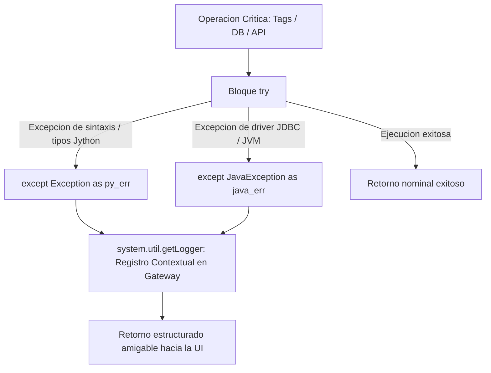

# Sesión 4

### 1. Repaso Inicial y Resolución de Dudas de la Sesión 3

#### Objetivos

* Consolidar la metodología de depuración sistemática en 6 fases y el uso de la Script Console como entorno de aislamiento.
* Revisar el diseño de bancos de pruebas sintéticos (_Mocks_) para validar funciones de `Project Library`.

#### Contenidos

* Repaso de las técnicas de introspección de objetos (`type`, `dir`, `len`) en la JVM.
* Revisión de dudas sobre la interpretación de trazas de error (_Tracebacks_) en la consola.
* Comprobación de la correcta eliminación de sentencias `print` temporales antes del pase a entornos de Gateway.

#### Resultado esperado

* Fijación del flujo de aislamiento y pruebas en consola, base necesaria para implementar captura formal de excepciones y logging en esta sesión.

***

### 2. Tema 8: Logging y Tratamiento Profesional de Errores en Ignition

#### Objetivos

* Dominar la captura jerárquica de excepciones duales (Jython nativo y clases Java de la JVM).
* Comprender la arquitectura de registro de trazas en el Gateway mediante `system.util.getLogger` y sus niveles de severidad.
* Diseñar mensajes contextuales para diagnóstico técnico y respuestas estructuradas amigables para el operador de planta.

#### Contenidos

* Gestión formal de excepciones con `try / except / else / finally`:
  * El peligro del _bare except_ (`except: pass`) y la supresión de fallos críticos de comunicación.
  * Captura de excepciones propias de Jython (`TypeError`, `ValueError`, `KeyError`, `IndexError`).
  * Captura de excepciones nativas de Java mediante `from java.lang import Exception as JavaException` y `java.sql.SQLException`.
* Sistema de Logging centralizado en el Gateway:
  * Creación y jerarquía de registradores con `system.util.getLogger("SCADA.Modulo")`.
  * Niveles de severidad industrial: `DEBUG` (trazas de desarrollo), `INFO` (eventos nominales), `WARN` (situaciones anómalas recuperables), `ERROR` (fallos operativos).
  * Visualización y filtrado de trazas en la consola web de administración del Gateway (_Status -> Diagnostics -> Logs_).
* Principio de Logging Contextual:
  * Inclusión obligatoria de metadatos de trazabilidad: `[Módulo] [Usuario/Sesión] [Recurso/Máquina/Tag] [Detalle técnico]`.
* Separación entre trazas técnicas y mensajes de interfaz:
  * Registro del _Stack Trace_ completo en los logs internos del Gateway y entrega de mensajes funcionales sin tecnicismos hacia las pantallas de Perspective/Vision.

#### Resultado esperado

* Capacidad para proteger scripts críticos mediante captura dual de errores, registrando trazas contextualizadas en el Gateway y evitando que excepciones no controladas afecten a la interfaz de usuario.

***

### 3. Laboratorio 4.1: Módulo de Logging Contextual y Wrapper Defensivo

#### Objetivos

* Construir una función de ejecución protegida (_Wrapper_) en `Project Library` (`project.util.logging`) que capture excepciones híbridas de Jython y Java.
* Registrar automáticamente los fallos en el sistema de logs del Gateway con metadatos contextuales (usuario, máquina, acción) y retornar una tupla estandarizada `(success, result_or_user_message)`.

#### Resultado esperado

* Módulo creado y verificado desde la Script Console que procesa llamadas nominales y llamadas con fallos forzados (tags inválidos, errores de tipo), comprobando la emisión de trazas formateadas en el visor de logs del Gateway y la entrega de respuestas limpias hacia la consola.

***

### 4. Tema 9: SQL Esencial para Scripting Industrial y Cálculo de KPIs

#### Objetivos

* Dominar la sintaxis de consultas SQL estructuradas (`SELECT`, `WHERE`, `ORDER BY`, `GROUP BY`, `HAVING`) aplicadas a datos de telemetría y eventos de planta.
* Relacionar tablas transaccionales de eventos con tablas maestras de planta mediante operaciones `JOIN`.
* Delegar el cálculo de indicadores de rendimiento (OEE, porcentajes de scrap, medias de ciclo) directamente en el motor de base de datos utilizando lógica condicional `CASE WHEN`.

#### Contenidos

* Arquitectura de consultas para datos de planta:
  * Filtrado estricto en origen mediante cláusulas `WHERE` sobre columnas temporales e identificadores de máquina.
  * Agregaciones masivas en base de datos: `SUM()`, `AVG()`, `COUNT()`, `MIN()`, `MAX()`.
  * Filtrado de grupos agregados mediante `HAVING` (ej. detección de máquinas con excesivas microparadas).
* Combinación de tablas industriales mediante `JOIN`:
  * `INNER JOIN` para cruzar registros transaccionales con tablas de configuración obligatoria.
  * `LEFT JOIN` para mantener eventos de telemetría aunque no tengan asignada receta o lote previo.
* Lógica condicional en base de datos con `CASE WHEN`:
  * Clasificación directa de estados operativos (textos de estado, códigos de severidad).
  * Asignación de semáforos de color calculados en SQL para evitar bucles condicionales en scripts de interfaz.
* Prevención de errores matemáticos en SQL:
  * Uso de `NULLIF(divisor, 0)` para prevenir fallos de división por cero en el cálculo de porcentajes de rendimiento y scrap.

#### Resultado esperado

* Capacidad para diseñar consultas SQL analíticas de alto rendimiento que entreguen datos agregados y KPIs precalculados listos para su consumo en Ignition.

***

### 5. Laboratorio 4.2: Consultas Analíticas Industriales y Cálculo de KPIs en Base de Datos

#### Objetivos

* Diseñar una consulta SQL industrial que cruce tablas de máquinas y registros de producción, calculando unidades conformes, scrap, porcentaje de rechazo, tiempo medio de ciclo y estado de calidad condicional.
* Ejecutar la consulta desde la Script Console simulando el consumo del `Dataset` resultante y formateando el reporte consolidado de líneas.

#### Resultado esperado

* Consulta SQL validada en el sandbox de base de datos que agrupa por línea, máquina y turno, y script de prueba en consola que recorre el `Dataset` resultante mostrando un informe formateado de producción y calidad por equipo.

***

### 6. Test de Conceptos de la Sesión 4

#### Objetivos

* Validar la comprensión sobre la captura de excepciones Java frente a excepciones Jython.
* Evaluar el criterio de asignación de niveles de severidad en el sistema de logging.
* Comprobar el dominio sobre el uso de `NULLIF`, `GROUP BY` y `CASE WHEN` para el cálculo de indicadores en SQL.

#### Contenidos

* Cuestionario técnico de opción múltiple y resolución de casos prácticos de logging y optimización de consultas.

#### Resultado esperado

* Comprobación del nivel de asimilación de los mecanismos de logging industrial y de las técnicas de agregación analítica en base de datos.

***

### 7. Feedback Individual y Cierre de la Sesión

#### Objetivos

* Verificar en el Gateway de cada alumno la correcta visualización de los logs generados en el laboratorio.
* Revisar las consultas SQL construidas para asegurar la no utilización de `SELECT *` y el uso adecuado de alias y filtros.
* Introducir los contenidos de la Sesión 5.

#### Contenidos

* Inspección individual de las trazas de registro en _Status -> Diagnostics -> Logs_.
* Resolución de incidencias en la sintaxis de consultas SQL y manejo de excepciones.
* Avance de la Sesión 5: Modificaciones seguras de datos (`INSERT`, `UPDATE`, `DELETE`), borrado lógico, diseño de tablas de auditoría e implementación de _Named Queries_ parametrizadas.

#### Resultado esperado

* Cada alumno finaliza la jornada con su módulo de logging operativo, trazabilidad confirmada en el Gateway y consultas analíticas de KPI validadas en el sandbox de base de datos.
