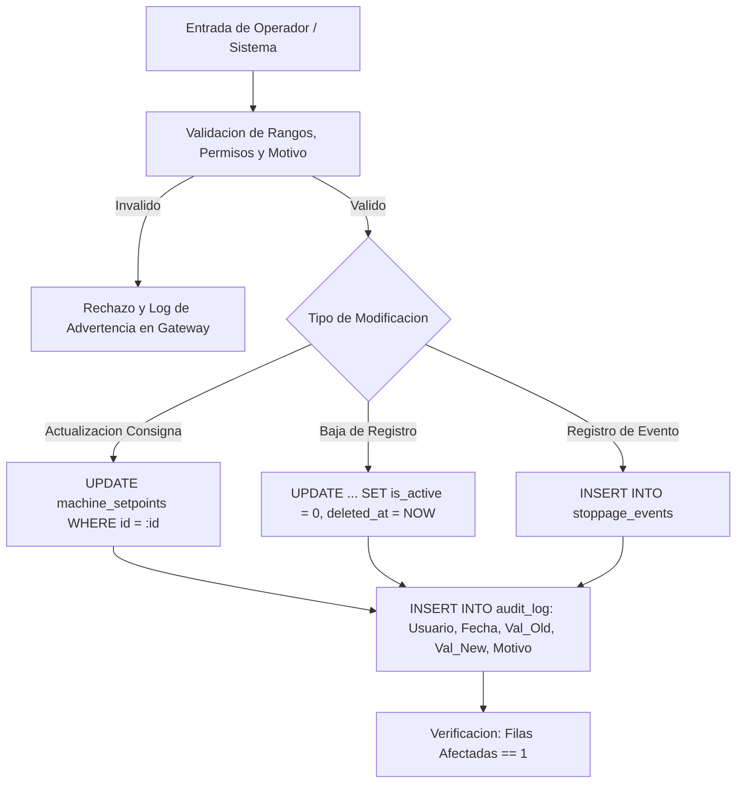
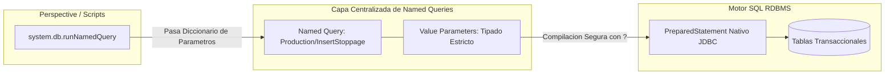

# Sesión 5

### 1. Repaso Inicial y Resolución de Dudas de la Sesión 4

#### Objetivos

* Consolidar la gestión de excepciones duales en la JVM (Jython + Java) y el uso de `system.util.getLogger` para registro contextual.
* Revisar las consultas SQL analíticas industriales construidas con `GROUP BY`, `JOIN` y lógica condicional `CASE WHEN`.

#### Contenidos

* Repaso de las consultas sobre la captura de `java.lang.Exception` frente a errores propios de Python.
* Revisión de las buenas prácticas de proyección de columnas explícitas y uso de `NULLIF` para evitar divisiones por cero.
* Comprobación del estado de la base de datos de pruebas para abordar operaciones de escritura.

#### Resultado esperado

* Fijación de las directrices de logging y analítica en base de datos, asegurando la base técnica para implementar modificaciones seguras y auditoría.

***

### 2. Tema 10: Inserciones, Actualizaciones y Borrados Seguros en Entornos Industriales

#### Objetivos

* Comprender los riesgos de integridad y seguridad derivados de escrituras directas o concatenadas en bases de datos SCADA.
* Aplicar técnicas de validación previa de rangos, estados de máquina y permisos antes de ejecutar sentencias `INSERT`, `UPDATE` o `DELETE`.
* Diferenciar entre borrado físico y borrado lógico, implementando esquemas de auditoría estandarizados para trazabilidad de planta.

#### Contenidos

* Prevención de fallos críticos y riesgos de inyección SQL:
  * Peligros de la concatenación de texto con entradas de usuario o lectores de códigos de barras.
  * Obligatoriedad del paso de parámetros tipados en sentencias de modificación.
* Patrones de modificación y borrado seguro:
  * Cláusulas `WHERE` defensivas: inclusión de claves primarias unívocas y validación estricta de filas afectadas (asegurar que `rows_affected == 1`).
  * Borrado físico (`DELETE FROM`) vs. Borrado lógico (`UPDATE ... SET is_active = FALSE, deleted_at = NOW()`): conservación del histórico y mantenimiento de la integridad referencial.
* Trazabilidad y auditoría de operaciones sensibles:
  * Registro sistemático de cambios de consigna (_setpoints_), fórmulas de recetas y anulaciones manuales.
  * Estructura de la tabla de auditoría: quién (usuario), cuándo (timestamp de servidor), qué (parámetro y equipo), valores (anterior y nuevo) y justificación operativa (motivo obligatorio).

#### Resultado esperado

* Capacidad para diseñar e implementar operaciones de escritura protegidas que validen condiciones operativas antes de persistir y mantengan trazabilidad mediante tablas de auditoría y borrado lógico.

***

### 3. Laboratorio 5.1: Auditoría de Setpoints y Modificación Segura con Borrado Lógico

#### Objetivos

* Construir una función en `Project Library` que valide límites de ingeniería antes de modificar la consigna de temperatura o presión de una máquina.
* Registrar automáticamente una traza completa en la tabla `audit_log` con usuario, valor anterior, valor nuevo y justificación del cambio, verificando el número exacto de filas afectadas.

#### Resultado esperado

* Función verificada en la Script Console que procesa modificaciones nominales de consignas, rechaza valores fuera de rango físico o solicitudes sin motivo justificado, e inserta la correspondiente traza de auditoría en la base de datos sandbox.

***

### 4. Tema 11: Named Queries como Capa de Abstracción y Acceso Seguro a Datos

#### Objetivos

* Comprender la arquitectura, ciclo de vida y ventajas de centralización de las _Named Queries_ en Ignition Designer.
* Distinguir los tipos de consulta (_Query_, _Scalar Query_, _Update Query_) y los mecanismos internos de paso de parámetros (_Value Parameters_ vs. _Query Strings_).
* Dominar la invocación programática de Named Queries desde scripts mediante `system.db.runNamedQuery`.

#### Contenidos

* Arquitectura y organización de Named Queries:
  * Centralización del código SQL en el árbol del proyecto de Ignition, desacoplando las consultas de los componentes visuales.
  * Estructuración jerárquica por dominios funcionales (`Production/`, `Maintenance/`, `Quality/`, `Audit/`).
* Tipología de Named Queries y retornos:
  * **Query:** Ejecución de consultas `SELECT` con retorno de un objeto `Dataset` tabular.
  * **Scalar Query:** Retorno de una celda o valor atómico individual (`int`, `float`, `str`, `Date`).
  * **Update Query:** Ejecución de sentencias `INSERT`, `UPDATE` o `DELETE` con retorno del número entero de filas modificadas.
* Gestión de Parámetros: _Value Parameters_ vs. _Query String Parameters_:
  * **Value Parameters (`:nombreParam`):** Vinculación nativa como `PreparedStatement` de Java (protección total contra SQL Injection y casteo de tipos automático).
  * **Query String Parameters (`{nombreParam}`):** Sustitución textual en crudo (uso restringido a casos donde el nombre de la tabla o columna es dinámico).
* Invocación desde scripts con `system.db.runNamedQuery`:
  * Sintaxis en contextos con y sin proyecto implícito (manejo del argumento `project` en Gateway Scope frente a Perspective Scope).

#### Resultado esperado

* Dominio de la creación, tipado y ejecución programática de Named Queries parametrizadas, utilizándolas como el estándar principal de acceso a datos del proyecto SCADA.

***

### 5. Laboratorio 5.2: Configuración y Consumo de Named Queries Parametrizadas desde Project Library

#### Objetivos

* Configurar en el Designer una Named Query de tipo `Update Query` parametrizada mediante _Value Parameters_ para el registro de eventos de parada de línea.
* Construir una función de servicio en `Project Library` (`project.stoppage.events`) que valide las entradas, arme el diccionario de parámetros e invoque la Named Query controlando el retorno de filas afectadas.

#### Resultado esperado

* Named Query creada en el árbol del Designer y consumida desde una función modular en `Project Library`, verificada mediante la Script Console ante llamadas nominales y llamadas con parámetros incorrectos, comprobando la persistencia en la tabla `stoppage_events`.

***

### 6. Test de Conceptos de la Sesión 5

#### Objetivos

* Evaluar la asimilación conceptual sobre prevención de inyecciones SQL y borrado lógico en bases de datos industriales.
* Comprobar la correcta diferenciación entre _Value Parameters_ y _Query Strings_ en Named Queries.
* Validar el entendimiento sobre el retorno entero de filas afectadas en operaciones de tipo `Update Query`.

#### Contenidos

* Cuestionario técnico individual de opción múltiple y resolución de casos de diseño seguro de consultas y auditoría.

#### Resultado esperado

* Comprobación del dominio de los patrones de modificación segura y de la arquitectura de Named Queries en Ignition.

***

### 7. Feedback Individual y Cierre de la Sesión

#### Objetivos

* Verificar que cada alumno ha creado correctamente sus Named Queries con los tipos de parámetros adecuados en el Designer.
* Comprobar en el _Database Query Browser_ que las inserciones y trazas de auditoría generadas en los laboratorios están correctamente registradas.
* Presentar la planificación de la Sesión 6 (sesión intensiva de 5 horas).

#### Contenidos

* Rondas de revisión individual de las Named Queries y módulos de servicio en `Project Library`.
* Corrección de errores comunes en la coincidencia de nombres de parámetros entre el script y la Named Query.
* Avance de la Sesión 6: Ecosistema avanzado de `system.db.*`, transacciones atómicas ACID (`commit`/`rollback`), buenas prácticas en Script Transforms y arquitectura de eventos en Perspective, Vision y Gateway.

#### Resultado esperado

* Cada participante finaliza la sesión con su capa de Named Queries funcional, auditoría verificada en base de datos y claridad sobre los conceptos transaccionales que se abordarán en la siguiente jornada intensiva.
