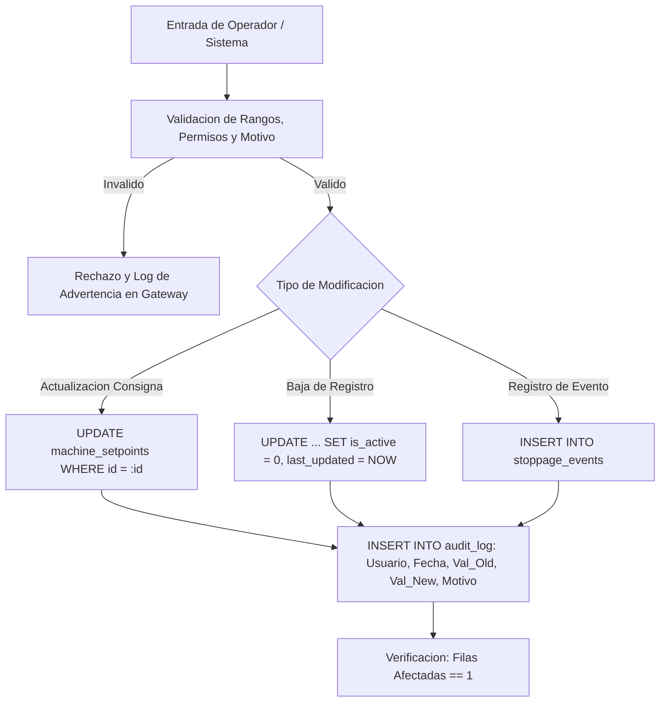
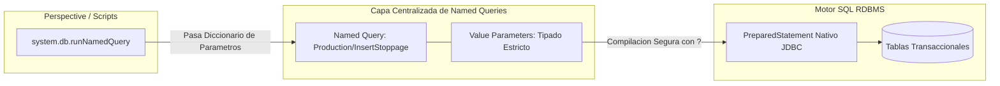

# Sesión 5

### 1. Repaso Inicial y Resolución de Dudas de la Sesión 4

#### Objetivos

* Consolidar la gestión de excepciones duales en la JVM (Jython + Java) y el uso de `system.util.getLogger` para registro contextual.
* Revisar las consultas SQL analíticas industriales construidas con `GROUP BY`, `JOIN` y lógica condicional `CASE WHEN`.

#### Contenidos

* Repaso de las consultas sobre la captura de `java.lang.Exception` frente a errores propios de Python.
* Revisión de las buenas prácticas de proyección de columnas explícitas y uso de `NULLIF` para evitar divisiones por cero.
* Comprobación del estado de la base de datos de pruebas para abordar operaciones de escritura.

#### Resultado esperado

* Fijación de las directrices de logging y analítica en base de datos, asegurando la base técnica para implementar modificaciones seguras y auditoría.

***

### 2. Tema 10: Inserciones, Actualizaciones y Borrados Seguros en Entornos Industriales

#### Objetivos

* Comprender los riesgos de integridad y seguridad derivados de escrituras directas o concatenadas en bases de datos SCADA.
* Aplicar técnicas de validación previa de rangos, estados de máquina y permisos antes de ejecutar sentencias `INSERT`, `UPDATE` o `DELETE`.
* Diferenciar entre borrado físico y borrado lógico, implementando esquemas de auditoría estandarizados para trazabilidad de planta.

#### Contenidos

**1. Prevención de Fallos Críticos y Riesgos de Inyección SQL en SCADA**

* **Peligros de la concatenación de texto:**
  * Unir cadenas con el operador `+` (`"WHERE equip = '" + equip + "'"`) es una de las mayores vulnerabilidades en sistemas industriales.
  * *Inyección accidental:* Caracteres especiales introducidos por operarios (ej. comillas simples en observaciones como `"Válvula 2" no cierra'`) rompen la gramática SQL y abortan la ejecución.
  * *Inconsistencia de fechas:* Formatos regionales de fecha (`DD/MM/YYYY` vs `YYYY-MM-DD`) provocan desajustes temporales o rechazos en el motor.
  * *Riesgo en dispositivos externos:* Entradas procedentes de lectores de códigos de barras, escáneres RFID o APIs externas pueden inyectar fragmentos destructivos (`BOMBA_01' OR '1'='1`).
* **Obligatoriedad de parámetros tipados (`PreparedStatement`):**
  * El estándar industrial exige el uso estricto de `system.db.runPrepUpdate` o Named Queries parametrizadas.
  * La consulta se envía con marcadores de posición (`?`), congelando la estructura sintáctica en el motor de base de datos.
  * El driver JDBC transmite los parámetros en un canal binario desacoplado con casteo estricto de tipos (`Timestamp`, `Double`, `Varchar`), neutralizando físicamente cualquier intento de inyección.

**2. Patrones de Modificación Defensiva y Borrado Seguro**

* **Cláusulas `WHERE` defensivas y el Seguro de Filas Afectadas (`rows_affected == 1`):**
  * Toda sentencia de modificación unitaria debe incluir claves primarias unívocas en el `WHERE`.
  * La función de base de datos devuelve el número entero de filas modificadas. Ignorar este retorno asumiendo éxito es un grave error de diseño:
    * `rows_affected == 0`: El equipo no existe o está inactivo. Fallo silencioso; la máquina física sigue con la consigna antigua.
    * `rows_affected == 1`: **Único resultado admisible** en operaciones sobre un activo unitario.
    * `rows_affected > 1`: Violación crítica de unicidad; el `WHERE` afectó a múltiples máquinas por error.
  * *Patrón defensivo:*
    ```python
    rows_affected = system.db.runPrepUpdate(update_sql, [new_sp, equip_id], database="SANDBOX_DB")
    if rows_affected != 1:
        logger.warn("Inconsistencia en actualización: {} filas afectadas para equipo {}".format(rows_affected, equip_id))
        return (False, u"Error: no se modificó la consigna esperada")
    ```
* **Borrado Físico (`DELETE FROM`) vs. Borrado Lógico (*Soft Delete*):**
  * *La regla de planta:* **En un SCADA nunca se borra nada**. El borrado físico destruye la integridad referencial histórica y deja huérfanos millones de registros de telemetría y alarmas en el Historian (regulaciones ISA-95, GAMP5, FDA 21 CFR Part 11).
  * *Implementación de baja lógica:* Inclusión de columnas de control `is_active` (`BOOLEAN`), `updated_by` (`VARCHAR`) y `last_updated` (`TIMESTAMP`).
  * Desactivación mediante actualización: `UPDATE machine_setpoints SET is_active = FALSE, updated_by = ?, last_updated = CURRENT_TIMESTAMP WHERE equip = ? AND is_active = TRUE;`.
  * Los selectores visuales y consultas operativas filtran siempre por activos: `WHERE is_active = TRUE`.

**3. Trazabilidad y Auditoría Canónica de Operaciones Sensibles**

* **Registro sistemático de cambios de consigna (*setpoints*), fórmulas de recetas y anulaciones manuales.**
* **Las 5 preguntas obligatorias de la pista de auditoría (*Audit Trail*):**
  * *Quién:* Usuario autenticado en la sesión de Ignition (`username`).
  * *Cuándo:* Marca temporal oficial del servidor de base de datos (`CURRENT_TIMESTAMP`), evitando desincronizaciones entre relojes de clientes o husos horarios.
  * *Dónde:* Identificador físico del equipo o señal (`equip`).
  * *Qué:* Parámetro alterado, valor anterior y valor nuevo con sus unidades de ingeniería.
  * *Por qué:* Justificación operativa obligatoria (validación mínima de longitud, ej. `len(reason.strip()) >= 5`).
* **Estructura canónica de la tabla de auditoría (`ins_Registre_Actuacions`):**
  ```sql
  INSERT INTO ins_Registre_Actuacions (Equip, Descripcio, Usuari, DataHora)
  VALUES (?, ?, ?, CURRENT_TIMESTAMP);
  ```


```mermaid
flowchart TD
    UserInput[Entrada de Operador / Sistema] --> Validate[Validacion de Rangos, Permisos y Motivo]
    Validate -->|Invalido| Reject[Rechazo y Log de Advertencia en Gateway]
    Validate -->|Valido| QueryType{Tipo de Modificacion}
    
    QueryType -->|Actualizacion Consigna| UpdateSP[UPDATE machine_setpoints WHERE id = :id]
    QueryType -->|Baja de Registro| SoftDelete[UPDATE ... SET is_active = 0, last_updated = NOW]
    QueryType -->|Registro de Evento| InsertEvent[INSERT INTO stoppage_events]
    
    UpdateSP --> Audit[INSERT INTO audit_log: Usuario, Fecha, Val_Old, Val_New, Motivo]
    SoftDelete --> Audit
    InsertEvent --> Audit
    
    Audit --> Confirm[Verificacion: Filas Afectadas == 1]
```

#### Resultado esperado

* Capacidad para diseñar e implementar operaciones de escritura protegidas que validen condiciones operativas antes de persistir y mantengan trazabilidad mediante tablas de auditoría y borrado lógico.

***

### 3. Laboratorio 5.1: Auditoría de Setpoints y Modificación Segura con Borrado Lógico

#### Objetivos

* Construir una función en `Project Library` que valide límites de ingeniería antes de modificar la consigna de temperatura o presión de una máquina.
* Registrar automáticamente una traza completa en la tabla `audit_log` con usuario, valor anterior, valor nuevo y justificación del cambio, verificando el número exacto de filas afectadas.

#### Resultado esperado

* Función verificada en la Script Console que procesa modificaciones nominales de consignas, rechaza valores fuera de rango físico o solicitudes sin motivo justificado, e inserta la correspondiente traza de auditoría en la base de datos sandbox.

***

### 4. Tema 11: Named Queries como Capa de Abstracción y Acceso Seguro a Datos

#### Objetivos

* Comprender la arquitectura, ciclo de vida y ventajas de centralización de las _Named Queries_ en Ignition Designer.
* Distinguir los tipos de consulta (_Query_, _Scalar Query_, _Update Query_) y los mecanismos internos de paso de parámetros (_Value Parameters_ vs. _Query Strings_).
* Dominar la invocación programática de Named Queries desde scripts mediante `system.db.runNamedQuery`.

#### Contenidos

**1. Arquitectura y Organización Centralizada de Named Queries**

* **Centralización del código SQL en el árbol del proyecto (`Project Browser -> Named Queries`):**
  * Desacoplamiento total del SQL frente a componentes visuales y scripts (patrón Repository / DAO). Evita el antipatrón del "SQL disperso" en botones y bindings.
  * *Entorno de pruebas integrado (Testing Tab):* Permite ejecutar la consulta dentro del Designer con parámetros reales antes de enlazarla a pantallas o scripts.
  * *Caché en memoria RAM del Gateway:* TTL configurable para reducir drásticamente la carga sobre el motor SQL en consultas de alta concurrencia (ej. catálogo de recetas).
  * *Control de acceso por roles (Role-Based Permissions):* Restricción de consultas sensibles a perfiles autorizados (`Supervisor`, `DirectorPlanta`).
* **Estructuración jerárquica por dominios funcionales:**
  * Organización modular en carpetas por área de planta (`Production/`, `Maintenance/`, `Quality/`, `Audit/`, `Actuacions/`).

**2. Tipología de Named Queries y Contratos de Retorno**

* **`Query` (Consulta Tabular):**
  * Ejecución de consultas `SELECT` con retorno de un objeto `Dataset` (`com.inductiveautomation.ignition.common.BasicDataset`).
  * Uso: Tablas en Perspective/Vision, listas desplegables (*Dropdowns*) o procesamiento con `system.dataset.toPyDataSet()`.
* **`Scalar Query` (Consulta Escalar Atómica):**
  * Retorno directo de la primera celda de la primera fila como valor atómico (`int`, `float`, `unicode`, `java.util.Date`), o `None` si la consulta no devuelve filas.
  * Ventaja clave: Evita el código intermedio de desenvolvimiento de un Dataset (`ds.getValueAt(0, 0)`) para indicadores numéricos, contadores o KPIs individuales.
* **`Update Query` (Sentencia de Modificación):**
  * Ejecución de sentencias `INSERT`, `UPDATE` o `DELETE` con retorno del número entero de filas afectadas (`rows_affected`).
  * Uso: Modificación de consignas, bajas lógicas y registros de auditoría con validación inmediata de filas afectadas (`rows == 1`).

**3. Gestión de Parámetros: *Value Parameters* vs. *Query String Parameters***

* **Value Parameters (`:nombreParam`):**
  * Vinculación nativa como `PreparedStatement` de Java (marcadores `?` en el driver JDBC).
  * *Seguridad:* Inmunidad total contra inyección SQL y casteo estricto automático de tipos (`Integer`, `Float`, `String`, `DateTime`).
  * *Rendimiento:* Máximo aprovechamiento de la precompilación y planes de ejecución en el motor SQL.
  * *Ámbito de uso:* Estándar obligatorio para el 99% de las consultas (`WHERE col = :val`, `SET col = :val`, `VALUES (:val)`).
* **Query String Parameters (`{nombreParam}`):**
  * Sustitución textual en crudo antes de compilar la sentencia.
  * *Seguridad:* Vulnerable a inyección SQL si no se valida exhaustivamente mediante listas blancas en Python.
  * *Ámbito de uso restringido:* Exclusivamente cuando el nombre de la tabla o columna es dinámico (ej. particiones temporales del Historian: `FROM sqlt_data_1_{mes}`).

**4. Invocación Programática desde Scripts con `system.db.runNamedQuery`**

* **Sintaxis de invocación:** `system.db.runNamedQuery([project], path, parameters)`.
* **El contexto de Scopes y el parámetro `project`:**
  * En **Perspective Scope** o **Vision Client Scope**, el nombre del proyecto es implícito.
  * En **Gateway Scope**, **Script Console** o tareas programadas (*Timer Scripts*), el argumento `project` es obligatorio o se lanza `IllegalArgumentException: Project name not specified`.
* **El patrón universal agnóstico de Scope con `system.util.getProjectName()`:**
  ```python
  # Resuelve dinámicamente el proyecto para ejecución válida en cualquier Scope
  project_name = system.util.getProjectName()
  rows = system.db.runNamedQuery(project=project_name, path="Actuacions/InsertRegistre", parameters=params)
  ```
* **Sensibilidad estricta a mayúsculas y minúsculas (*Case-Sensitivity*):** Las claves del diccionario `parameters` deben coincidir de forma idéntica con los nombres declarados en la Named Query del Designer.


```mermaid
flowchart LR
    subgraph UI_Scripts [Perspective / Scripts]
        Call[system.db.runNamedQuery]
    end

    subgraph Named_Query_Layer [Capa Centralizada de Named Queries]
        direction TB
        NQDef[Named Query: Production/InsertStoppage]
        ValParams[Value Parameters: Tipado Estricto]
        NQDef --- ValParams
    end

    subgraph Database_Engine [Motor SQL RDBMS]
        PrepStmt[PreparedStatement Nativo JDBC]
        DBExec[(Tablas Transaccionales)]
        PrepStmt --> DBExec
    end

    Call -->|Pasa Diccionario de Parametros| NQDef
    ValParams -->|Compilacion Segura con ?| PrepStmt
```

#### Resultado esperado

* Dominio de la creación, tipado y ejecución programática de Named Queries parametrizadas, utilizándolas como el estándar principal de acceso a datos del proyecto SCADA.

***

### 5. Laboratorio 5.2: Configuración y Consumo de Named Queries Parametrizadas desde Project Library

#### Objetivos

* Configurar en el Designer una Named Query de tipo `Update Query` parametrizada mediante _Value Parameters_ para el registro de eventos de parada de línea.
* Construir una función de servicio en `Project Library` (`project.stoppage.events`) que valide las entradas, arme el diccionario de parámetros e invoque la Named Query controlando el retorno de filas afectadas.

#### Resultado esperado

* Named Query creada en el árbol del Designer y consumida desde una función modular en `Project Library`, verificada mediante la Script Console ante llamadas nominales y llamadas con parámetros incorrectos, comprobando la persistencia en la tabla `stoppage_events`.

***

### 6. Test de Conceptos de la Sesión 5

#### Objetivos

* Evaluar la asimilación conceptual sobre prevención de inyecciones SQL y borrado lógico en bases de datos industriales.
* Comprobar la correcta diferenciación entre _Value Parameters_ y _Query Strings_ en Named Queries.
* Validar el entendimiento sobre el retorno entero de filas afectadas en operaciones de tipo `Update Query`.

#### Contenidos

* Cuestionario técnico individual de opción múltiple y resolución de casos de diseño seguro de consultas y auditoría.
* [Cuestionario Sesión 5](https://docs.google.com/forms/d/e/1FAIpQLSdENIk0hUBa_KXuzF0ycJa3vv02xlAvEzA1ZsgAkQSFlzW8oA/viewform?usp=publish-editor)

#### Resultado esperado

* Comprobación del dominio de los patrones de modificación segura y de la arquitectura de Named Queries en Ignition.

***

### 7. Feedback Individual y Cierre de la Sesión

#### Objetivos

* Verificar que cada alumno ha creado correctamente sus Named Queries con los tipos de parámetros adecuados en el Designer.
* Comprobar en el _Database Query Browser_ que las inserciones y trazas de auditoría generadas en los laboratorios están correctamente registradas.
* Presentar la planificación de la Sesión 6 (sesión intensiva de 5 horas).

#### Contenidos

* Rondas de revisión individual de las Named Queries y módulos de servicio en `Project Library`.
* Corrección de errores comunes en la coincidencia de nombres de parámetros entre el script y la Named Query.
* Avance de la Sesión 6: Ecosistema avanzado de `system.db.*`, transacciones atómicas ACID (`commit`/`rollback`), buenas prácticas en Script Transforms y arquitectura de eventos en Perspective, Vision y Gateway.

#### Resultado esperado

* Cada participante finaliza la sesión con su capa de Named Queries funcional, auditoría verificada en base de datos y claridad sobre los conceptos transaccionales que se abordarán en la siguiente jornada intensiva.
