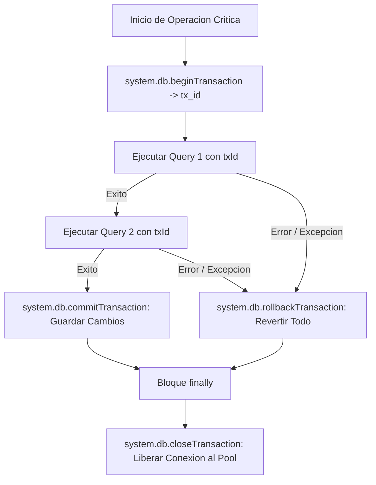
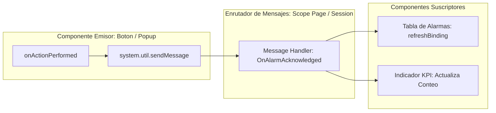

# Sesión 6

### 1. Repaso Inicial y Resolución de Dudas de la Sesión 5

#### Objetivos

* Consolidar los conceptos de escrituras seguras, control de filas afectadas, borrado lógico y auditoría industrial.
* Revisar la creación y tipado de parámetros en Named Queries dentro de Ignition Designer.

#### Contenidos

* Repaso de las consultas sobre la diferenciación técnica entre _Value Parameters_ y _Query Strings_.
* Revisión de las buenas prácticas de validación previa de límites de ingeniería antes de persistir en base de datos.
* Comprobación del correcto registro de pistas de auditoría en la tabla `audit_log` del sandbox.

#### Resultado esperado

* Fijación de los estándares de acceso a datos mediante Named Queries, base requerida para abordar transacciones complejas multiconsulta.

***

### 2. Tema 12: Prepared Statements y Ecosistema de Funciones `system.db.*`

#### Objetivos

* Conocer la matriz comparativa de funciones del módulo `system.db.*` y sus casos de uso específicos.
* Dominar la sintaxis de sentencias preparadas (_Prepared Statements_) utilizando marcadores de posición posicionales `?` y listas de argumentos.
* Gestionar consultas dirigidas a múltiples conexiones de base de datos dentro del Gateway de Ignition.

#### Contenidos

* Comparativa del ecosistema de funciones de base de datos:
  * `system.db.runQuery` vs. `system.db.runPrepQuery`: eliminación de sentencias en texto plano en favor de sentencias preparadas que retornan `PyDataSet`.
  * `system.db.runScalarPrepQuery`: optimización de consultas para la obtención directa de un valor atómico (conteos, identificadores generados, valores máximos).
  * `system.db.runPrepUpdate`: ejecución de sentencias de modificación con retorno del número de filas afectadas.
  * `system.db.runNamedQuery`: estándar modular preferente frente a consultas directas en código.
* Mecánica de enlace de parámetros (_Parameter Binding_):
  * Paso de argumentos posicionales en listas (`args=[val1, val2]`) y resolución de tipos en el driver JDBC.
* Enrutamiento multi-base de datos:
  * Uso del parámetro explícito `database="NombreConexion"` para dirigir operaciones a servidores históricos, transaccionales o de laboratorio.

#### Resultado esperado

* Capacidad para seleccionar y parametrizar la función exacta de `system.db.*` según el tipo de retorno requerido y la conexión de base de datos de destino.

***

### 3. Tema 13: Transacciones Atómicas (ACID), Consistencia y Operaciones Críticas

#### Objetivos

* Comprender los principios de atomicidad, consistencia, aislamiento y durabilidad (ACID) aplicados a procesos de planta.
* Dominar el ciclo de vida de una transacción JDBC en Ignition mediante `system.db.beginTransaction`, `commitTransaction` y `rollbackTransaction`.
* Prevenir fugas de conexiones en el pool del Gateway mediante la liberación obligatoria en bloques `finally`.

#### Contenidos

* La unidad lógica de trabajo en operaciones industriales:
  * El riesgo de escrituras parciales: creación de cabeceras de lote sin inserción de líneas de consumo de materia prima.
* Ciclo de vida y funciones transaccionales en Ignition:
  * Inicio de transacción con identificador único: `tx_id = system.db.beginTransaction(database, timeout)`.
  * Ejecución de múltiples sentencias bajo el mismo `txId`.
  * Confirmación atómica de cambios: `system.db.commitTransaction(tx_id)`.
  * Reversión completa ante cualquier excepción: `system.db.rollbackTransaction(tx_id)`.
* Gestión estricta de conexiones y prevención de _Connection Leaks_:
  * Obligatoriedad de invocar `system.db.closeTransaction(tx_id)` dentro del bloque `finally` para retornar la conexión al pool de JDBC, independientemente de si la operación tuvo éxito o falló.

#### Resultado esperado

* Dominio del diseño de transacciones ACID en Jython, asegurando la consistencia total de datos en procesos de fabricación y la estabilidad del pool JDBC del Gateway.

***

### 4. Laboratorio 6.1: Transacción Atómica de Cierre de Lote con Control de Stock y Rollback

#### Objetivos

* Implementar una función en `Project Library` (`project.production.batch`) que ejecute una transacción compuesta: inserción de cabecera de lote y descuento de existencias de materias primas en una sola unidad lógica.
* Proteger la ejecución mediante `commit`/`rollback` y liberación estricta de la transacción en `finally`, verificando la reversión automática si no existe stock suficiente.

#### Resultado esperado

* Función probada desde la Script Console que ejecuta satisfactoriamente el cierre de lote y actualización de existencias ante datos válidos, y revierte la totalidad de los cambios en base de datos cuando se fuerza un error de stock insuficiente.

***

### 5. Tema 14: Script Transforms en Bindings: Buenas Prácticas y Rendimiento en Perspective

#### Objetivos

* Comprender el ciclo de vida, propósito y limitaciones de los _Script Transforms_ en la arquitectura web de Perspective.
* Identificar y erradicar anti-patrones críticos que provocan congelamientos en la interfaz gráfica y saturación de hilos en el Gateway.
* Aplicar el estándar de diseño basado en funciones puras delegadas a `Project Library`.

#### Contenidos

* Ciclo de vida y mecánica de los Script Transforms:
  * Entrada (`value`): dato original proveniente de un tag, Named Query o propiedad de componente.
  * Salida (`return`): dato transformado consumible por la propiedad visual del componente.
  * Contexto de ejecución: corre en el Gateway Scope vinculado a la sesión de Perspective.
* Anti-patrones críticos de rendimiento:
  * Prohibición de ejecutar consultas SQL (`system.db.*`) o llamadas de red HTTP dentro de transforms reactivos.
  * Prohibición de escrituras en tags o modificaciones de base de datos desde un transform (los transforms deben carecer de efectos secundarios).
  * Eliminación de bloques de código extensos embebidos en el componente.
* Guía de estilo y buenas prácticas:
  * Delegación de toda lógica a funciones puras en `Project Library` (`return project.ui.transforms.format_card(value)`).
  * Tratamiento defensivo ante valores nulos (`None`) o estructuras vacías de inicio de sesión.

#### Resultado esperado

* Capacidad para construir bindings reactivos y ligeros en Perspective que no degraden la experiencia de usuario ni sobrecarguen los hilos del servidor.

***

### 6. Laboratorio 6.2: Script Transform Defensivo y Estilizado en Perspective

#### Objetivos

* Construir una función en `Project Library` (`project.ui.transforms`) que reciba un objeto de telemetría y genere una estructura visual completa (texto descriptivo, código de color, icono y bandera de parpadeo).
* Conectar la función a un Script Transform en una vista de Perspective asegurando un tiempo de evaluación casi instantáneo.

#### Resultado esperado

* Script Transform operativo en una vista de Perspective que delega la lógica en `Project Library` y actualiza dinámicamente el estilo y contenido de una tarjeta de máquina según su estado operativo (producción, parada, mantenimiento, sin comunicación).

***

### 7. Tema 15: Arquitectura de Eventos en Perspective, Vision y Gateway

#### Objetivos

* Comprender la taxonomía y ámbitos de ejecución de los diferentes tipos de eventos en Ignition.
* Dominar la configuración de tareas programadas (_Gateway Scheduled Scripts_) y cíclicas (_Timer Scripts_) para automatizaciones desatendidas.
* Aplicar el patrón publicador-suscriptor mediante _Message Handlers_ (`system.util.sendMessage`) para desacoplar la comunicación entre componentes y vistas.

#### Contenidos

* Taxonomía de eventos en Ignition:
  * **Component Events:** Reacción inmediata a la interacción del operador (clics, cambios de selección, entradas de teclado).
  * **Session Events:** Ciclo de vida de la conexión del usuario (inicio de sesión, cierre de sesión, permisos).
  * **Gateway Event Scripts (24/7):**
    * _Timer Scripts:_ Procesos cíclicos con intervalos fijos en milisegundos.
    * _Scheduled Scripts:_ Tareas programadas mediante expresiones CRON (ej. cálculo de fin de turno a las 06:00, 14:00 y 22:00).
    * _Tag Change Scripts:_ Reacción instantánea ante flancos o cambios de valor en variables de PLC.
* Comunicación desacoplada mediante _Message Handlers_:
  * El problema del acoplamiento directo entre vistas y popups.
  * Emisión de mensajes con `system.util.sendMessage(project, messageHandler, payload, scope)`.
  * Recepción y tratamiento controlado de mensajes según el ámbito (_Session_, _Page_, _Gateway_).

#### Resultado esperado

* Capacidad para seleccionar el tipo de evento adecuado para cada requerimiento industrial y comunicar componentes de interfaz de forma desacoplada y mantenible.

***

### 8. Laboratorio 6.3: Desacoplamiento de Eventos mediante Message Handlers

#### Objetivos

* Configurar un Message Handler en una vista de Perspective que escuche eventos de reconocimiento de alarmas.
* Implementar un script de disparo en un botón que ejecute la lógica de reconocimiento y emita un mensaje con `system.util.sendMessage` para actualizar componentes dependientes sin recargar la página completa.

#### Resultado esperado

* Sistema de eventos desacoplado y funcional en Perspective donde la interacción con un componente actualiza selectivamente las propiedades de otros componentes de la vista a través del bus de mensajes.

***

### 9. Test de Conceptos de la Sesión 6

#### Objetivos

* Evaluar la comprensión sobre el control transaccional ACID y la prevención de fugas de conexiones JDBC.
* Validar el criterio técnico para evitar llamadas pesadas en Script Transforms.
* Comprobar el dominio sobre la selección de scopes y la comunicación mediante Message Handlers.

#### Contenidos

* Cuestionario técnico de opción múltiple y resolución de casos prácticos sobre concurrencia, transforms y eventos de Gateway.

#### Resultado esperado

* Fijación de los principios de consistencia transaccional, optimización de interfaces y desacoplamiento de eventos.

***

### 10. Feedback Individual y Cierre de la Sesión

#### Objetivos

* Verificar que todos los alumnos han ejecutado la transacción del Laboratorio 6.1 controlando los estados de `commit` y `rollback`.
* Revisar que los Script Transforms implementados carecen de sentencias bloqueantes.
* Presentar los contenidos de la Sesión 7.

#### Contenidos

* Comprobación individual de la correcta liberación de transacciones en la base de datos sandbox.
* Resolución de dudas sobre la sintaxis de expresiones CRON en Gateway Scheduled Scripts.
* Avance de la Sesión 7: Ecosistema de Tags, lecturas y escrituras por lotes con `readBlocking`/`writeBlocking`, manejo de calidades (`QualityCode`) y tratamiento de calendarios industriales, fechas y turnos nocturnos.

#### Resultado esperado

* Cada alumno concluye la sesión intensiva con sus tres laboratorios validados, su base de datos consistente y preparación para el módulo de scripting operativo con tags y ventanas temporales.
