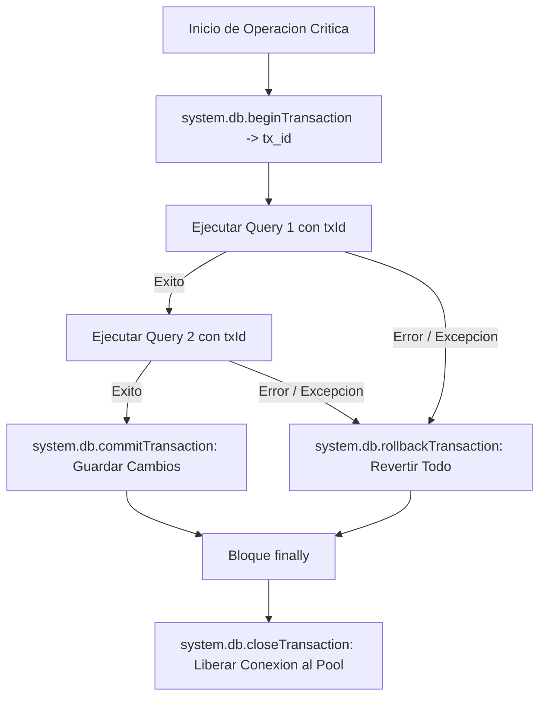
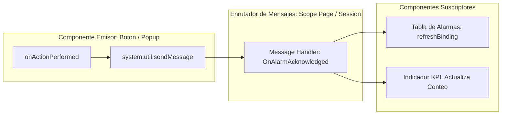

# Sesión 6

### 1. Repaso Inicial y Resolución de Dudas de la Sesión 5

#### Objetivos

* Consolidar los conceptos de escrituras seguras, control de filas afectadas, borrado lógico y auditoría industrial.
* Revisar la creación y tipado de parámetros en Named Queries dentro de Ignition Designer.

#### Contenidos

* Repaso de las consultas sobre la diferenciación técnica entre _Value Parameters_ y _Query Strings_.
* Revisión de las buenas prácticas de validación previa de límites de ingeniería antes de persistir en base de datos.
* Comprobación del correcto registro de pistas de auditoría en la tabla `ins_Registre_Actuacions` / `audit_log` del sandbox.

#### Resultado esperado

* Fijación de los estándares de acceso a datos mediante Named Queries, base requerida para abordar transacciones complejas multiconsulta.

***

### 2. Tema 12: Prepared Statements y Ecosistema de Funciones `system.db.*`

#### Objetivos

* Conocer la matriz comparativa de funciones del módulo `system.db.*` y sus casos de uso específicos.
* Dominar la sintaxis de sentencias preparadas (_Prepared Statements_) utilizando marcadores de posición posicionales `?` y listas de argumentos.
* Gestionar consultas dirigidas a múltiples conexiones de base de datos dentro del Gateway de Ignition.

#### Contenidos

**1. Taxonomía y Matriz Comparativa del Ecosistema `system.db.*`**

* **Contratos de retorno y optimización de memoria en la JVM:**
  * `system.db.runQuery` vs. `system.db.runPrepQuery`: erradicación definitiva de consultas construidas con concatenación de texto plano en favor de sentencias preparadas; `runPrepQuery` retorna un objeto `PyDataSet` que permite acceso indexado natural en Jython (`row["columna"]` o `row[0]`) sin sobrecargar la memoria.
  * `system.db.runScalarPrepQuery`: optimización quirúrgica para la obtención directa de un único valor atómico 1x1 (conteos masivos `COUNT(*)`, identificadores autogenerados, valores máximos o comprobaciones rápidas de existencias); retorna directamente el objeto primitivo (`int`, `float`, `str`, `Date`) o `None` si la consulta no devuelve coincidencias, eliminando por completo el coste de instanciar y desenvolver un dataset.
  * `system.db.runPrepUpdate`: ejecución de sentencias de manipulación (`INSERT`, `UPDATE`, `DELETE`) con retorno obligatorio del número entero de filas modificadas (`rows_affected`) para verificar la unicidad de la operación (`rows_affected == 1`), incorporando soporte opcional para recuperar claves primarias autogeneradas mediante el argumento `getKey=True`.
  * `system.db.runNamedQuery`: estándar arquitectónico preferente para desacoplar el SQL de los scripts y vistas, centralizando la persistencia en el Designer con gestión de permisos, tipado estricto y optimización de caché en el Gateway.
* **Erradicación de funciones heredadas vulnerables:** Prohibición terminante de `system.db.runQuery` y `system.db.runUpdateQuery` en entornos industriales modernos debido al riesgo crítico de inyección SQL accidental y degradación de rendimiento.

**2. Mecánica de Parameter Binding y Resolución en Driver JDBC**

* **Separación de planos sintáctico y de datos:**
  * La consulta se transmite al motor SQL utilizando marcadores de posición posicionales (`?`), precompilando la estructura y el plan de ejecución antes de la llegada de los valores.
  * Los argumentos se envían en una lista ordenada de Python (`args=[val1, val2]`), vinculándose por canal binario desacoplado en el driver JDBC.
  * Inmunidad absoluta ante caracteres conflictivos: comillas simples en observaciones de operadores (ej. `"Válvula 2" no cierra'`) o fragmentos maliciosos (`' OR '1'='1`) se interpretan estrictamente como literales de texto, nunca como sentencias ejecutables.
* **Tipado estricto en la JVM:** Conversión automática y segura de tipos entre Jython y JDBC (`Types.VARCHAR`, `Types.DOUBLE`, `Types.INTEGER`, `Types.TIMESTAMP`), previniendo errores de conversión derivados de formatos regionales de fecha (`DD/MM/YYYY`) o delimitadores decimales.

**3. Enrutamiento Multi-Base de Datos en Arquitecturas SCADA de Planta**

* **Obligatoriedad del parámetro explícito `database="NombreConexion"`:** Prevención de escrituras no autorizadas o accidentales en la base de datos por defecto (*Default Database*) del proyecto cuando esta es modificada en el Gateway.
* **Coexistencia de fuentes industriales de datos:**
  * Conexiones transaccionales y de recetas: `MES_TRANSACTIONS` o `SANDBOX_DB`.
  * Conexiones de series temporales y telemetría: `HISTORIAN_DB`.
  * Conexiones de laboratorio y calidad: `LAB_LIMS_DB`.
* **Portabilidad entre motores RDBMS:** Estandarización de sentencias y compatibilidad con PostgreSQL, Microsoft SQL Server y MySQL en entornos multi-planta.

#### Resultado esperado

* Capacidad para seleccionar y parametrizar la función exacta de `system.db.*` según el tipo de retorno requerido y la conexión de base de datos de destino.

***

### 3. Tema 13: Transacciones Atómicas (ACID), Consistencia y Operaciones Críticas

#### Objetivos

* Comprender los principios de atomicidad, consistencia, aislamiento y durabilidad (ACID) aplicados a procesos de planta.
* Dominar el ciclo de vida de una transacción JDBC en Ignition mediante `system.db.beginTransaction`, `commitTransaction` y `rollbackTransaction`.
* Prevenir fugas de conexiones en el pool del Gateway mediante la liberación obligatoria en bloques `finally`.

#### Contenidos

**1. La Unidad Lógica de Trabajo en Operaciones Industriales y Riesgos de Consistencia**

* **El desastre del modo *Auto-Commit* por defecto:** Cada sentencia individual ejecutada de forma aislada confirma sus cambios de manera inmediata e irrevocable en disco; una interrupción posterior deja la base de datos en un estado inconsistente (*Split-Brain* industrial).
* **Análisis de fallos en operaciones compuestas (código heredado de planta, PDF págs. 14-15):**
  * El riesgo de escrituras parciales: inserción de la cabecera de un lote de producción sin que se descuente el inventario de reactivos o materias primas asociadas.
  * Desfase irreversible entre el stock real de planta, la trazabilidad de calidad y el sistema ERP corporativo ante caídas de red o fallos de PLC a mitad del script.
* **Los cuatro principios ACID aplicados a la fabricación industrial:**
  * *Atomicidad (Atomicity):* O se ejecutan todas las operaciones del proceso (cabecera + consumo de reactivos + auditoría), o no se ejecuta ninguna (*All or Nothing*).
  * *Consistencia (Consistency):* La transacción respeta todas las restricciones de integridad y reglas de validación (ej. impedir que las existencias queden en valores negativos mediante restricciones `CHECK stock_qty >= 0`).
  * *Aislamiento (Isolation):* Control de concurrencia y bloqueos de fila (*Row-level locks*) para asegurar que dos líneas de producción que descuentan existencias simultáneamente no interfieran entre sí ni generen lecturas sucias (*Dirty Reads*).
  * *Durabilidad (Durability):* Una vez confirmado el cambio con `COMMIT`, los datos del lote permanecen inmutables en disco frente a apagones o cortes de tensión en el Gateway gracias al registro previo en el diario de transacciones (WAL).

**2. Ciclo de Vida y Control Transaccional JDBC en Ignition**

* **Identificador de transacción (`tx_id`):** Apertura mediante `tx_id = system.db.beginTransaction(database=db_conn, timeout=10000)`, extrayendo una conexión física del pool del Gateway y desactivando el Auto-Commit.
* **Uso obligatorio del parámetro `timeout`:** Establecimiento de tiempos límite (ej. 10 segundos) para abortar automáticamente transacciones congeladas por bloqueos de tabla.
* **Propagación estricta de `txId`:** Necesidad imperativa de pasar `txId=tx_id` en todas y cada una de las consultas que formen parte de la unidad atómica (`runPrepUpdate`, `runScalarPrepQuery`, `runNamedQuery`). Si se omite en una consulta intermedia, esa sentencia se ejecutará por fuera en modo Auto-Commit rompiendo la atomicidad.
* **Confirmación y reversión:**
  * `system.db.commitTransaction(tx_id)`: Consolidación atómica simultánea de todas las operaciones.
  * `system.db.rollbackTransaction(tx_id)`: Reversión inmediata e íntegra de la totalidad de las modificaciones ante cualquier excepción o anomalía operativa.
* **Descuento atómico de existencias en el motor SQL:**
  * Uso del patrón SQL defensivo: `UPDATE raw_materials_stock SET stock_qty = stock_qty - ? WHERE material_id = ? AND stock_qty >= ?`.
  * Comprobación en script: si `rows_affected == 0`, significa rotura de stock y se dispara una excepción para forzar el rollback automático.

**3. Gestión Estricta del Pool JDBC y Prevención de *Connection Pool Starvation***

* **Anatomía del pool de conexiones del Gateway:** Los pools JDBC (HikariCP / DBCP) poseen límites estrictos de conexiones concurrentes (habitualmente entre 8 y 16 conexiones activas).
* **El peligro mortal del *Connection Leak* (Fuga de conexiones):**
  * Si `closeTransaction(tx_id)` se sitúa después de `commit` o dentro del bloque principal, cualquier excepción previa impedirá que se ejecute.
  * La conexión física permanece secuestrada en la memoria del Gateway. Tras varias ejecuciones fallidas, el pool se satura al 100%.
  * *Consecuencia catastrófica en planta:* Todas las pantallas SCADA de la fábrica quedan inutilizadas arrojando el error `Cannot get a connection, pool error: Timeout waiting for idle object`, obligando al reinicio forzado del servidor de Ignition.
* **El patrón canónico sénior `try / except / finally`:**
  * Obligatoriedad absoluta de incluir `system.db.closeTransaction(tx_id)` de forma incondicional dentro del bloque `finally`, garantizando que la conexión física regrese al pool tanto en caso de éxito (`commit`) como de fallo (`rollback`).


```mermaid
flowchart TD
    Start[Inicio de Operacion Critica] --> BeginTx[system.db.beginTransaction -> tx_id]
    
    BeginTx --> Step1[Ejecutar Query 1 con txId]
    Step1 -->|Exito| Step2[Ejecutar Query 2 con txId]
    Step2 -->|Exito| Commit[system.db.commitTransaction: Guardar Cambios]
    
    Step1 -->|Error / Excepcion| Rollback[system.db.rollbackTransaction: Revertir Todo]
    Step2 -->|Error / Excepcion| Rollback
    
    Commit --> FinallyBlock[Bloque finally]
    Rollback --> FinallyBlock
    
    FinallyBlock --> CloseTx[system.db.closeTransaction: Liberar Conexion al Pool]
```

#### Resultado esperado

* Dominio del diseño de transacciones ACID en Jython, asegurando la consistencia total de datos en procesos de fabricación y la estabilidad del pool JDBC del Gateway.

***

### 4. Laboratorio 6.1: Transacción Atómica de Cierre de Lote con Control de Stock y Rollback

#### Objetivos

* Implementar una función en `Project Library` (`project.production.batch`) que ejecute una transacción compuesta: inserción de cabecera de lote y descuento de existencias de materias primas en una sola unidad lógica.
* Proteger la ejecución mediante `commit`/`rollback` y liberación estricta de la transacción en `finally`, verificando la reversión automática si no existe stock suficiente.

#### Resultado esperado

* Función probada desde la Script Console que ejecuta satisfactoriamente el cierre de lote y actualización de existencias ante datos válidos, y revierte la totalidad de los cambios en base de datos cuando se fuerza un error de stock insuficiente.

***

### 5. Tema 14: Script Transforms en Bindings: Buenas Prácticas y Rendimiento en Perspective

#### Objetivos

* Comprender el ciclo de vida, propósito y limitaciones de los _Script Transforms_ en la arquitectura web de Perspective.
* Identificar y erradicar anti-patrones críticos que provocan congelamientos en la interfaz gráfica y saturación de hilos en el Gateway.
* Aplicar el estándar de diseño basado en funciones puras delegadas a `Project Library`.

#### Contenidos

**1. Ciclo de Vida Reactivo y Mecánica de los Script Transforms en Perspective**

* **Arquitectura web reactiva de Perspective vs. Vision clásico:**
  * En Vision (Swing), el código corre en el cliente local; en Perspective (HTML5/WebSockets), **todos los scripts se ejecutan en el servidor Gateway** dentro de hilos vinculados a la sesión web del usuario.
  * Múltiples operadores conectados con decenas de componentes reactivos pueden generar miles de ejecuciones de scripts por segundo en la CPU del Gateway.
* **Contrato de entrada y salida:**
  * Entrada automática (`value`): dato original emitido por el binding (tag, Named Query o propiedad de componente).
  * Objeto de contexto opcional (`self`): referencia al componente visual de Perspective.
  * Salida obligatoria (`return`): valor transformado final consumido por la propiedad visual de destino.
* **Naturaleza reactiva:** El transform se reevalúa automáticamente ante cualquier modificación del dato entrante o refresco del binding.

**2. Anti-Patrones Críticos de Rendimiento y Bloqueo de Hilos**

* **Prohibición absoluta de consultas SQL (`system.db.*`) y Named Queries dentro de transforms:**
  * Cada cambio de tag abre una conexión JDBC y bloquea el hilo web mientras espera la respuesta de la base de datos (latencia de 50-200 ms).
  * Concurrencia masiva: cientos de hilos del Gateway quedan retenidos esperando al motor SQL, provocando el congelamiento de la interfaz web, la aparición de círculos de carga (*Spinning Wheels*) y desconexiones de clientes.
* **Prohibición de lecturas síncronas bloqueantes de tags (`system.tag.readBlocking`) y peticiones HTTP:**
  * Riesgo de paralizar la reactividad visual si un PLC o servicio externo responde con demora o pierde la comunicación; el acceso a datos adicionales debe resolverse mediante Tag Bindings directos o propiedades personalizadas (*Custom Properties*).
* **Prohibición de efectos secundarios (*Side Effects*):**
  * Un transform debe ser estrictamente un formateador de datos en memoria; jamás debe escribir en tags (`writeBlocking`) ni realizar modificaciones en base de datos (`UPDATE`/`INSERT`).
* **Eliminación de código espagueti monolítico embebido:**
  * Evitar scripts extensos de decenas de líneas dentro del componente; dificultan la depuración, carecen de versionado modular y multiplican la duplicación de código.

**3. Guía de Estilo Sénior y Programación Defensiva**

* **Delegación estricta a funciones puras en `Project Library`:**
  * Construcción de transformadores en módulos reutilizables (ej. `project.ui.transforms`).
  * Ejecución en memoria RAM con tiempos de evaluación de fracciones de microsegundo (< 0.1 ms).
  * El transform en Perspective se reduce a una sola línea limpia:
    ```python
    return project.ui.transforms.format_equipment_status_card(value)
    ```
* **Tratamiento defensivo ante valores nulos (`value is None`) en arranques asíncronos:**
  * Durante la carga inicial de una vista, los bindings pueden tardar unos milisegundos en resolver su primer dato real, entregando `None` o diccionarios vacíos.
  * Comprobación obligatoria en la cabecera de la función (`if value is None: return default_dict`), erradicando excepciones de tipo `TypeError` y recuadros de error visual (*Overlay Errors*) en pantalla.
* **Generación de estructuras visuales compuestas:** Retorno de diccionarios con estilos dinámicos (colores hexadecimales, textos explicativos, iconos y clases CSS) para alimentar simultáneamente múltiples aspectos del componente en una sola evaluación.

#### Resultado esperado

* Capacidad para construir bindings reactivos y ligeros en Perspective que no degraden la experiencia de usuario ni sobrecarguen los hilos del servidor.

***

### 6. Laboratorio 6.2: Script Transform Defensivo y Estilizado en Perspective

#### Objetivos

* Construir una función en `Project Library` (`project.ui.transforms`) que reciba un objeto de telemetría y genere una estructura visual completa (texto descriptivo, código de color, icono y bandera de parpadeo).
* Conectar la función a un Script Transform en una vista de Perspective asegurando un tiempo de evaluación casi instantáneo.

#### Resultado esperado

* Script Transform operativo en una vista de Perspective que delega la lógica en `Project Library` y actualiza dinámicamente el estilo y contenido de una tarjeta de máquina según su estado operativo (producción, parada, mantenimiento, sin comunicación).

***

### 7. Tema 15: Arquitectura de Eventos en Perspective, Vision y Gateway

#### Objetivos

* Comprender la taxonomía y ámbitos de ejecución de los diferentes tipos de eventos en Ignition.
* Dominar la configuración de tareas programadas (_Gateway Scheduled Scripts_) y cíclicas (_Timer Scripts_) para automatizaciones desatendidas.
* Aplicar el patrón publicador-suscriptor mediante _Message Handlers_ (`system.util.sendMessage`) para desacoplar la comunicación entre componentes y vistas.

#### Contenidos

**1. Taxonomía Integral de Eventos y Ámbitos de Ejecución en Ignition**

* **Component Events (Front-End Reactivo):**
  * Disparados por la interacción directa del operario: `onActionPerformed` (botones), `onClick`, `onSelectionChanged`, `onFileReceived`.
  * Diseñados para validaciones inmediatas de interfaz y delegación a la capa de servicios en `Project Library`.
* **Session Events (Ciclo de Vida de Usuario):**
  * `sessionStartup`, `sessionShutdown`, `pageStartup`: gestión del inicio y cierre de sesión, control de permisos de usuario, perfiles IdP e inicialización de parámetros de navegación.
* **Gateway Event Scripts (Back-End Desatendido 24/7):**
  * Procesos que corren permanentemente en el servidor central con independencia total de si hay clientes o navegadores abiertos:
  * *_Timer Scripts:_ Ejecución cíclica basada en intervalos fijos en milisegundos (ej. cada 5.000 ms). Selección estratégica entre hilos compartidos (*Shared Pool*) para tareas ligeras e hilos dedicados (*Dedicated Thread*) para evitar bloqueos cruzados en tareas con latencia de red.
  * *_Scheduled Scripts (Expresiones CRON):_ Ejecución en instantes exactos de calendario industrial (ej. cálculo de fin de turno a las 06:00, 14:00 y 22:00 con `0 0 6,14,22 * * ?`, balances mensuales de OEE y gestión robusta del cambio de hora invierno/verano DST).
  * *_Tag Change Scripts:_ Reacción en tiempo real ante flancos o cambios de valor en variables de PLC; uso obligatorio de la bandera `if not initialChange:` para prevenir disparos accidentales durante el arranque del Gateway, y evaluación de `previousValue` frente a `currentValue` y calidad `QualityCode`.

**2. Erradicación del Acoplamiento Rígido en Interfaces SCADA**

* **Análisis del anti-patrón de navegación relativa (código real del cliente, PDF pág. 8):**
  * `self.parent.parent.parent.getChild("TabContainer").refreshBinding('props.tabs')`
  * *Fragilidad estructural:* Si un diseñador reorganiza la vista, agrega un contenedor intermedio o recoloca el botón, la ruta relativa se destruye lanzando un error fatal `AttributeError: NoneType has no attribute getChild`.
* **Principio de desacoplamiento:** Los componentes deben comunicarse sin conocer la estructura jerárquica de la pantalla ni la ubicación física de sus vecinos en el árbol de componentes.

**3. El Bus de Mensajería Desacoplado: Patrón Publicador-Suscriptor**

* **Emisión de eventos en el bus del sistema:**
  * Uso de `system.perspective.sendMessage(messageHandler, payload, scope)` en Perspective y `system.util.sendMessage(project, messageHandler, payload, scope)` en Gateway/Vision.
  * *Estructura del mensaje:* Nombre descriptivo del evento (ej. `'OnAlarmAcknowledged'`) y datos contextuales encapsulados en un diccionario (`payload`).
* **Matriz de Scopes de Difusión:**
  * `scope="page"`: El mensaje se difunde exclusivamente dentro de la página/pestaña activa del navegador web (incluye vistas principales, docks laterales y ventanas modales emergentes). Es el ámbito preferente para refrescos visuales de pantalla sin sobrecargar la red.
  * `scope="session"`: El mensaje alcanza a todas las ventanas y pestañas abiertas por esa sesión de usuario.
  * `scope="gateway"`: El mensaje viaja por toda la red del Gateway, permitiendo notificaciones entre múltiples operadores o disparo de scripts de servidor.
* **Recepción y refresco controlado en Message Handlers:**
  * Configuración del manejador con el mismo identificador en componentes suscriptores (tablas, tarjetas, indicadores).
  * Invocación de `self.refreshBinding("props.data")` en el componente receptor: actualización quirúrgica de los datos desde la base de datos sin necesidad de recargar la página completa ni perturbar la navegación del operario.


```mermaid
flowchart LR
    subgraph Emisor [Componente Emisor: Boton / Popup]
        Action[onActionPerformed] --> SendMsg[system.util.sendMessage]
    end

    subgraph Router_Ignition [Enrutador de Mensajes: Scope Page / Session]
        SendMsg --> MsgBus[Message Handler: OnAlarmAcknowledged]
    end

    subgraph Receptores [Componentes Suscriptores]
        MsgBus --> TableComp[Tabla de Alarmas: refreshBinding]
        MsgBus --> BadgeComp[Indicador KPI: Actualiza Conteo]
    end
```

#### Resultado esperado

* Capacidad para seleccionar el tipo de evento adecuado para cada requerimiento industrial y comunicar componentes de interfaz de forma desacoplada y mantenible.

***

### 8. Laboratorio 6.3: Desacoplamiento de Eventos mediante Message Handlers

#### Objetivos

* Configurar un Message Handler en una vista de Perspective que escuche eventos de reconocimiento de alarmas.
* Implementar un script de disparo en un botón que ejecute la lógica de reconocimiento y emita un mensaje con `system.util.sendMessage` para actualizar componentes dependientes sin recargar la página completa.

#### Resultado esperado

* Sistema de eventos desacoplado y funcional en Perspective donde la interacción con un componente actualiza selectivamente las propiedades de otros componentes de la vista a través del bus de mensajes.

***

### 9. Test de Conceptos de la Sesión 6

#### Objetivos

* Evaluar la comprensión sobre el control transaccional ACID y la prevención de fugas de conexiones JDBC.
* Validar el criterio técnico para evitar llamadas pesadas en Script Transforms.
* Comprobar el dominio sobre la selección de scopes y la comunicación mediante Message Handlers.

#### Contenidos

* Cuestionario técnico de opción múltiple y resolución de casos prácticos sobre concurrencia, transforms y eventos de Gateway.
* [Cuestionario Sesión 6](https://docs.google.com/forms/d/e/1FAIpQLScoVlHDorDBCewEhUE4wNgG5-g2I_b0td1b0eY6wW59QEayCA/viewform?usp=publish-editor)

#### Resultado esperado

* Fijación de los principios de consistencia transaccional, optimización de interfaces y desacoplamiento de eventos.

***

### 10. Feedback Individual y Cierre de la Sesión

#### Objetivos

* Verificar que todos los alumnos han ejecutado la transacción del Laboratorio 6.1 controlando los estados de `commit` y `rollback`.
* Revisar que los Script Transforms implementados carecen de sentencias bloqueantes.
* Presentar los contenidos de la Sesión 7.

#### Contenidos

* Comprobación individual de la correcta liberación de transacciones en la base de datos sandbox.
* Resolución de dudas sobre la sintaxis de expresiones CRON en Gateway Scheduled Scripts.
* Avance de la Sesión 7: Ecosistema de Tags, lecturas y escrituras por lotes con `readBlocking`/`writeBlocking`, manejo de calidades (`QualityCode`) y tratamiento de calendarios industriales, fechas y turnos nocturnos.

#### Resultado esperado

* Cada alumno concluye la sesión intensiva con sus tres laboratorios validados, su base de datos consistente y preparación para el módulo de scripting operativo con tags y ventanas temporales.
