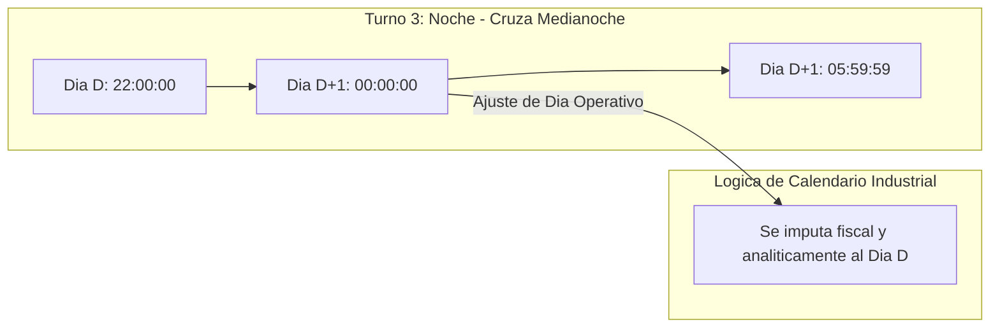

# Sesión 7

### 1. Repaso Inicial y Resolución de Dudas de la Sesión 6

#### Objetivos

* Consolidar el diseño de transacciones ACID compuestas y la prevención de fugas de conexiones JDBC mediante bloques `finally`.
* Revisar el desacoplamiento de componentes mediante Message Handlers y las buenas prácticas en Script Transforms de Perspective.

#### Contenidos

* Repaso de consultas sobre el ciclo de vida de transacciones (`beginTransaction`, `commit`, `rollback`, `closeTransaction`).
* Revisión de dudas sobre la invocación de `system.util.sendMessage` entre vistas y popups.
* Comprobación del estado del proveedor de tags de pruebas en el Designer.

#### Resultado esperado

* Fijación de los estándares transaccionales y de eventos, asegurando la base técnica para interactuar directamente con el motor de tags y variables de proceso.

***

### 2. Tema 16: Tags, Lectura/Escritura Masiva y Scripting Operativo en Planta

#### Objetivos

* Comprender la anatomía del dato industrial a través del objeto `QualifiedValue` (valor, calidad y marca temporal).
* Dominar las operaciones de lectura y escritura por lotes (_Batch Operations_) con `system.tag.readBlocking` y `writeBlocking`.
* Aplicar el principio de programación defensiva mediante la validación obligatoria del código de calidad (`QualityCode`) antes de procesar lógica de control.

#### Contenidos

* Estructura tridimensional del dato de tag:
  * `.value`: Valor de la variable en memoria.
  * `.quality`: Estado de comunicación e integridad (`quality.isGood()`, `Bad_NotFound`, `Bad_Stale`, `Uncertain`).
  * `.timestamp`: Marca temporal de adquisición del dato.
* Erradicación del anti-patrón de I/O en bucles:
  * Comparativa de rendimiento: Lecturas individuales dentro de bucles `for` (saturación de canales OPC-UA) frente a lectura atómica por lote con lista de rutas.
* Control y verificación de escrituras operativas:
  * Análisis de la lista de objetos `QualityCode` devuelta por `system.tag.writeBlocking`.
  * Diferenciación de tipos de tags: tags de proceso (OPC), memoria, calculados (Expression) y derivados.
* Sincronización entre tags y base de datos:
  * Patrones de disparo por evento para el volcado de valores de planta hacia tablas relacionales.

#### Resultado esperado

* Capacidad para interactuar con el motor de tags de Ignition de forma masiva y eficiente, validando sistemáticamente la calidad de los datos antes de ejecutar cálculos o acciones operativas.

***

### 3. Laboratorio 7.1: Servicio de Lectura y Escritura de Tags por Lote con Validación de Calidad

#### Objetivos

* Construir un servicio en `Project Library` (`project.tags.service`) que lea un conjunto de tags de una máquina en una sola llamada atómica, filtre variables con calidad no confiable y devuelva un diccionario normalizado.
* Implementar una función de escritura masiva segura que verifique que todos los valores fueron aceptados por el PLC, alertando si alguno fue rechazado por permisos o desconexión.

#### Resultado esperado

* Módulo creado en `Project Library` y verificado en la Script Console ante lotes de tags válidos y tags con errores forzados (rutas inexistentes o desconectadas), comprobando la entrega de datos limpios y el control de códigos de retorno de calidad.

***

### 4. Tema 17: Gestión de Fechas, Turnos Industriales y Ventanas Temporales

#### Objetivos

* Dominar la manipulación de objetos `java.util.Date`, timestamps Epoch (milisegundos) y formatos SQL en Jython.
* Resolver la problemática analítica del "Día Operativo" frente al "Día Natural" en turnos nocturnos que cruzan la medianoche.
* Diseñar consultas SQL filtradas por rangos temporales que aprovechen índices de base de datos sin degradar el rendimiento.

#### Contenidos

* Coexistencia de tipos temporales en Ignition:
  * Objetos `java.util.Date` como tipo estándar de intercambio en el motor de scripting.
  * Milisegundos Epoch (`long`) para cálculo de duraciones, tiempos de ciclo y microparadas.
  * Formatos de presentación visual (`system.date.format`) restringidos exclusivamente a la interfaz de usuario.
* El cálculo del Día Operativo y turnos nocturnos:
  * Definición de turnos industriales estándar (Mañana: 06:00-14:00, Tarde: 14:00-22:00, Noche: 22:00-06:00).
  * Lógica de ajuste para imputar la producción de las primeras horas de la madrugada (00:00 a 05:59) al día calendario en que inició el turno nocturno.
* Consultas temporales eficientes en base de datos:
  * Paso de objetos `Date` como _Value Parameters_ en Named Queries (`WHERE fecha BETWEEN :inicio AND :fin`).
  * Eliminación de conversiones a texto en las cláusulas `WHERE` para permitir el uso de índices temporales B-Tree.

#### Resultado esperado

* Dominio del manejo de marcas temporales y calendarios industriales, resolviendo cálculos de turnos continuos y consultas analíticas por rangos de fechas sin errores de zona horaria ni conversiones textuales frágiles.

***

### 5. Laboratorio 7.2: Motor de Turnos Industriales y Filtros Temporales SQL

#### Objetivos

* Construir un módulo en `Project Library` (`project.util.shifts`) capaz de determinar el identificador del turno actual, su nombre funcional y el día operativo correspondiente a partir de cualquier marca temporal.
* Calcular dinámicamente los objetos `Date` exactos de inicio y fin del turno para su uso directo como parámetros de filtrado en consultas de base de datos.

#### Resultado esperado

* Módulo de cálculo de turnos verificado en la Script Console ante múltiples marcas temporales (incluyendo horarios diurnos y casos límite de madrugada en turno de noche), comprobando la correcta delimitación de las ventanas temporales y la imputación del día operativo.

***

### 6. Test de Conceptos de la Sesión 7

#### Objetivos

* Evaluar la asimilación conceptual sobre la estructura del `QualifiedValue` y el impacto de lecturas individuales en bucles.
* Validar la comprensión de las reglas de cálculo de turnos nocturnos y la imputación del día operativo.
* Comprobar el entendimiento sobre el paso de objetos `Date` nativos a consultas SQL parametrizadas.

#### Contenidos

* Cuestionario técnico individual de opción múltiple y resolución de casos de gestión de tags y fechas.

#### Resultado esperado

* Fijación de los principios de optimización de I/O de tags y del tratamiento de calendarios industriales en sistemas SCADA.

***

### 7. Feedback Individual y Cierre de la Sesión

#### Objetivos

* Verificar en el entorno de cada alumno la correcta ejecución de los servicios de lectura/escritura de tags por lote.
* Comprobar los resultados del motor de turnos ante casos borde de cambio de día.
* Presentar la planificación de la Sesión 8.

#### Contenidos

* Rondas de revisión individual del código en `Project Library` y en la Script Console.
* Resolución de dudas sobre la gestión de códigos de calidad y formatos de fecha.
* Avance de la Sesión 8: Optimización avanzada de consultas SQL (índices compuestos, SARGability), optimización de scripts Jython, reducción de uso de CPU y patrones de caché en memoria de Gateway con TTL.

#### Resultado esperado

* Cada alumno finaliza la jornada con sus módulos de tags y turnos verificados, sin llamadas ineficientes en bucles y con la preparación técnica requerida para el módulo de optimización y rendimiento.
