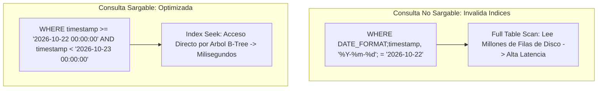
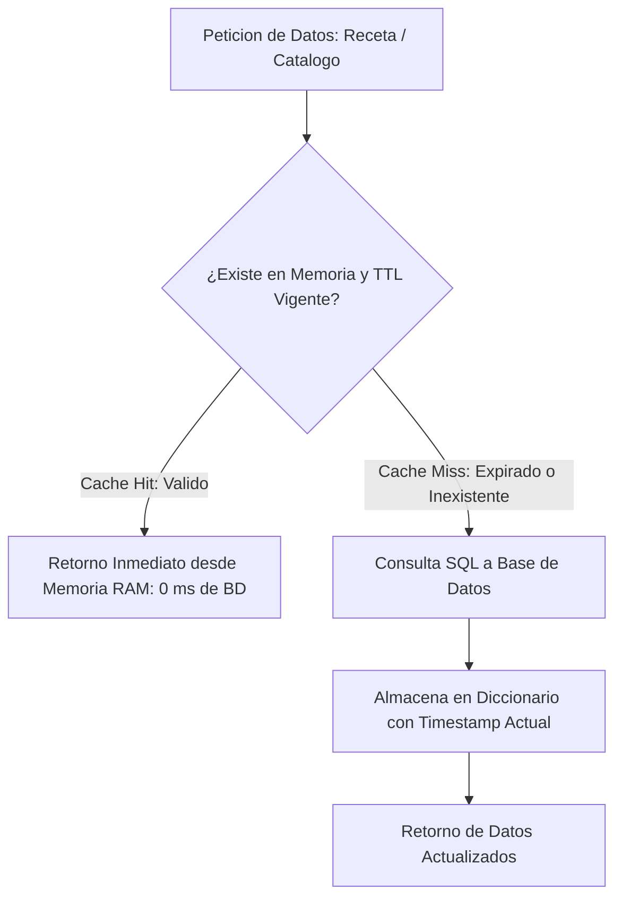

# Sesión 8

### 1. Repaso Inicial y Resolución de Dudas de la Sesión 7

#### Objetivos

* Consolidar el uso de operaciones masivas por lotes (_Batch Operations_) con `system.tag.readBlocking` y `writeBlocking`.
* Revisar la lógica de cálculo de calendarios industriales, días operativos y turnos nocturnos que cruzan la medianoche.

#### Contenidos

* Repaso de las consultas sobre la validación obligatoria de `QualityCode` en objetos `QualifiedValue`.
* Revisión de las dudas en la delimitación de ventanas temporales con objetos `java.util.Date` en Named Queries.
* Comprobación del correcto filtrado por rangos de fecha en las tablas del sandbox.

#### Resultado esperado

* Fijación de las directrices de acceso eficiente a tags y manejo de fechas, asegurando la base técnica para abordar la optimización de recursos y rendimiento del Gateway.

***

### 2. Tema 18: Optimización Avanzada de Consultas SQL Industriales

#### Objetivos

* Comprender el impacto en la memoria JVM y el pool JDBC derivado del uso indiscriminado de `SELECT *` y escaneos completos de tabla.
* Aplicar el principio de SARGability (_Search Argument Able_) en cláusulas `WHERE` para forzar el uso de índices B-Tree en la base de datos.
* Diseñar estrategias de indexación compuesta y separación de capas entre consultas transaccionales rápidas y consultas analíticas agregadas.

#### Contenidos

* Proyección controlada de columnas y reducción de carga de red:
  * Eliminación de `SELECT *` en tablas de telemetría y eventos industriales.
  * Selección estricta de las columnas necesarias para minimizar la serialización JDBC y el uso de memoria Heap.
* Consultas SARGables e indexación eficiente:
  * El problema de las funciones sobre columnas indexadas: cómo `WHERE DATE(fecha) = '...'` o `WHERE CAST(id AS VARCHAR) = '...'` invalidan los índices y fuerzan lecturas completas de disco (_Full Table Scan_).
  * Construcción de filtros sargables mediante comparaciones directas por rangos binarios (`col >= :inicio AND col < :fin`).
* Índices compuestos y ordenación:
  * Jerarquía de columnas en índices B-Tree (ej. índice compuesto `(machine_id, timestamp)` para acelerar consultas por equipo y ventana temporal).
* Separación de cargas transaccionales y analíticas:
  * Creación de tablas de agregación histórica precalculada (resúmenes diarios/turnos) para evitar consultar tablas transaccionales de millones de filas desde cuadros de mando en tiempo real.

#### Resultado esperado

* Capacidad para diagnosticar consultas lentas, reescribir filtros SQL garantizando el uso de índices y diseñar estructuras de datos optimizadas para reporting industrial.

***

### 3. Laboratorio 8.1: Refactorización y Benchmark de Consultas SQL Lentas

#### Objetivos

* Analizar y medir el tiempo de respuesta de una consulta histórica no optimizada (con `SELECT *` y funciones en la cláusula `WHERE`) en la Script Console.
* Refactorizar la consulta bajo criterios sargables con proyección explícita, ejecutando una comparativa de rendimiento (_Benchmarking_) mediante medición de tiempos en milisegundos.

#### Resultado esperado

* Script de evaluación en la Script Console que ejecuta ambas versiones de la consulta sobre la base de datos sandbox y emite un informe comparativo detallando el tiempo medio, mínimo y máximo de respuesta, evidenciando la reducción de latencia en la versión optimizada.

***

### 4. Tema 19: Optimización y Rendimiento de Scripts Jython en Ignition

#### Objetivos

* Detectar "puntos calientes" (_Hotspots_) de ejecución excesiva en bindings, Script Transforms y eventos reactivos.
* Eliminar conversiones redundantes de tipos en bucles para reducir la presión sobre el recolector de basura de la JVM (_Garbage Collector_).
* Implementar patrones de caché en memoria de Gateway con tiempo de expiración (TTL) para datos de baja volatilidad.

#### Contenidos

* Detección y mitigación de scripts sobrecargados:
  * Identificación de bindings de alta frecuencia que ejecutan scripts en cada refresco de tag.
  * Delegación de lógica pesada hacia el Gateway o la base de datos para no penalizar la sesión web de Perspective.
* Optimización de bucles e iteraciones:
  * Eliminación de transformaciones encadenadas innecesarias (`Dataset -> PyDataSet -> Dict -> Dataset`) dentro de bucles cerrados.
  * Uso de `PyDataSet` para lecturas directas sin creación de nuevos objetos en el Heap.
* Medición precisa de rendimiento en Jython:
  * Uso de `java.lang.System.nanoTime()` y `System.currentTimeMillis()` para perfilar tiempos reales de ejecución de funciones.
* Patrón de Caché en Memoria del Gateway con TTL (_Time-To-Live_):
  * Almacenamiento en memoria RAM de catálogos maestros, listas de recetas y tablas de configuración.
  * Reducción drástica de peticiones repetitivas a la base de datos SQL.

#### Resultado esperado

* Dominio de las técnicas de perfilado de scripts, eliminación de redundancias de memoria y diseño de sistemas de caché en el Gateway para maximizar la velocidad de respuesta del sistema SCADA.

***

### 5. Laboratorio 8.2: Gestor de Caché Genérico con TTL en Memoria de Gateway

#### Objetivos

* Construir un módulo en `Project Library` (`project.util.cache`) que implemente un almacén de caché en memoria con expiración por TTL parametrizable.
* Validar el gestor desde la Script Console comprobando que la primera llamada consulta el origen de datos y las llamadas sucesivas se resuelven instantáneamente desde la memoria RAM mientras el dato esté vigente.

#### Resultado esperado

* Módulo de caché operativo que intercepta llamadas a funciones pesadas, sirviendo respuestas inmediatas desde memoria durante el periodo de TTL y refrescando automáticamente los datos desde la base de datos una vez expirado el tiempo de vida.

***

### 6. Test de Conceptos de la Sesión 8

#### Objetivos

* Validar la asimilación conceptual sobre SARGability y el impacto de funciones en cláusulas `WHERE`.
* Evaluar el entendimiento sobre el ciclo de vida de la memoria en la JVM y el coste de las conversiones repetidas de datasets.
* Comprobar el criterio de aplicación del patrón de caché con TTL en entornos industriales.

#### Contenidos

* Cuestionario técnico individual de opción múltiple y resolución de casos de optimización de código y bases de datos.

#### Resultado esperado

* Comprobación del dominio de las técnicas de optimización de consultas SQL y de scripts Jython en el Gateway.

***

### 7. Feedback Individual y Cierre de la Sesión

#### Objetivos

* Revisar los resultados de los benchmarks de consultas SQL ejecutados por los alumnos en la Script Console.
* Comprobar la correcta implementación del módulo de caché y el manejo de tiempos de expiración.
* Presentar la planificación de la Sesión 9 (sesión intensiva de 5 horas).

#### Contenidos

* Rondas de revisión individual del código de optimización y de los módulos de caché.
* Entrega de la _Checklist de Rendimiento_ para auditoría de scripts previos al despliegue.
* Avance de la Sesión 9: Procesamiento asíncrono (`system.util.invokeAsynchronous`), seguridad avanzada y RBAC, integración con APIs REST (`system.net.httpClient`), microservicios FastAPI y metodología de refactorización de código heredado (_Legacy_).

#### Resultado esperado

* Cada alumno finaliza la sesión con sus módulos de caché operativos, benchmarks completados y comprensión de los criterios de rendimiento que se aplicarán en arquitecturas asíncronas y microservicios.
