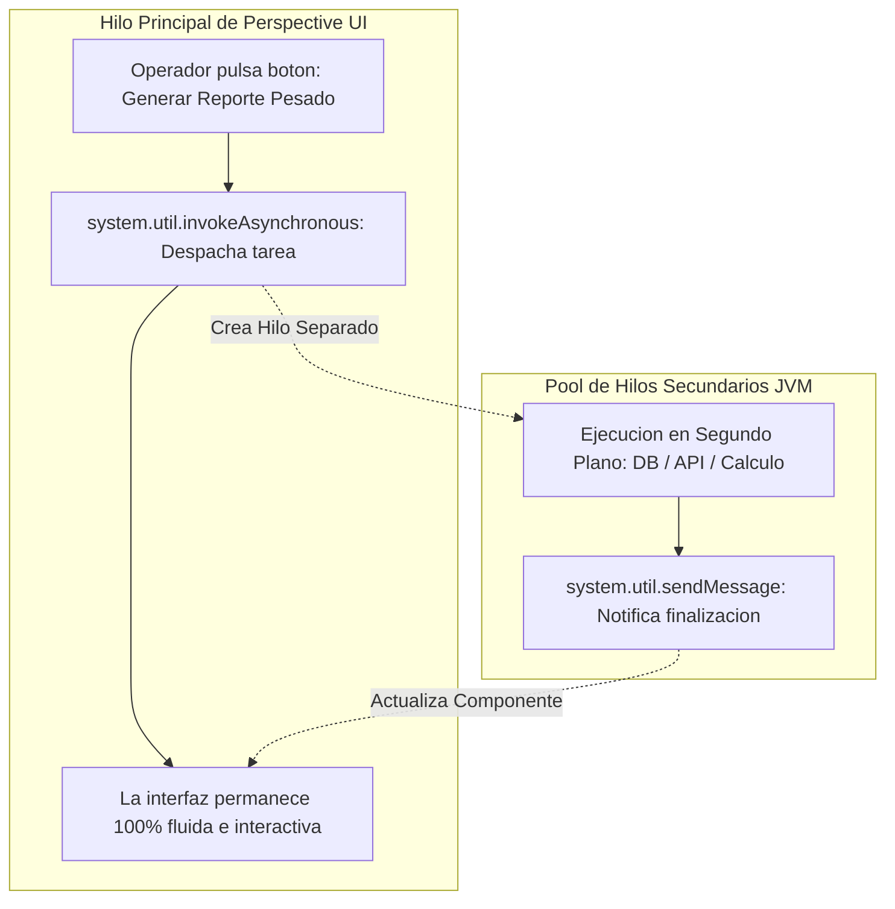
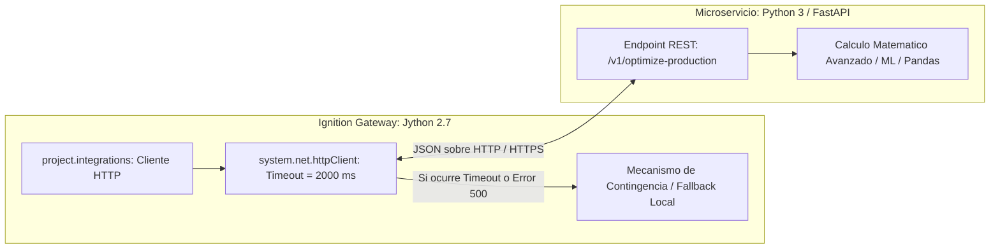

# Sesión 9

### 1. Repaso Inicial y Resolución de Dudas de la Sesión 8

#### Objetivos

* Consolidar los conceptos de optimización de consultas SQL sargables e indexación B-Tree en tablas de telemetría industrial.
* Revisar la implementación del gestor de caché en memoria de Gateway con control de tiempo de vida (TTL).

#### Contenidos

* Repaso de las consultas sobre la reescritura de filtros temporales sin aplicar funciones sobre columnas indexadas.
* Revisión de los resultados de benchmarking y reducción de tiempos de CPU en la JVM.
* Comprobación del uso de la _Checklist de Rendimiento_ en los módulos de `Project Library`.

#### Resultado esperado

* Fijación de las directrices de alto rendimiento en base de datos y memoria, base técnica requerida para abordar tareas asíncronas e integraciones con servicios externos.

***

### 2. Tema 20: Procesamiento Asíncrono, Tareas Programadas e Idempotencia

#### Objetivos

* Comprender la diferencia entre la ejecución síncrona en hilos de interfaz de usuario y la ejecución en segundo plano (_Background Threads_).
* Dominar el uso de `system.util.invokeAsynchronous` para evitar el congelamiento de pantallas (_UI Freezing_) durante operaciones de larga duración.
* Diseñar tareas automáticas programadas en el Gateway bajo el principio de **idempotencia** y control de fallos desatendidos.

#### Contenidos

* Prevención del bloqueo de la interfaz de usuario:
  * El problema de las llamadas bloqueantes (consultas SQL pesadas, generación de informes, peticiones web) en el hilo principal de la UI.
  * Delegación de tareas a hilos secundarios con `system.util.invokeAsynchronous(funcion_objetivo)`.
* Notificación asíncrona hacia la interfaz:
  * Comunicación de fin de tarea hacia Perspective mediante Message Handlers (`system.util.sendMessage`) sin bloquear la interactividad del operador.
* Automatizaciones desatendidas en Gateway:
  * Programación temporal basada en el motor Quartz CRON para procesos de cambio de turno o mantenimiento de datos.
  * Registro de inicio, fin, duración y excepciones en tareas automáticas sin interacción humana.
* El principio de Idempotencia en procesos de planta:
  * Diseño de scripts capaces de ejecutarse múltiples veces consecutivas sin duplicar registros en base de datos, descontar stock por duplicado ni romper estados de máquina (uso de comprobaciones previas y sentencias `UPSERT` / `MERGE`).

#### Resultado esperado

* Capacidad para ejecutar procesos pesados en segundo plano sin congelar la pantalla del operador y diseñar tareas programadas de Gateway que se ejecuten de forma segura e idempotente.

***

### 3. Tema 21: Seguridad en Scripting, Validación RBAC en Servidor y Protección de Secretos

#### Objetivos

* Comprender el principio de defensa en profundidad aplicado al scripting SCADA, distinguiendo la seguridad en interfaz de la seguridad en servidor.
* Implementar control de acceso basado en roles (_Role-Based Access Control - RBAC_) directamente en la capa de lógica de negocio en Gateway.
* Aplicar directrices para la protección de credenciales y la sanitización de trazas de error hacia el usuario final.

#### Contenidos

* Seguridad en Backend (Servidor) vs. Seguridad en Frontend (UI):
  * La vulnerabilidad de depender únicamente de la propiedad `enabled` o `visible` en botones de pantalla.
  * Validación obligatoria de roles y permisos en el script de ejecución en Gateway (`session.props.auth.user.roles`).
* Prevención de fuga de credenciales e información sensible:
  * Prohibición absoluta de almacenar contraseñas, tokens de API o cadenas de conexión en texto plano dentro de scripts.
  * Uso de conexiones administradas de Gateway, variables de entorno y almacenes seguros.
* Sanitización de mensajes de error:
  * Separación estricta entre la traza técnica completa (registrada internamente con `system.util.getLogger`) y el mensaje mostrado al operador (mensaje funcional que no expone nombres de tablas, direcciones IP ni volcados de pila).

#### Resultado esperado

* Dominio del diseño de funciones protegidas mediante validación de roles en servidor y eliminación de credenciales expuestas en el código fuente.

***

### 4. Tema 22: Integración con APIs REST Externas y Microservicios

#### Objetivos

* Dominar la comunicación HTTP/REST desde Ignition utilizando la utilidad nativa `system.net.httpClient`.
* Comprender la arquitectura híbrida SCADA + Microservicios para desacoplar cálculos analíticos complejos (Python 3 / FastAPI) de la JVM de Ignition.
* Diseñar clientes REST industriales resilientes con timeouts estrictos, gestión de cabeceras de autenticación y mecanismos de respuesta de contingencia (_Fallback_).

#### Contenidos

* El cliente HTTP moderno de Ignition: `system.net.httpClient`:
  * Configuración de peticiones GET, POST, PUT, DELETE con parámetros, cabeceras (`Authorization: Bearer <token>`) y decodificación automática de JSON.
  * Configuración de timeouts cortos (1.000 a 3.000 ms) para impedir que caídas de servicios externos retengan hilos en el Gateway.
* Arquitectura Híbrida: Cuándo delegar a Microservicios externos:
  * Cuando un cálculo requiere librerías no soportadas por Jython 2.7 (NumPy, Pandas, modelos de IA/Machine Learning en Python 3, algoritmos de optimización pesados).
  * Creación de APIs internas en **FastAPI (Python 3)** consumidas por Ignition vía HTTP REST.
* Resiliencia y mecanismos de Fallback:
  * Manejo estructurado de fallos de red y códigos de estado HTTP anómalos (4xx, 5xx), entregando valores de contingencia seguros para que la planta continúe operando.

#### Resultado esperado

* Capacidad para integrar Ignition con servicios web y APIs REST empresariales de forma robusta, aplicando timeouts defensivos y arquitecturas híbridas con microservicios externos.

***

### 5. Laboratorio 9.1: Cliente REST Asíncrono con Timeout y Fallback Resiliente

#### Objetivos

* Construir un módulo en `Project Library` (`project.integrations.energy`) que consuma una API REST externa de tarificación eléctrica mediante `system.net.httpClient`.
* Parametrizar cabeceras seguras, timeouts estrictos y un mecanismo de respuesta de fallback que devuelva una tarifa predeterminada si la API externa no responde o arroja errores de conexión.

#### Resultado esperado

* Servicio probado en la Script Console ante respuestas nominales simuladas y ante escenarios de caída de red / timeout, verificando la entrega de datos reales en condiciones normales y del objeto de contingencia con registro de advertencia en el log del Gateway ante fallos.

***

### 6. Laboratorio 9.2: Control de Acceso Basado en Roles (RBAC) y Auditoría en Servidor

#### Objetivos

* Crear un servicio de seguridad en `Project Library` (`project.security.core`) que valide si los roles del usuario autenticado cumplen los privilegios necesarios antes de ejecutar una acción crítica de planta.
* Registrar en el log del Gateway cualquier intento de ejecución no autorizada y emitir trazas de auditoría funcionales.

#### Resultado esperado

* Función modular verificada en consola simulando llamadas con usuarios operadores (rol básico, denegado con advertencia de seguridad) y supervisores (rol autorizado, ejecución completada y auditada).

***

### 7. Tema 23: Metodología de Refactorización de Scripts Heredados (Legacy)

#### Objetivos

* Identificar síntomas de código degradado (_Code Smells_) habituales en proyectos SCADA antiguos.
* Aplicar una metodología secuencial de refactorización para transformar scripts monolíticos e inseguros en código modular y mantenible.
* Diseñar pruebas de no-regresión para garantizar que los cambios estructurales conservan exactamente el comportamiento funcional requerido por la planta.

#### Contenidos

* Diagnóstico de "Code Smells" en aplicaciones SCADA:
  * Consultas SQL dinámicas concatenadas en texto plano.
  * Scripts de decenas de líneas incrustados en botones y componentes gráficos.
  * Bucles `for` que ejecutan llamadas unitarias a `system.tag.readBlocking`.
  * Ausencia de validación de tipos, nulos o captura de excepciones.
* Flujo de refactorización en 5 pasos:
  1. Caracterización: Mapear entradas, salidas y casos límite del script original.
  2. Banco de Pruebas: Crear casos de prueba de referencia en la Script Console.
  3. Extracción: Mover la lógica matemática a funciones puras en `Project Library`.
  4. Sustitución de I/O: Reemplazar SQL inseguro por Named Queries y lecturas de tags por llamadas masivas en lote.
  5. Verificación de No-Regresión: Ejecutar la batería de pruebas para comprobar que los resultados son idénticos a los del sistema original.

#### Resultado esperado

* Dominio de la metodología de modernización de código heredado, transformando scripts frágiles en componentes modulares, testeables y seguros.

***

### 8. Laboratorio 9.3: Taller de Refactorización Integral de Código Heredado

#### Objetivos

* Analizar un script industrial monolítico real con múltiples anti-patrones (SQL concatenado, lecturas de tags individuales en bucle, cálculos de UI mezclados con I/O y variables ambiguas).
* Refactorizar el código separando la lógica en una función pura de cálculo y una función orquestadora con lecturas por lote, Named Queries y captura dual de excepciones.

#### Resultado esperado

* Script heredado completamente transformado en un módulo limpio en `Project Library` (`project.line1.analytics`), validado mediante la Script Console ante un vector de pruebas que certifica la equivalencia matemática de los resultados y la erradicación de vulnerabilidades de seguridad y rendimiento.

***

### 9. Test de Conceptos de la Sesión 9

#### Objetivos

* Evaluar la comprensión sobre el procesamiento asíncrono y el principio de idempotencia en tareas de Gateway.
* Validar el entendimiento de la seguridad RBAC en backend frente a frontend.
* Comprobar el dominio sobre el consumo de APIs REST con `system.net.httpClient` y la metodología de refactorización de código heredado.

#### Contenidos

* Cuestionario técnico individual de opción múltiple y resolución de casos de arquitectura asíncrona, seguridad y refactorización.

#### Resultado esperado

* Fijación de los principios de diseño asíncrono, ciberseguridad industrial y modernización de código en Ignition SCADA.

***

### 10. Feedback Individual y Cierre de la Sesión

#### Objetivos

* Revisar las soluciones de refactorización implementadas por los alumnos en el Laboratorio 9.3.
* Verificar el correcto funcionamiento de los clientes REST y el control de roles RBAC.
* Presentar la planificación de la Sesión 10.

#### Contenidos

* Rondas de revisión individual del código refactorizado y validación de estándares de diseño.
* Resolución de dudas sobre integración con microservicios externos y gestión de timeouts.
* Avance de la Sesión 10: Testing funcional formal de scripts y consultas, estándares de estilo y documentación de equipo, y presentación del enunciado del Proyecto Final Integrador (Tema 26).

#### Resultado esperado

* Cada participante finaliza la sesión intensiva con sus laboratorios validados, su ejercicio de refactorización completado y la preparación técnica requerida para abordar las fases de testing formal y desarrollo del proyecto final.
