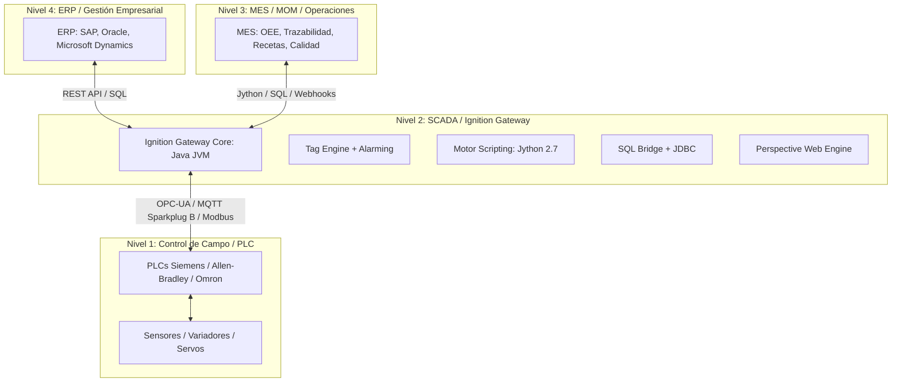
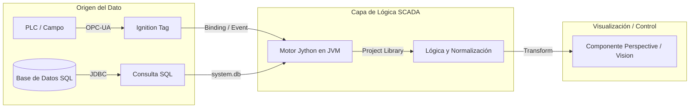
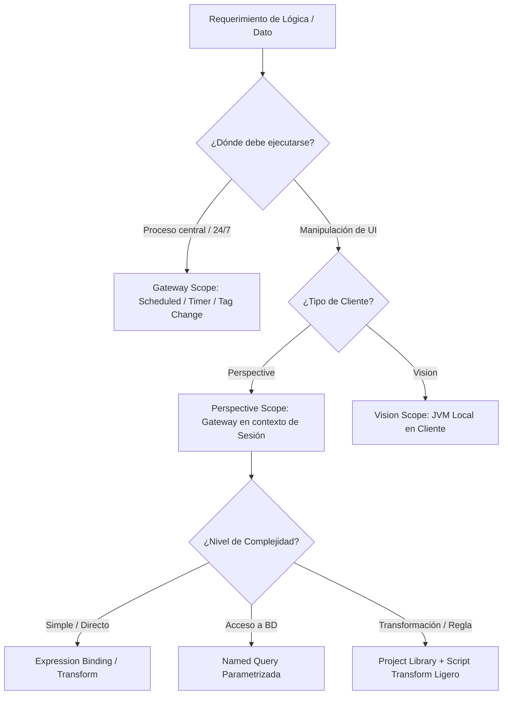

# Sesión 1

### Presentación del Curso y Validación del Entorno

#### Objetivos

* Exponer la metodología de trabajo, los criterios de diseño y las normas de seguridad del curso.
* Verificar la conectividad de todos los alumnos al Designer, base de datos sandbox y herramientas de soporte.

#### Contenidos

* Metodología de desarrollo guiado y buenas prácticas en scripting industrial.
* Directrices de seguridad en entornos de control: aislamiento del sandbox frente a redes de producción.
* Comprobación de acceso a Ignition Designer y base de datos relacional de pruebas.

#### Resultado esperado

* Todos los participantes disponen de acceso verificado al Designer y a la base de datos de pruebas sin bloqueos de red o credenciales.

***

### Tema 0: Contexto Industrial: El Ecosistema SCADA, Ignition y Jython

#### Objetivos

* Contextualizar a Ignition dentro de la pirámide de automatización (Modelo Purdue / ISA-95).
* Comprender la arquitectura centralizada del Gateway sobre la Máquina Virtual de Java (JVM).
* Asimilar el rol de Jython 2.7 como motor de scripting y sus implicaciones operativas.

#### Contenidos

* **El SCADA en la pirámide ISA-95:** rol de Ignition como hub transversal de convergencia IT/OT entre campo (N1/PLCs), operaciones (N3/MES) y gestión (N4/ERP).
* **Arquitectura interna del Gateway:** entorno centralizado sobre JVM, Tag Engine en memoria RAM y gestión multihilo (_thread pools_ para OPC, JDBC y UI).
* **Fundamentos de Jython:** ejecución sobre Java bytecode, integración nativa con APIs de Java e Ignition, y particularidades del runtime 2.7.



#### Resultado esperado

Comprensión del flujo global del dato entre PLC, Gateway JVM, bases de datos y visualización, asimilando el papel de Jython como orquestador del ecosistema.

***

### 2. Tema 1: Introducción al Scripting en Ignition - Del Dato de Planta al Script Útil

#### Objetivos

* Comprender el ciclo de vida del dato industrial desde su adquisición en campo hasta su presentación al usuario.
* Identificar los puntos exactos donde el scripting aporta valor frente a configuraciones nativas.
* Diferenciar las responsabilidades de SQL, Jython y los componentes de visualización.

#### Contenidos

* Recorrido de una variable operativa: Tag OPC-UA / Registro SQL -> Motor de procesamiento -> Vista de usuario.
* Identificación de puntos de inserción de scripts: Bindings, Script Transforms, Eventos y Tareas de Gateway.
* Separación de responsabilidades: cuándo procesar en base de datos, en motor SCADA o en interfaz.
* Criterios técnicos de legibilidad, mantenibilidad y rendimiento en código de planta.



#### Resultado esperado

* Capacidad para trazar el flujo completo de una variable de proceso y seleccionar el mecanismo de scripting adecuado según el requerimiento funcional.

***

### 3. Laboratorio 1.1: Trazabilidad y Normalización de Telemetría de Planta

#### Objetivos

* Construir una función de normalización que valide la calidad y límites físicos de una lectura de velocidad de cinta transportadora.
* Transformar unidades de ingeniería brutas (m/min a m/s) y clasificar el estado operativo con código de color dinámico.

#### Resultado esperado

* Función validada en consola que recibe valor crudo y estado de calidad, devolviendo una estructura normalizada con valor en m/s, estado textual ('RUNNING', 'SLOW', 'STOPPED', 'OUT\_OF\_RANGE', 'SENSOR\_ERROR') y código de color hexadecimal.

#### Paso a Paso para la Realización

**Paso 1: Apertura de la Script Console**

1. Abrir **Ignition Designer**.
2. En el menú superior, seleccionar **Tools -> Script Console**.
3. Asegurarse de que el área interactiva esté limpia.

**Paso 2: Implementación de la Función de Normalización**

Copiar y pegar el siguiente código en el panel superior de la Script Console:

```python
def normalize_conveyor_telemetry(raw_value, quality_code):
    """
    Valida y normaliza la telemetria de velocidad de una cinta transportadora.
    
    Args:
        raw_value (float|int|None): Lectura bruta en metros/minuto.
        quality_code (str): Codigo de calidad del tag ('Good', 'Bad_NotFound', etc.).
        
    Returns:
        dict: Estructura normalizada con valor en m/s, estado y color de interfaz.
    """
    # 1. Validacion defensiva de calidad de origen
    if quality_code is None or str(quality_code).upper() != "GOOD":
        return {
            "value_ms": 0.0,
            "status": "SENSOR_ERROR",
            "color": "#e74c3c", # Rojo
            "is_valid": False
        }
    
    # 2. Validacion de tipo y rango fisico del instrumento (0 a 120 m/min)
    if raw_value is None or raw_value < 0.0 or raw_value > 120.0:
        return {
            "value_ms": 0.0,
            "status": "OUT_OF_RANGE",
            "color": "#f39c12", # Ambar
            "is_valid": False
        }
    
    # 3. Conversion de unidades de ingenieria (m/min a m/s)
    # Division forzada a punto flotante compatible con Jython 2.7
    speed_ms = round(float(raw_value) / 60.0, 2)
    
    # 4. Clasificacion de estado operativo
    if speed_ms == 0.0:
        status_text = "STOPPED"
        status_color = "#95a5a6" # Gris
    elif speed_ms < 0.8:
        status_text = "SLOW"
        status_color = "#3498db" # Azul
    else:
        status_text = "RUNNING"
        status_color = "#2ecc71" # Verde
        
    return {
        "value_ms": speed_ms,
        "status": status_text,
        "color": status_color,
        "is_valid": True
    }
```

**Paso 3: Definición del Vector de Pruebas**

Añadir a continuación el código de ejecución con casos representativos de planta (caso nominal, máquina parada, sensor desconectado y desbordamiento de rango):

```python
# Bateria de casos de prueba
test_cases = [
    {"name": "Velocidad Nominal (75 m/min)",   "raw": 75.0,  "quality": "Good"},
    {"name": "Cinta Parada (0 m/min)",         "raw": 0.0,   "quality": "Good"},
    {"name": "Velocidad Lenta (30 m/min)",      "raw": 30.0,  "quality": "Good"},
    {"name": "Fallo de Comunicacion Tag",      "raw": None,  "quality": "Bad_NotFound"},
    {"name": "Valor Fuera de Escala (150 m/min)","raw": 150.0, "quality": "Good"},
    {"name": "Lectura Negativa Ruido (-5 m/min)", "raw": -5.0,  "quality": "Good"}
]

print "=== RESULTADOS LABORATORIO 1.1 ==="
for test in test_cases:
    resultado = normalize_conveyor_telemetry(test["raw"], test["quality"])
    print "Caso: {:<30} -> m/s: {:<5} | Estado: {:<12} | Color: {:<8} | Valido: {}".format(
        test["name"],
        resultado["value_ms"],
        resultado["status"],
        resultado["color"],
        resultado["is_valid"]
    )
```

***

### 4. Tema 2: Analizando y Estructurando Tipos de Scripts en Ignition

#### Objetivos

* Comprender la arquitectura de Scopes de ejecución en Ignition y sus limitaciones técnicas.
* Establecer un criterio de decisión para elegir entre Expression Bindings, Script Transforms, Named Queries y funciones de librería.
* Prevenir la degradación de rendimiento por sobrecarga de lógica en componentes de interfaz.

#### Contenidos

* Matriz de Scopes de Ejecución:
  * Gateway Scope (Servidor, desatendido, 24/7).
  * Perspective Session Scope (Gateway con contexto de sesión web).
  * Vision Client Scope (JVM local en equipo cliente Swing).
* Tipos de disparadores: scripts por evento, scripts cíclicos, scripts bajo demanda.
* Matriz de decisión técnica:
  * Expression Binding para operaciones lógicas y matemáticas simples.
  * Named Queries para acceso estructurado a datos.
  * Script Transforms para adaptación de estructuras JSON/Datasets.
  * Project Library para centralización de lógica de negocio.
* Regla arquitectónica contra la dispersión: evitar código embebido en eventos de componentes.



#### Resultado esperado

* Identificación precisa del scope de ejecución de cualquier script en el proyecto y correcta selección del recurso para cada lógica.

***

### 5. Tema 3: Python, Jython e Ignition - Parecidos, Diferencias y Límites

#### Objetivos

* Asimilar las particularidades de Jython 2.7 sobre la JVM frente a entornos CPython modernos (Python 3.x).
* Identificar incompatibilidades sintácticas para evitar errores comunes de migración.
* Aprovechar la interoperabilidad directa con el ecosistema de clases nativas de Java.

#### Contenidos

* Arquitectura de Jython 2.7: ejecución de código Python compilado a bytecode de Java.
* Diferencias críticas respecto a Python 3.x:
  * Sentencia `print` frente a función `print()`.
  * Tipado de texto: cadenas de bytes (`str`) vs. cadenas Unicode (`unicode`).
  * División por defecto: comportamiento de división entera en enteros (`5 / 2 = 2`).
  * Ausencia de f-strings, type hints, async/await y librerías C-extension (NumPy nativo, Pandas C).
* Interoperabilidad con Java: importación de paquetes `java.lang`, `java.util`, `java.text`.
* Uso del módulo nativo `system.*` de Ignition.

#### Resultado esperado

* Capacidad para escribir código Jython 2.7 sintácticamente válido, libre de patrones incompatibles de Python 3 y con capacidad de invocar utilidades estándar de la JVM.

***

### 6. Laboratorio 1.2: Adaptación a Jython 2.7 e Interoperabilidad con Clases Java

#### Objetivos

* Implementar un formateador de duraciones y marcas de tiempo utilizando clases nativas de Java (`java.text.SimpleDateFormat`, `java.util.Date`) desde la Script Console.
* Gestionar codificación Unicode y sustitución de formateo tradicional compatible con Jython 2.7.

#### Resultado esperado

* Script verificado en la Script Console que procesa marcas temporales en milisegundos y devuelve resúmenes en formato Unicode (`u"Parada de Xh Ym registrada el DD/MM/YYYY..."`) consumiendo clases Java.

#### Paso a Paso para la Realización

**Paso 1: Preparación en la Script Console**

1. En la **Script Console**, limpiar el contenido del editor superior.

**Paso 2: Implementación con Clases Java y Unicode**

Copiar y pegar el siguiente código en la consola:

```python
from java.text import SimpleDateFormat
from java.util import Date

def format_industrial_event(timestamp_ms, duration_seconds, equipment_name, description):
    """
    Formatea un evento de planta combinando clases Java y Jython 2.7 Unicode.
    
    Args:
        timestamp_ms (long|int|None): Marca temporal Epoch en milisegundos.
        duration_seconds (float|int|None): Duracion total del evento en segundos.
        equipment_name (str|unicode): Identificador del equipo (ej. 'EDAR_BOMBA_01').
        description (str|unicode): Descripcion del evento con posibles caracteres especiales.
        
    Returns:
        unicode: Texto descriptivo formateado y seguro contra errores de decodificacion.
    """
    # 1. Validacion de entradas nulas
    if timestamp_ms is None or duration_seconds is None:
        return u"Dades de l'esdeveniment no disponibles (Valors Nuls)"
        
    # 2. Uso de clase nativa Java para formatear la fecha
    event_date = Date(long(timestamp_ms))
    date_formatter = SimpleDateFormat("dd/MM/yyyy 'a les' HH:mm:ss")
    formatted_date = date_formatter.format(event_date)
    
    # 3. Calculo de horas, minutos y segundos (division entera defensiva)
    total_sec = int(duration_seconds)
    hours = total_sec // 3600
    minutes = (total_sec % 3600) // 60
    seconds = total_sec % 60
    
    # 4. Construccion de cadena Unicode (.format compatible con Jython 2.7)
    # Se evita el uso de f-strings (inexistentes en Python 2.7)
    summary_text = u"Equip: {} | Event: {} | Durada: {}h {}m {}s | Registrat: {}".format(
        unicode(equipment_name),
        unicode(description),
        hours,
        minutes,
        seconds,
        unicode(formatted_date)
    )
    
    return summary_text
```

**Paso 3: Casos de Prueba con Datos Reales del Sandbox**

Añadir las pruebas ejecutando la función con marcas de tiempo actuales y equipos de la base de datos `SANDBOX_DB`:

```python
# Obtener timestamp actual en milisegundos desde Java
now_epoch = Date().getTime()

# Caso 1: Evento de parada en Bomba 1 con caracteres especiales
e1 = format_industrial_event(
    timestamp_ms=now_epoch,
    duration_seconds=3725, # 1h 2m 5s
    equipment_name="EDAR_BOMBA_01",
    description=u"Fallo confirmación marcha (Sobrecàrrega tèrmica relé)"
)

# Caso 2: Microparada en Compresor 2
e2 = format_industrial_event(
    timestamp_ms=now_epoch - 7200000, # Hace 2 horas
    duration_seconds=45,
    equipment_name="EDAR_COMPRESOR_02",
    description=u"Aturada per alta pressió d'oli"
)

# Caso 3: Entrada con datos incompletos
e3 = format_industrial_event(
    timestamp_ms=None,
    duration_seconds=120,
    equipment_name="DECANTADOR_01",
    description=u"Revisió preventiva"
)

print "=== RESULTADOS LABORATORIO 1.2 ==="
print e1
print e2
print e3
```

***

### 7. Tema 4: Fundamentos de Lenguaje Aplicados a Casos SCADA

#### Objetivos

* Dominar la manipulación de tipos de datos, estructuras de control y acumuladores en contextos operativos.
* Implementar un tratamiento defensivo ante valores ausentes, nulos (`None`) o lecturas erróneas.
* Construir funciones puras con firmas claras y documentación estandarizada.

#### Contenidos

* Declaración y tipado de variables operativas: contadores, tiempos de ciclo, estados y límites.
* Manejo de valores nulos (`None`), cadenas vacías y conversiones seguras de tipo (`int`, `float`, `str`).
* Estructuras condicionales (`if/elif/else`) para validación de enclavamientos y rangos.
* Bucles `for` y `while`: reglas de uso prudente para evitar bloqueos de hilos en la JVM.
* Acumuladores industriales: conteos, sumatorios de producción, cálculo de medias y detección de extremos (mínimos/máximos).

#### Resultado esperado

* Dominio de la sintaxis base y diseño de algoritmos de cálculo industrial con control estricto de tipos y nulos.

***

### 8. Tema 5 (Parte 1): Estructuras de Datos - Listas, Diccionarios, Datasets y PyDataSets

#### Objetivos

* Diferenciar las estructuras nativas de Python (`list`, `dict`) de las estructuras tabulares de Ignition (`Dataset`, `PyDataSet`).
* Comprender la inmutabilidad de los objetos `Dataset` y el funcionamiento de las funciones de manipulación tabular.
* Iterar datasets de forma eficiente mediante `PyDataSet` extrayendo columnas por nombre o índice.

#### Contenidos

* Tipos de datos estructurados:
  * Listas y diccionarios como base para objetos dinámicos y estructuras JSON en Perspective.
  * `BasicDataset` (Java): estructura tabular inmutable de alto rendimiento.
  * `PyDataSet`: capa de adaptación en Jython (`system.dataset.toPyDataSet`) para iteraciones seguras.
* Inmutabilidad del `Dataset`: comprensión de por qué funciones como `system.dataset.addRow` retornan una nueva instancia en lugar de mutar el origen.
* Patrones de recorrido fila por fila y agregación de métricas.

#### Resultado esperado

* Comprensión operativa de la inmutabilidad de los Datasets de Ignition y capacidad para transformar y consultar datos tabulares con `PyDataSet`.

***

### 9. Laboratorio 1.3: Manipulación e Inmutabilidad de Datasets vs. PyDataSets

#### Objetivos

* Procesar un `Dataset` de telemetría de producción de varias máquinas.
* Iterar sobre la estructura utilizando `PyDataSet` para agregar piezas conformes, scrap y calcular la tasa porcentual de rechazo por máquina.
* Reconstruir un nuevo `Dataset` inmutable con los resultados agregados apto para alimentar una tabla de visualización.

#### Resultado esperado

* Algoritmo probado en la Script Console que recibe un `Dataset` tabular con múltiples lotes por máquina y genera un nuevo `Dataset` con cabeceras `["Machine", "Good Units", "Scrap Units", "Scrap Rate (%)"]` y filas consolidadas.

#### Paso a Paso para la Realización

**Paso 1: Preparación en la Script Console**

1. En la **Script Console**, limpiar el editor superior.

**Paso 2: Implementación del Algoritmo de Agregación Tabular**

Copiar y pegar el siguiente código:

```python
def aggregate_machine_production(raw_dataset):
    """
    Agrupa produccion por maquina y calcula metricas de calidad y scrap.
    
    Args:
        raw_dataset (Dataset): Dataset original inmutable de Ignition.
        
    Returns:
        Dataset: Nuevo Dataset de Ignition con los totales agregados.
    """
    if raw_dataset is None or raw_dataset.getRowCount() == 0:
        out_headers = ["Equip", "Bones", "Scrap", "Total", "Taxa_Rebuig_Pct"]
        return system.dataset.toDataSet(out_headers, [])
        
    # 1. Conversion a PyDataSet para iteracion segura por nombre de columna
    pyds = system.dataset.toPyDataSet(raw_dataset)
    
    # 2. Diccionario acumulador en memoria
    summary = {}
    
    for row in pyds:
        equip = row["equip"]
        good_qty = row["good_units"] if row["good_units"] is not None else 0
        scrap_qty = row["scrap_units"] if row["scrap_units"] is not None else 0
        
        if equip not in summary:
            summary[equip] = {"good": 0, "scrap": 0}
            
        summary[equip]["good"] += good_qty
        summary[equip]["scrap"] += scrap_qty
        
    # 3. Construccion de filas para el nuevo Dataset inmutable
    out_headers = ["Equip", "Bones", "Scrap", "Total", "Taxa_Rebuig_Pct"]
    out_rows = []
    
    # Iteracion ordenada por nombre de equipo
    for equip in sorted(summary.keys()):
        total_good = summary[equip]["good"]
        total_scrap = summary[equip]["scrap"]
        total_produced = total_good + total_scrap
        
        # Calculo defensivo de porcentaje de rechazo (evitando division por cero)
        if total_produced > 0:
            scrap_rate = (float(total_scrap) / float(total_produced)) * 100.0
        else:
            scrap_rate = 0.0
            
        out_rows.append([
            equip,
            total_good,
            total_scrap,
            total_produced,
            round(scrap_rate, 2)
        ])
        
    # 4. Creacion del Dataset final inmutable
    return system.dataset.toDataSet(out_headers, out_rows)
```

**Paso 3: Simulación de Datos del Sandbox y Ejecución**

Añadir la creación de un `Dataset` sintético con los nombres de equipos reales definidos en el script SQL (`EDAR_BOMBA_01`, `EDAR_COMPRESOR_01`, etc.):

```python
# Simular un Dataset que vendria de system.db.runNamedQuery o system.tag.queryTagHistory
headers = ["equip", "batch_code", "good_units", "scrap_units"]
data = [
    ["EDAR_BOMBA_01",      "LOT-A101", 1200, 15],
    ["EDAR_BOMBA_01",      "LOT-A102",  850,  8],
    ["EDAR_BOMBA_02",      "LOT-B201", 2100, 95],
    ["EDAR_COMPRESOR_01",  "LOT-C301",  450, 42],
    ["EDAR_BOMBA_02",      "LOT-B202",  900, 20],
    ["LINEA_ENVASADO_01",  "LOT-E501", 5000, 110],
    ["LINEA_ENVASADO_01",  "LOT-E502", 4800,  85],
    ["DECANTADOR_01",      "LOT-D401",    0,   0] # Caso extremo sin produccion
]

raw_ds = system.dataset.toDataSet(headers, data)

# Ejecutar la transformacion
result_ds = aggregate_machine_production(raw_ds)

# Visualizar el resultado en la consola
print "=== RESULTADOS LABORATORIO 1.3 ==="
print "Dataset generado correctamente. Filas consolidadas:", result_ds.getRowCount()
print "-" * 75

pyds_result = system.dataset.toPyDataSet(result_ds)
print "{:<20} | {:<8} | {:<8} | {:<8} | {:<12}".format("EQUIP", "BONES", "SCRAP", "TOTAL", "REBUIG (%)")
print "-" * 75
for row in pyds_result:
    print "{:<20} | {:<8} | {:<8} | {:<8} | {:<12}%".format(
        row["Equip"], row["Bones"], row["Scrap"], row["Total"], row["Taxa_Rebuig_Pct"]
    )
```

***

### 10. Test de Conceptos de la Sesión 1

#### Objetivos

* Evaluar la asimilación conceptual de los módulos de la jornada (Scopes, diferencias Jython/Python 3, inmutabilidad y estructuras de datos).
* Detectar y corregir dudas técnicas antes de la Sesión 2.

#### Contenidos

* Cuestionario de validación técnica individual con preguntas de respuesta múltiple y razonamiento de casos prácticos.

#### Resultado esperado

* Comprobación del nivel de comprensión del grupo sobre los fundamentos del motor de scripting y fijación de conceptos clave.

###
