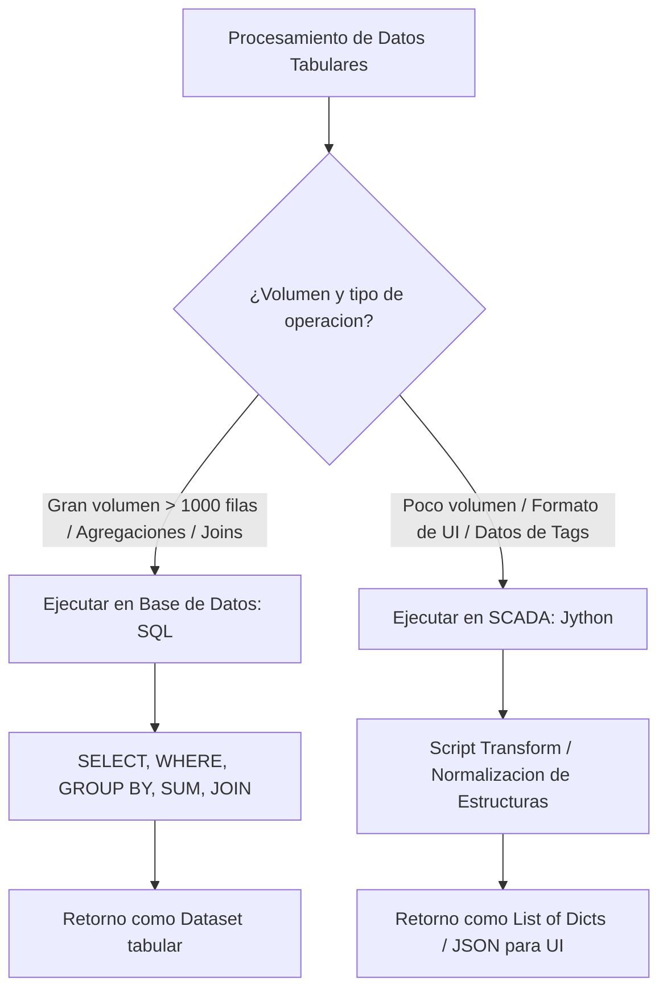
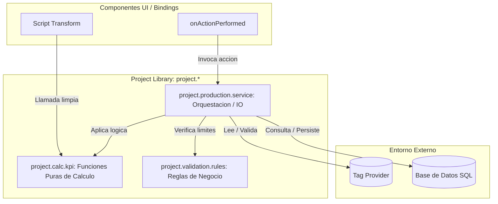

# Sesión 2

### 1. Repaso Inicial y Resolución de Dudas de la Sesión 1

#### Objetivos

* Consolidar los conceptos de Scopes de ejecución, limitaciones de Jython 2.7 en la JVM e inmutabilidad de los Datasets.
* Resolver incidencias detectadas en la ejecución de scripts base durante la primera sesión.

#### Contenidos

* Revisión de dudas sobre la diferencia de comportamiento entre la Script Console y los scripts en Gateway.
* Repaso del coste de memoria al reconstruir Datasets en bucles frente a listas nativas de Jython.
* Comprobación del estado del entorno de trabajo individual.

#### Resultado esperado

* Fijación de los conceptos fundacionales y alineación técnica de todos los alumnos para abordar estructuras de datos complejas.

***

### 2. Tema 5 (Continuación): Estructuras de Datos Avanzadas e Interoperabilidad

#### Objetivos

* Dominar la transformación bidireccional entre Datasets tabulares de Ignition y listas de diccionarios JSON para componentes de Perspective.
* Aplicar técnicas de programación defensiva para tolerar columnas ausentes, cambios de esquema y valores nulos.
* Establecer criterios claros de rendimiento para decidir si un procesamiento debe ejecutarse en SQL o en Jython.

#### Contenidos

**1. Transformación Bidireccional de Estructuras Tabulares**

* **De `Dataset` a Lista de Diccionarios (Perspective JSON):**
  * **Por qué es necesario:** Los componentes modernos de Perspective (tablas dinámicas, desplegables, tarjetas repetitivas) están diseñados para consumir árboles de objetos JSON. Vincular un `Dataset` directamente a una propiedad que espera un array de objetos limita la inyección de metadatos visuales (como colores de celda, iconos o estilos condicionales).
  * **Mecánica interna de iteración:**
    * Extracción de metadatos de cabecera mediante `dataset.getColumnNames()`.
    * Envoltura con `system.dataset.toPyDataSet` para evitar llamadas costosas por índice (`getValueAt(row, col)`).
    * Construcción de diccionarios independientes por cada fila del conjunto de datos.
* **De Lista de Diccionarios a `Dataset` de Ignition:**
  * **Por qué es necesario:** Requerido para exportaciones a archivos CSV/Excel, generación de reportes tabulares en el módulo de Reportes de Ignition o alimentación de componentes heredados de Vision.
  * **Mecánica de reconstrucción:**
    * Definición explícita de la lista de cabeceras (`headers`).
    * Mapeo ordenado de valores fila a fila asegurando que el orden de las columnas sea idéntico en cada iteración.
    * Invocación atómica final a `system.dataset.toDataSet(headers, data_rows)`.

**2. Gestión Defensiva de Inconsistencias y Tipos Nulos**

* **El problema de los esquemas volátiles en planta:**
  * Cambios de versión en la base de datos o consultas dinámicas pueden omitir columnas esperadas por el script.
* **Tratamiento estricto de claves en diccionarios:**
  * Acceso directo indexado (`rec["status"]`) vs. Acceso defensivo (`rec.get("status", "VALOR_DEFECTO")`).
  * El acceso directo lanza una excepción fatal `KeyError` si la clave no existe, deteniendo la renderización del componente en la pantalla del operador.
* **Tratamiento de valores `NULL` procedentes de SQL:**
  * En JDBC/Jython, un valor `NULL` de SQL se traduce como `None`.
  * Cualquier operación aritmética (`None * 1.5`) o de manipulación de cadenas (`None.strip()`) dispara inmediatamente un error de tipo `TypeError`.
  * _Patrón de Coalescencia:_ Sustitución temprana en la capa de lectura (`val if val is not None else 0.0`).

**3. Criterios de Delegación Arquitectónica: Motor SQL vs. Motor Jython**

* **La regla de oro del rendimiento:** _Procesar los datos lo más cerca posible de donde residen._
* **Cuándo delegar obligatoriamente en el RDBMS (SQL):**
  * **Conjuntos masivos de datos:** Procesar más de 1.000 filas. El motor SQL utiliza índices B-Tree en memoria y ejecución nativa compilada en C/C++, siendo cientos de veces más rápido que un bucle `for` en Jython.
  * **Agregaciones matemáticas complejas:** Operaciones `SUM()`, `AVG()`, `COUNT()`, `MIN()`, `MAX()`, `GROUP BY` y `HAVING`.
  * **Cruce de tablas relacionales:** `INNER JOIN`, `LEFT JOIN` para relacionar catálogos maestros con registros transaccionales.
  * **Filtrado temporal indexado:** Cláusulas `WHERE fecha >= :inicio AND fecha < :fin`.
* **Cuándo procesar en el Motor SCADA (Jython):**
  * **Integración con datos en vivo:** Cuando el cálculo depende simultáneamente de datos de base de datos y de tags de PLC en tiempo real adquiridos por OPC-UA.
  * **Formateo y enriquecimiento de UI:** Generación de estructuras visuales, asignación de estilos CSS, paletas de colores dinámicas e internacionalización de textos.
  * **Reglas de negocio complejas y algoritmos secuenciales:** Lógicas con múltiples ramas condicionales que resultarían ilegibles o inmantenibles dentro de un procedimiento almacenado SQL.



#### Resultado esperado

* Capacidad para convertir fluidamente estructuras tabulares en formatos compatibles con Perspective y aplicar el criterio correcto de reparto de carga entre base de datos y Gateway.

***

### 3. Laboratorio 2.1: Transformador Universal y Agrupador Jerárquico para Perspective

#### Objetivos

* Construir una función que transforme un `Dataset` de órdenes de fabricación en una lista de diccionarios enriquecida para componentes visuales de Perspective.
* Implementar validaciones defensivas ante columnas ausentes, divisiones por cero en objetivos de producción y cálculo de propiedades de estilo dinámicas.

#### Paso a Paso para la Realización

**Paso 1: Apertura de la Script Console**

1. Abrir **Ignition Designer**.
2. En el menú superior, seleccionar **Tools -> Script Console**.
3. Limpiar el panel interactivo.

**Paso 2: Implementación del Convertidor Universal y Enriquecedor de UI**

Copiar y pegar el siguiente código en el panel superior de la Script Console:

```python
def dataset_to_dict_list(dataset):
    """
    Convierte un Dataset de Ignition en una lista de diccionarios de forma segura.
    Tolera datasets vacios o nulos y normaliza los valores None.
    
    Args:
        dataset (Dataset): Objeto tabular inmutable de Ignition.
        
    Returns:
        list of dict: Lista de diccionarios con las cabeceras como claves.
    """
    if dataset is None or dataset.getRowCount() == 0:
        return []
        
    headers = list(dataset.getColumnNames())
    pyds = system.dataset.toPyDataSet(dataset)
    
    dict_list = []
    for row in pyds:
        row_dict = {}
        for col in headers:
            val = row[col]
            # Normalizar valores nulos de base de datos a tipos seguros
            row_dict[col] = val if val is not None else ""
        dict_list.append(row_dict)
        
    return dict_list


def build_perspective_order_instances(raw_dataset):
    """
    Transforma un Dataset de ordenes de fabricacion en una estructura lista para
    el componente Flex Repeater / Table de Perspective, inyectando estilos y estados.
    
    Args:
        raw_dataset (Dataset): Dataset con columnas ['work_order', 'equip', 'target_qty', 'produced_qty']
        
    Returns:
        list of dict: Estructura compatible con props.instances de Perspective.
    """
    records = dataset_to_dict_list(raw_dataset)
    instances = []
    
    for rec in records:
        # Extraccion defensiva con .get() para tolerar esquemas incompletos
        wo_id = rec.get("work_order", "WO-DESCONOCIDA")
        equip = rec.get("equip", "EQUIP_NO_ASIGNADO")
        target = rec.get("target_qty", 0)
        produced = rec.get("produced_qty", 0)
        
        # Conversion segura a numerico
        try:
            target_num = float(target) if target != "" else 0.0
            produced_num = float(produced) if produced != "" else 0.0
        except (ValueError, TypeError):
            target_num = 0.0
            produced_num = 0.0
            
        # Calculo defensivo de avance (evitando division por cero)
        if target_num > 0.0:
            progress_pct = round((produced_num / target_num) * 100.0, 1)
        else:
            progress_pct = 0.0
            
        # Asignacion de clasificacion operativa y estilos visuales para Perspective
        if progress_pct >= 100.0:
            status_text = "FINALIZADA"
            status_color = "#2ecc71" # Verde
            badge_class = "badge-success"
        elif progress_pct > 0.0:
            status_text = "EN PROCESO"
            status_color = "#3498db" # Azul
            badge_class = "badge-info"
        else:
            status_text = "PENDIENTE"
            status_color = "#e74c3c" # Rojo
            badge_class = "badge-danger"
            
        # Construccion de la instancia siguiendo el modelo de propiedades de Perspective
        instance_obj = {
            "instanceStyle": {
                "classes": badge_class,
                "backgroundColor": status_color
            },
            "instancePosition": {},
            "orderData": {
                "work_order": wo_id,
                "equip": equip,
                "target_qty": int(target_num),
                "produced_qty": int(produced_num),
                "progress_pct": progress_pct,
                "status": status_text
            }
        }
        
        instances.append(instance_obj)
        
    return instances
```

**Paso 3: Definición del Dataset de Prueba y Casos Borde**

Añadir a continuación la simulación de órdenes de trabajo asociadas a los equipos reales del sandbox (`EDAR_BOMBA_01`, `LINEA_ENVASADO_01`, etc.), incluyendo casos de nulos y objetivo cero:

```python
# Creacion de un Dataset de pruebas con casos limite
headers = ["work_order", "equip", "target_qty", "produced_qty"]
data = [
    ["WO-2026-101", "EDAR_BOMBA_01",      5000, 5200], # Finalizada (supero objetivo)
    ["WO-2026-102", "LINEA_ENVASADO_01", 10000, 4500], # En proceso (45%)
    ["WO-2026-103", "EDAR_COMPRESOR_01",   800,    0], # Pendiente (0%)
    ["WO-2026-104", "DECANTADOR_01",         0,    0], # Caso limite: Objetivo 0
    ["WO-2026-105", "VALVULA_RECIRC_01",  None,  150]  # Caso limite: Target nulo
]

raw_orders_ds = system.dataset.toDataSet(headers, data)

# Ejecutar la transformacion
perspective_instances = build_perspective_order_instances(raw_orders_ds)

print "=== RESULTADOS LABORATORIO 2.1 ==="
print "Total instancias generadas:", len(perspective_instances)
print "-" * 80

for inst in perspective_instances:
    d = inst["orderData"]
    s = inst["instanceStyle"]
    print "Orden: {:<12} | Equip: {:<18} | Progreso: {:<6}% | Estat: {:<12} | Color: {}".format(
        d["work_order"], d["equip"], d["progress_pct"], d["status"], s["backgroundColor"]
    )
```

#### Resultado esperado

* Función probada en la Script Console que recibe un `Dataset` tabular con órdenes de producción y genera una lista de diccionarios lista para Perspective con progreso porcentual calculado, estados normalizados ('FINALIZADA', 'EN PROCESO', 'PENDIENTE') y objetos de estilo asociados.

***

### 4. Tema 6: Funciones Reutilizables y Arquitectura en Project Library

#### Objetivos

* Comprender la arquitectura de centralización de código dentro del árbol de `Project Library` (`project.*`).
* Aplicar el principio de separación entre _Funciones Puras_ (lógica matemática testeable) y _Funciones Impuras_ (operaciones con I/O de tags y base de datos).
* Estandarizar firmas de funciones, retornos defensivos y documentación técnica formal mediante docstrings.

#### Contenidos

**Arquitectura Interna de la Project Library (`project.*`)**

* **Compilación y Namespaces:**
  * Todos los scripts creados bajo la carpeta `Server Scripting -> Project Library` en el Designer se compilan como módulos de Python dentro del namespace global del proyecto.
  * Cuando se guarda un cambio en el Designer (`Ctrl+S` / `Cmd+S`), el Gateway recompila el módulo en memoria y actualiza todas las referencias de ejecución en caliente.
* **Jerarquía de Paquetes por Dominio de Negocio:**
  * La estructura debe reflejar la funcionalidad del sistema, no la estructura organizativa del equipo:
    * `project.data.*`: Transformaciones, validaciones de esquema, conversores de formatos.
    * `project.calc.*`: Lógica matemática, cálculo de KPIs (OEE, Disponibilidad, Calidad, MTBF, MTTR).
    * `project.validation.*`: Reglas de seguridad industrial, validación de rangos y enclavamientos lógicos.
    * `project.util.*`: Utilidades transversales (fechas, logging, formateo de texto, wrappers).
    * `project.service.*` o `project.io.*`: Orquestadores que interactúan con tags (`system.tag.*`) y bases de datos (`system.db.*`).
* **Herencia de Proyectos (**_**Project Inheritance**_**&#x20;en Ignition 8+):**
  * Los módulos de scripts definidos en un proyecto padre (_Parent Project_) son heredados y visibles automáticamente por todos los proyectos hijos (_Child Projects_), permitiendo crear librerías corporativas reutilizables en múltiples aplicaciones SCADA.

**2. Principio de Funciones Puras vs. Funciones Impuras**

* **La importancia de la separación en entornos industriales:**



* **Funciones Puras (Lógica de Negocio Aislada):**
  * **Definición:** Funciones deterministas donde el valor retornado depende **única y exclusivamente** de los parámetros que recibe por argumento.
  * **Características:**
    * No leen tags (`system.tag.readBlocking` prohibido).
    * No consultan bases de datos (`system.db.*` prohibido).
    * No dependen de variables globales ni del estado de la pantalla.
  * **Ventajas:** Son 100% testeables en la _Script Console_ mediante datos simulados (_Mocks_), no generan efectos colaterales y su ejecución es instantánea.
* **Funciones Impuras / de Orquestación (Capa de I/O):**
  * **Definición:** Funciones encargadas de interactuar con el entorno físico o persistente.
  * **Responsabilidad:** Leer las variables necesarias de campo, pasarlas como parámetros a las funciones puras para el cálculo y, finalmente, persistir los resultados en base de datos o escribirlos en los tags del PLC.

**3. Contratos de Función y Estandarización de Retornos**

* **El problema de los retornos ambiguos:**
  * Si una función devuelve un número en caso de éxito y `None` o `False` en caso de error, el código que la consume se vuelve propenso a excepciones no capturadas.
* **Patrón de Retorno Estructurado (Tupla de Estado):**
  * Toda función con posibilidad de fallo debe devolver una tupla canónica de dos elementos:
    * `(True, resultado_del_calculo)` en caso de éxito.
    * `(False, u"Descripción legible del error")` en caso de fallo.
* **Ventaja operativa en bindings:**
  * Permite que el consumidor (un Script Transform o un botón de Perspective) verifique el primer elemento booleano antes de procesar el resultado, mostrando notificaciones limpias al operador en lugar de generar errores rojos en la pantalla.

**4. Documentación Formal de Módulos (Docstrings Estándar)**

* **Requisitos del estándar técnico para librerías industriales:**
  * Cada módulo y función pública debe incluir un bloque de documentación estructurado:
    * **Propósito funcional:** Qué problema de ingeniería o de negocio resuelve.
    * **`Args` (Argumentos):** Nombre, tipo esperado y significado de cada parámetro.
    * **`Returns` (Retorno):** Estructura y tipo de datos devuelto.
    * **`Raises` (Excepciones):** Errores previsibles controlados por la función.
    * **Ejemplo de uso:** Fragmento de código ejecutable directamente en la Script Console.

```python
def calculate_oee_metrics(planned_time_min, operating_time_min, ideal_cycle_sec, total_units, scrap_units):
    """
    Calcula los componentes individuales y el valor global de OEE industrial.

    Args:
        planned_time_min (float): Tiempo planificado de produccion en minutos.
        operating_time_min (float): Tiempo real de operacion de la maquina en minutos.
        ideal_cycle_sec (float): Tiempo de ciclo optimo nominal por pieza en segundos.
        total_units (int): Cantidad total de piezas producidas (buenas + scrap).
        scrap_units (int): Cantidad de piezas defectuosas / rechazadas.

    Returns:
        tuple: (bool success, dict payload_or_error)
            Si success es True, payload contiene {"availability", "performance", "quality", "oee"}.
            Si success es False, payload contiene una cadena descriptiva del error.
    """
    pass
```

#### Resultado esperado

* Capacidad para diseñar arquitecturas de scripts modulares, desacopladas de la interfaz gráfica y organizadas bajo paquetes semánticos dentro de `Project Library`.

***

### 5. Laboratorio 2.2: Modularización en Project Library y Pruebas en Script Console

#### Objetivos

* Crear un módulo en `Project Library` (`project.calc.kpi`) con funciones puras para el cálculo de disponibilidad técnica de maquinaria y tasa de calidad industrial.
* Implementar contratos de retorno estructurados `(success, value_or_message)` y validar el módulo mediante llamadas de prueba en la Script Console.

#### Paso a Paso para la Realización

**Paso 1: Creación del Módulo en Project Library**

1. En el panel izquierdo del **Ignition Designer** (_Project Browser_), desplegar **Server Scripting**.
2. Hacer clic derecho sobre **Project Library** y seleccionar **New Script**.
3. Nombrar el paquete y script como: `calc.kpi` (o crear la carpeta `calc` y dentro el script `kpi`).

**Paso 2: Implementación de las Funciones Puras en `project.calc.kpi`**

En el editor del script `project.calc.kpi`, copiar y guardar el siguiente código:

```python
"""
Modulo: project.calc.kpi
Descripcion: Funciones puras para el calculo estandarizado de KPIs industriales.
Autor: Equipo SCADA
"""

def calculate_availability(planned_time_min, downtime_min):
    """
    Calcula el porcentaje de disponibilidad tecnica de un equipo.
    
    Args:
        planned_time_min (float|int): Tiempo total planificado de produccion en minutos.
        downtime_min (float|int): Tiempo total acumulado de paradas en minutos.
        
    Returns:
        tuple: (bool success, float availability_pct | unicode error_message)
    """
    # 1. Validaciones defensivas de nulos
    if planned_time_min is None or downtime_min is None:
        return (False, u"Els valors de temps no poden ser nuls")
        
    try:
        planned = float(planned_time_min)
        downtime = float(downtime_min)
    except (ValueError, TypeError):
        return (False, u"Els parametres han de ser numerics")
        
    # 2. Validaciones de coherencia fisica
    if planned <= 0.0:
        return (False, u"El temps planificat ha de ser superior a zero")
        
    if downtime < 0.0:
        return (False, u"El temps de parada no pot ser negatiu")
        
    operating_time = planned - downtime
    if operating_time < 0.0:
        return (False, u"El temps de parada supera el temps planificat de torn")
        
    # 3. Calculo porcentual
    availability = (operating_time / planned) * 100.0
    return (True, round(availability, 2))


def calculate_quality_rate(total_units, scrap_units):
    """
    Calcula la tasa porcentual de calidad sobre el total producido.
    
    Args:
        total_units (int|float): Total de unidades producidas (buenas + scrap).
        scrap_units (int|float): Total de unidades defectuosas / rechazadas.
        
    Returns:
        tuple: (bool success, float quality_pct | unicode error_message)
    """
    if total_units is None or scrap_units is None:
        return (False, u"Els parametres d'unitats no poden ser nuls")
        
    try:
        total = float(total_units)
        scrap = float(scrap_units)
    except (ValueError, TypeError):
        return (False, u"Les quantitats han de ser numeriques")
        
    if total < 0.0 or scrap < 0.0:
        return (False, u"Les unitats no poden ser negatives")
        
    if scrap > total:
        return (False, u"La quantitat de rebuig no pot superar la produccio total")
        
    # Si no hubo produccion, no se penaliza la calidad (100% nominal)
    if total == 0.0:
        return (True, 100.0)
        
    good_units = total - scrap
    quality = (good_units / total) * 100.0
    return (True, round(quality, 2))
```

**Paso 3: Guardado del Proyecto en el Designer**

1. En el menú superior, hacer clic en **File -> Save** (o presionar `Ctrl+S` / `Cmd+S`).
2. _Nota técnica:_ Guardar el proyecto es indispensable para que el Gateway compile el nuevo módulo y sea accesible desde la Script Console y los clientes web.

**Paso 4: Pruebas y Validación desde la Script Console**

1. Abrir la **Script Console** (**Tools -> Script Console**).
2. Copiar y ejecutar el siguiente script de pruebas unitarias que invoca `project.calc.kpi`:

```python
print "=== VALIDACION MODULAR: project.calc.kpi ==="

# 1. Pruebas de Disponibilidad (Torn estandard de 8h = 480 min)
casos_disponibilidad = [
    {"name": "Nominal (480 min planificados, 45 min parada)", "p": 480, "d": 45},
    {"name": "Sense Parades (480 min planificados, 0 min parada)", "p": 480, "d": 0},
    {"name": "Error: Parada major que torn (480 min, 600 min parada)", "p": 480, "d": 600},
    {"name": "Error: Temps planificat zero (0 min, 0 min parada)", "p": 0, "d": 0},
    {"name": "Error: Valor nul", "p": None, "d": 30}
]

print "\n--- Tests de Disponibilitat ---"
for c in casos_disponibilidad:
    ok, resultado = project.calc.kpi.calculate_availability(c["p"], c["d"])
    estado = "OK " if ok else "ERR"
    if ok:
        print "[{}] {:<55} -> Disponibilitat: {}%".format(estado, c["name"], resultado)
    else:
        print "[{}] {:<55} -> Missatge: {}".format(estado, c["name"], resultado)

# 2. Pruebas de Tasa de Calidad
casos_calidad = [
    {"name": "Nominal (5000 bones + 120 scrap = 5120 total)", "tot": 5120, "scr": 120},
    {"name": "Zero Rebuig (1000 total, 0 scrap)",            "tot": 1000, "scr": 0},
    {"name": "Sense Produccio (0 total, 0 scrap)",          "tot": 0,    "scr": 0},
    {"name": "Error: Scrap major que total (100 tot, 150 scr)", "tot": 100,  "scr": 150}
]

print "\n--- Tests de Taxa de Qualitat ---"
for c in casos_calidad:
    ok, resultado = project.calc.kpi.calculate_quality_rate(c["tot"], c["scr"])
    estado = "OK " if ok else "ERR"
    if ok:
        print "[{}] {:<55} -> Qualitat: {}%".format(estado, c["name"], resultado)
    else:
        print "[{}] {:<55} -> Missatge: {}".format(estado, c["name"], resultado)
```

#### Resultado esperado

* Módulo creado en el árbol del proyecto con funciones documentadas mediante docstrings y verificado desde la Script Console ante casos nominales, valores límite y escenarios de error (paradas superiores al tiempo planificado, rechazos superiores al total producido).

***

### 6. Test de Conceptos de la Sesión 2

#### Objetivos

* Validar la comprensión de las ventajas de las listas de diccionarios en Perspective frente a Datasets nativos.
* Evaluar el criterio de diseño entre funciones puras y de orquestación, así como la distribución de responsabilidades entre SQL y Jython.

#### Contenidos

* Evaluación conceptual breve de opción múltiple y análisis de casos arquitectónicos.
* [https://docs.google.com/forms/d/e/1FAIpQLSeoaWrZGCxHgxUFV-WgZP\_ZdNc1BWW7TjRazVDu6lyqh--0sg/viewform?usp=publish-editor](https://docs.google.com/forms/d/e/1FAIpQLSeoaWrZGCxHgxUFV-WgZP_ZdNc1BWW7TjRazVDu6lyqh--0sg/viewform?usp=publish-editor)

#### Resultado esperado

* Comprobación del dominio de los patrones de modularización y asimilación de los criterios de rendimiento en el manejo de datos.

***

### 7. Feedback Individual y Cierre de la Sesión

#### Objetivos

* Validar la correcta estructura de paquetes creada por cada alumno en su Designer.
* Corregir errores típicos en firmas de función, retornos estructurados y docstrings.
* Presentar la planificación de la Sesión 3.

#### Contenidos

* Revisión guiada de los módulos implementados en `Project Library`.
* Resolución de dudas sobre la invocación de funciones `project.*` desde distintos puntos del sistema.
* Avance de la Sesión 3: Técnicas avanzadas de uso de la `Script Console`, depuración sistemática de errores y creación de bancos de pruebas con datos simulados (_Mocks_).

#### Resultado esperado

* Cada participante finaliza la sesión con sus módulos de librería operativos, probados en consola y con claridad sobre el flujo de depuración que se trabajará en la siguiente sesión.
