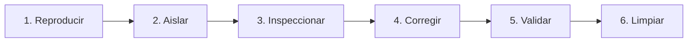

# Sesión 3

### 1. Repaso Inicial y Resolución de Dudas de la Sesión 2

#### Objetivos

* Consolidar los conceptos de transformación de datos (`Dataset` a listas de diccionarios JSON) y estructuración modular en `Project Library`.
* Revisar el impacto del desacoplamiento entre funciones puras y funciones impuras con I/O.

#### Contenidos

* Repaso de las consultas sobre la manipulación segura de diccionarios y control de valores `None`.
* Revisión de las firmas estándar y contratos de retorno estructurados `(success, payload_or_error)` en `project.*`.
* Validación del guardado de proyectos en el Designer y su recarga en caliente en el Gateway.

#### Resultado esperado

* Alineación del grupo en la creación de funciones puras modulares, base indispensable para ejecutar pruebas directas en la consola.

***

### 2. Tema 7: Entorno de la Script Console, Introspección y Diagnóstico de Scopes

#### Objetivos

* Comprender el alcance de ejecución de la Script Console dentro de la arquitectura de Ignition Designer.
* Dominar las herramientas de introspección nativas de Jython para analizar tipos, métodos y estructuras complejas en memoria.
* Identificar las diferencias de comportamiento y permisos entre la consola de diseño, las sesiones de usuario y el Gateway.


#### Contenidos

**1. Ciclo de Vida y Recarga de Módulos en el Designer**

* **Persistencia de scripts en memoria:**
  * Los cambios realizados en `Project Library` se guardan en el árbol del Designer.
  * Para que la Script Console reconozca nuevas funciones o modificaciones en los módulos `project.*`, es imprescindible **guardar el proyecto en el Designer (`Ctrl+S` / `Cmd+S`)**, lo que fuerza la recompilación del bytecode en la sesión activa.
* **Espacio de nombres interactivo (**_**Interactive Namespace**_**):**
  * Las variables asignadas en la consola persisten durante la sesión abierta del Designer. Para evitar comportamientos residuales (variables que conservan valores de pruebas previas), se debe reiniciar el contexto o limpiar explícitamente las variables de prueba.

**2. Herramientas de Introspección y Reflexión en Jython**

* **`type(objeto)`:**
  * Fundamental para verificar si un dato devuelto por Ignition es un primitivo Python (`int`, `str`, `dict`), un envoltorio de Ignition (`PyDataSet`, `QualifiedValue`) o una clase interna de Java (`com.inductiveautomation.ignition.common.BasicDataset`, `java.util.Date`).
* **`dir(objeto)`:**
  *   Lista todos los atributos y métodos disponibles en un objeto. Es la herramienta clave para descubrir capacidades de clases Java sin necesidad de consultar el JavaDoc externo:

      ```python
      # Inspeccion de metodos disponibles en un Dataset crudo
      raw_ds = system.db.runQuery("SELECT 1")
      print dir(raw_ds)
      # Revela metodos Java como: getColumnCount, getColumnNames, getValueAt, etc.
      ```
* **`len(coleccion)`:**
  * Permite validar dimensiones de listas, diccionarios y `PyDataSet` antes de iterar, previniendo excepciones por colecciones vacías.

**3. Formateo y Visualización de Estructuras Complejas**

* **El problema de la salida plana:** Imprimir diccionarios anidados o listas de objetos grandes mediante `print` genera una sola línea de texto ininteligible.
* **Técnicas de inspección estructurada:**
  * **Serialización JSON:** `system.util.jsonEncode(objeto, 4)` formatea árboles de diccionarios con indentación de 4 espacios.
  * **Módulo nativo `pprint`:** `import pprint; pprint.pprint(objeto)` imprime estructuras de datos con saltos de línea automáticos.

#### Resultado esperado

* Capacidad para explorar e inspeccionar cualquier objeto retornado por Ignition o Java, identificando con precisión su tipo de dato y estructura interna.

***

### 3. Tema 7 (Continuación): Metodología de Depuración Sistemática y Simulación (Mocks)

#### Objetivos

* Aplicar un flujo de trabajo ordenado y reproducible para aislar y corregir fallos en scripts industriales.
* Clasificar las causas raíz de error entre fallos de sintaxis, discrepancias de datos de planta y problemas de infraestructura o scope.
* Construir datos sintéticos simulados (_Mocks_) para desacoplar el testing de la lógica respecto al estado real de los PLCs y bases de datos.

#### Contenidos

**1. Metodología Sistemática de Depuración (**_**The 6-Step Debug Loop**_**)**



* **Fase 1: Reproducir el fallo:** Capturar los parámetros exactos (valores de tags, inputs de operador, timestamps) que provocaron el error.
* **Fase 2: Aislar en la Script Console:** Extraer la función sospechosa fuera del componente gráfico o del evento de Gateway y llevarla a la consola con entradas controladas.
* **Fase 3: Inspeccionar variables y tipos:** Colocar puntos de impresión para verificar el tipo de dato de cada variable intermedia y comprobar si existen valores `None` o cadenas vacías imprevistas.
* **Fase 4: Corregir la lógica:** Implementar validaciones defensivas, conversiones explícitas de tipo o reestructuración del algoritmo.
* **Fase 5: Validar con casos límite:** Ejecutar la función corregida sometiéndola a una batería de pruebas con valores nominales, ceros, negativos, nulos y extremos.
* **Fase 6: Limpiar y desplegar:** Eliminar todos los `print` temporales de depuración antes de reintegrar la función en `Project Library` y guardar el proyecto.

**2. Taxonomía de Errores en Sistemas Ignition SCADA**

* **A. Errores de Código y Sintaxis (Jython):**
  * `TypeError`: Intentar operar tipos incompatibles (ej. concatenar texto con números, operar sobre `None`).
  * `KeyError`: Intentar acceder a una clave inexistente en un diccionario (`dict["presion"]` cuando la clave es `"pressure"`).
  * `IndexError`: Intentar acceder a una fila o columna fuera de los límites de una lista o dataset.
  * `ZeroDivisionError`: División por cero en cálculos de rendimiento donde la producción planificada o las unidades son 0.
* **B. Errores por Anomalías en Datos de Planta:**
  * Variables con calidad `Bad_NotFound`, `Bad_Stale` o `Uncertain` que entregan valores `None` al script.
  * Cadenas numéricas mal formateadas procedentes de básculas o escáneres (ej. `"12,50"` con coma decimal en lugar de punto `"12.50"`).
* **C. Errores de Infraestructura y Conectividad:**
  * `java.sql.SQLException`: Timeouts de base de datos, credenciales expiradas o tablas bloqueadas.
  * `java.net.SocketTimeoutException`: Caída de conexión al consultar APIs externas o servicios web.
* **D. Errores de Discrepancia de Scope (**_**Scope Mismatch**_**):**
  * Intentar invocar funciones de interfaz de Vision (`system.gui.*`) dentro de sesiones web de Perspective.
  * Intentar acceder a propiedades de sesión en scripts de Gateway desatendidos (como Scheduled Scripts).

**3. Simulación de Datos (**_**Mocking**_**) y Pruebas Unitarias Manuales**

* **Por qué crear datos sintéticos (Mocks):**
  * Una máquina en parada no entrega lecturas dinámicas.
  * No es aceptable forzar un fallo real en la línea física (ej. sobrecalentar un horno) solo para probar si el script de alarma reacciona correctamente.
* **Construcción de Mocks en la Script Console:**
  * **Simulación de Datasets:** Uso de `system.dataset.toDataSet(headers, data)` para construir respuestas artificiales de consultas SQL que incluyan casos nominales y filas con datos nulos.
  * **Simulación de Estructuras de Tags:** Creación de diccionarios que emulan la estructura retornada por `system.tag.readBlocking` con diferentes códigos de calidad (`Good`, `Bad`).
* **Diseño de Micro-Runners de Pruebas:**
  * Creación de funciones evaluadoras de aserciones (`assert_equal(obtenido, esperado)`) para validar automáticamente múltiples condiciones de una función en un solo clic dentro de la consola.

#### Resultado esperado

* Dominio de una metodología de depuración estructurada que elimina el método de prueba y error a ciegas en entornos de producción.

***

### 4. Laboratorio 3.1: Inspección de Tipos y Mocking de Respuestas SQL

#### Objetivos

* Construir una simulación (_Mock_) de respuesta tabular de base de datos directamente en la Script Console.
* Utilizar herramientas de introspección para analizar metadatos del `Dataset` e implementar un recorrido seguro con tratamiento de celdas con valor `None`.

#### Resultado esperado

* Script verificado en la Script Console que genera un `Dataset` simulado con lecturas de presión y estados de máquina, inspecciona sus metadatos y recorre sus filas extrayendo valores con formateo numérico defensivo ante valores nulos.


#### Paso a Paso para la Realización

**Paso 1: Apertura de la Script Console**

1. Abrir **Ignition Designer**.
2. En el menú superior, seleccionar **Tools -> Script Console**.
3. Limpiar el panel interactivo.

**Paso 2: Construcción del Mock e Introspección de Metadatos**

Copiar y pegar el siguiente código en la Script Console para generar la simulación e inspeccionar el objeto Java subyacente:

```python
# 1. Mocking: Construccion de una respuesta identica a sqlt_data_1_2026_10
headers = ["tagpath", "intvalue", "floatvalue", "stringvalue", "datevalue", "t_stamp"]
data = [
    ["[default]EDAR/EDAR_BOMBA_01/SCFL",      None,  45.8, "ESTADO_OK", None, 1793318400000],
    ["[default]EDAR/EDAR_BOMBA_01/SCMX",       100,  None, "ESTADO_OK", None, 1793318460000],
    ["[default]EDAR/EDAR_COMPRESOR_01/SCFL",  None,  None, "ALERTA",    None, 1793318520000], # Caso limite: valores numericos nulos
    ["[default]EDAR/EDAR_COMPRESOR_02/SCMX",  None,  82.3, "ESTADO_OK", None, 1793318580000],
    ["[default]EDAR/VALVULA_RECIRC_01/SCFL",     0,   0.0, "PARADA",    None, 1793318640000]
]

mock_history_ds = system.dataset.toDataSet(headers, data)

# 2. Introspeccion y Reflexion en la JVM
print "=== 1. INTROSPECCION DEL OBJETO DATASET ==="
print "Tipo de objeto base:", type(mock_history_ds)
print "Numero de filas:    ", mock_history_ds.getRowCount()
print "Numero de columnas: ", mock_history_ds.getColumnCount()
print "Nombres de columnas:", list(mock_history_ds.getColumnNames())

# Exploracion de metodos Java mediante dir()
java_methods = [m for m in dir(mock_history_ds) if not m.startswith("_")]
print "Metodos publicos Java disponibles (primeros 6):", java_methods[:6]
```

**Paso 3: Implementación de Recorrido Seguro con `PyDataSet`**

Añadir a continuación el algoritmo de lectura defensiva que extrae el valor válido priorizando tipos y formateando la salida sin bloques `try/except` ciegos:

```python
print "\n=== 2. RECORRIDO SEGURO Y COALESCENCIA DE NULOS ==="

pyds = system.dataset.toPyDataSet(mock_history_ds)

for idx, row in enumerate(pyds):
    tagpath = row["tagpath"]
    int_val = row["intvalue"]
    float_val = row["floatvalue"]
    str_val = row["stringvalue"]
    
    # Coalescencia jerarquica de tipos numericos
    if float_val is not None:
        effective_value = "{:.2f} (Float)".format(float_val)
    elif int_val is not None:
        effective_value = "{} (Int)".format(int_val)
    else:
        effective_value = "SIN VALOR NUMERICO"
        
    status_str = str_val if str_val is not None else "INDETERMINADO"
    
    # Extraccion limpia del nombre del equipo y variable
    tag_clean = tagpath.replace("[default]EDAR/", "")
    
    print "Fila {:<2} | Tag: {:<30} | Valor: {:<20} | Estado: {}".format(
        idx, tag_clean, effective_value, status_str
    )
```

***

### 5. Laboratorio 3.2: Mini-Runner de Pruebas Unitarias para Project Library

#### Objetivos

* Construir un evaluador automatizado de aserciones en la Script Console para validar funciones de `Project Library`.
* Definir una batería de pruebas que someta la lógica de cálculo a casos nominales, entradas nulas, valores fuera de rango y casos borde.

#### Resultado esperado

* Script ejecutable en la Script Console que evalúa automáticamente las funciones del módulo `project.calc.kpi` y emite un informe estructurado por consola indicando el estado de cada test (`PASS` / `FAIL`) y el resumen de pruebas superadas.


#### Paso a Paso para la Realización

**Paso 1: Preparación en la Script Console**

1. En la **Script Console**, limpiar el editor superior.

**Paso 2: Implementación de la Clase Test Runner**

Copiar y pegar el siguiente código:

```python
class SCADATestRunner(object):
    """
    Runner ligero de pruebas unitarias para validar funciones en Ignition.
    """
    def __init__(self, suite_name):
        self.suite_name = suite_name
        self.total_tests = 0
        self.passed_tests = 0
        self.failures = []

    def assert_equal(self, test_name, actual, expected):
        """
        Comprueba la igualdad estricta entre el resultado obtenido y el esperado.
        """
        self.total_tests += 1
        if actual == expected:
            self.passed_tests += 1
            print "  [ PASS ] {}".format(test_name)
        else:
            self.failures.append({
                "name": test_name,
                "expected": expected,
                "actual": actual
            })
            print "  [ FAIL ] {}".format(test_name)

    def print_report(self):
        """
        Imprime el resumen de ejecucion de la suite de pruebas.
        """
        print "\n" + "=" * 70
        print "INFORME DE TESTING: {}".format(self.suite_name)
        print "Total Ejecutados: {} | Superados: {} | Fallidos: {}".format(
            self.total_tests, self.passed_tests, len(self.failures)
        )
        print "=" * 70
        if self.failures:
            print "DETALLE DE FALLOS ENCONTRADOS:"
            for f in self.failures:
                print " - Test:     '{}'".format(f["name"])
                print "   Esperado: {}".format(f["expected"])
                print "   Obtenido: {}".format(f["actual"])
        else:
            print ">>> TODOS LOS CASOS DE PRUEBA FUERON SUPERADOS SATISFACTORIAMENTE <<<"
        print "=" * 70
```

**Paso 3: Definición y Ejecución de la Batería de Pruebas**

Añadir a continuación las pruebas sobre las funciones `project.calc.kpi.calculate_availability` y `calculate_quality_rate`:

```python
# Instanciar el runner
runner = SCADATestRunner("Suite de Calculos OEE y Disponibilidad (project.calc.kpi)")

print "=== EJECUTANDO BATERIA DE ASIONES EN CONSOLA ==="

# 1. Pruebas de Disponibilidad
runner.assert_equal(
    "Disponibilidad nominal (480 min planificados, 48 min parada -> 90.0%)",
    project.calc.kpi.calculate_availability(480, 48),
    (True, 90.0)
)

runner.assert_equal(
    "Disponibilidad 100% (480 min planificados, 0 min parada)",
    project.calc.kpi.calculate_availability(480, 0),
    (True, 100.0)
)

runner.assert_equal(
    "Rechazo por parada superior a tiempo planificado (100 min plan, 120 min parada)",
    project.calc.kpi.calculate_availability(100, 120)[0],
    False
)

runner.assert_equal(
    "Rechazo por parametro nulo (None)",
    project.calc.kpi.calculate_availability(None, 45)[0],
    False
)

# 2. Pruebas de Tasa de Calidad
runner.assert_equal(
    "Calidad nominal (1000 total, 25 scrap -> 97.5%)",
    project.calc.kpi.calculate_quality_rate(1000, 25),
    (True, 97.5)
)

runner.assert_equal(
    "Calidad con produccion cero (Caso borde -> 100.0%)",
    project.calc.kpi.calculate_quality_rate(0, 0),
    (True, 100.0)
)

runner.assert_equal(
    "Rechazo cuando scrap es mayor que total (100 total, 150 scrap)",
    project.calc.kpi.calculate_quality_rate(100, 150)[0],
    False
)

# Imprimir informe final
runner.print_report()
```

***

### 6. Laboratorio 3.3: Depuración y Corrección de un Script Industrial Defectuoso

#### Objetivos

* Aplicar el flujo de depuración sistemático para diagnosticar y aislar 4 errores críticos presentes en un script industrial heredado.
* Refactorizar la función en la Script Console implementando validaciones de entrada, control de tipos, manejo de división por cero y compatibilidad Unicode.

#### Resultado esperado

* Función defectuosa aislada, corregida y probada en la Script Console ante un vector de 5 casos problemáticos (formatos incompletos, cadenas corruptas, ceros y rechazos superiores al total), respondiendo con mensajes informativos sin lanzar excepciones no controladas.

#### 4. Paso a Paso para la Realización

**Paso 1: Análisis del Script Defectuoso Original**

El script heredado intenta parsear una trama industrial de producción enviada por un escáner (`"LOTE_ID;TOTAL_PRODUCIDO;RECHAZOS"`):

```python
# CÓDIGO HEREDADO (CONTIENE 4 ERRORES CRÍTICOS)
def parse_production_string_legacy(raw_string):
    parts = raw_string.split(";")
    batch_id = parts[0]
    total_parts = parts[1]
    bad_parts = parts[2]
    
    # Error 1: IndexError si la cadena no tiene exactamente 3 campos
    # Error 2: TypeError / ValueError si total_parts o bad_parts no son convertibles a float
    # Error 3: ZeroDivisionError si total_parts es 0
    # Error 4: Incompatibilidad si bad_parts > total_parts
    yield_rate = ((float(total_parts) - float(bad_parts)) / float(total_parts)) * 100.0
    return "Lote " + batch_id + " Rendimiento: " + str(yield_rate) + "%"
```

**Paso 2: Aplicación del Flujo de Depuración (Debug Loop)**

1. **Reproducir el error:** Ejecutar `parse_production_string_legacy("LOT-99;0;0")` en consola -> Arroja `ZeroDivisionError: float division by zero`.
2. **Aislar:** Identificar los 4 puntos de quiebre (longitud de array, conversión de tipos, división por cero, coherencia física).
3. **Corregir:** Reestructurar la función aplicando validaciones tempranas (_Guard Clauses_) y retornos estructurados.

**Paso 3: Implementación de la Función Refactorizada**

Copiar y pegar la versión corregida en la Script Console:

```python
def parse_production_string_robust(raw_string):
    """
    Parsea de forma segura una cadena 'LOTE;TOTAL;RECHAZOS' y calcula el rendimiento.
    
    Args:
        raw_string (str|unicode): Cadena separada por ';'
        
    Returns:
        tuple: (bool success, unicode message)
    """
    # 1. Validacion de existencia y tipo
    if raw_string is None or not isinstance(raw_string, (str, unicode)):
        return (False, u"Trama invalida o valor nulo")
        
    cleaned_str = raw_string.strip()
    if len(cleaned_str) == 0:
        return (False, u"La trama de produccion esta vacia")
        
    # 2. Validacion de estructura (esperados 3 campos)
    parts = cleaned_str.split(";")
    if len(parts) < 3:
        return (False, u"Estructura incorrecta. Se esperaban 3 campos ('LOTE;TOTAL;RECHAZOS')")
        
    batch_id = parts[0].strip()
    if len(batch_id) == 0:
        batch_id = "LOTE_SIN_ID"
        
    # 3. Conversion segura de tipos numericos
    try:
        total_units = float(parts[1].strip())
        bad_units = float(parts[2].strip())
    except ValueError:
        return (False, u"Los valores de total y rechazos deben ser numericos")
        
    # 4. Validaciones de coherencia industrial
    if total_units < 0.0 or bad_units < 0.0:
        return (False, u"Las cantidades de produccion no pueden ser negativas")
        
    if bad_units > total_units:
        return (False, u"Los rechazos ({:.0f}) superan la produccion total ({:.0f})".format(bad_units, total_units))
        
    # 5. Calculo defensivo de rendimiento
    if total_units == 0.0:
        yield_rate = 100.0 # Sin produccion no se penaliza
    else:
        good_units = total_units - bad_units
        yield_rate = round((good_units / total_units) * 100.0, 2)
        
    summary_msg = u"Lote: {} | Buenas: {:.0f} | Rechazo: {:.0f} | Rendimiento: {}%".format(
        unicode(batch_id), (total_units - bad_units), bad_units, yield_rate
    )
    
    return (True, summary_msg)
```

***

### 7. Test de Conceptos de la Sesión 3

#### Objetivos

* Validar la comprensión de las limitaciones y contexto de ejecución de la Script Console.
* Evaluar el dominio del ciclo de depuración, la introspección de objetos y las causas por las que un script válido en consola puede fallar en otros scopes.

#### Contenidos

* Cuestionario técnico de opción múltiple y resolución de casos de diagnóstico de errores en entornos Ignition.

#### Resultado esperado

* Comprobación del aprendizaje sobre técnicas de depuración y fijación de pautas para evitar la contaminación de logs de producción con mensajes de prueba.

***

### 8. Feedback Individual y Cierre de la Sesión

#### Objetivos

* Revisar individualmente la correcta ejecución de los tres laboratorios en la Script Console de cada alumno.
* Solventar dificultades en la interpretación de trazas de error (_Tracebacks_).
* Introducir los contenidos de la Sesión 4.

#### Contenidos

* Rondas de comprobación individual de los scripts de prueba y validación de resultados.
* Explicación de buenas prácticas para la eliminación de sentencias de depuración antes del pase a producción.
* Avance de la Sesión 4: Manejo formal de excepciones con `try/except`, captura de errores nativos de Java, logging contextual con `system.util.getLogger` y fundamentos de SQL industrial.

#### Resultado esperado

* Cada alumno finaliza la sesión con su batería de pruebas ejecutada con éxito, comprensión de la técnica de simulación de datos y preparación técnica para el módulo de logging y SQL.
