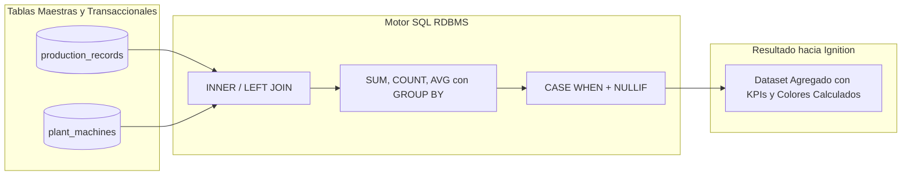

# Sesión 4

### 1. Repaso Inicial y Resolución de Dudas de la Sesión 3

#### Objetivos

* Consolidar la metodología de depuración sistemática en 6 fases y el uso de la Script Console como entorno de aislamiento.
* Revisar el diseño de bancos de pruebas sintéticos (_Mocks_) para validar funciones de `Project Library`.

#### Contenidos

* Repaso de las técnicas de introspección de objetos (`type`, `dir`, `len`) en la JVM.
* Revisión de dudas sobre la interpretación de trazas de error (_Tracebacks_) en la consola.
* Comprobación de la correcta eliminación de sentencias `print` temporales antes del pase a entornos de Gateway.

#### Resultado esperado

* Fijación del flujo de aislamiento y pruebas en consola, base necesaria para implementar captura formal de excepciones y logging en esta sesión.

***

### 2. Tema 8: Logging y Tratamiento Profesional de Errores en Ignition

#### Objetivos

* Dominar la captura jerárquica de excepciones duales (Jython nativo y clases Java de la JVM).
* Comprender la arquitectura de registro de trazas en el Gateway mediante `system.util.getLogger` y sus niveles de severidad.
* Diseñar mensajes contextuales para diagnóstico técnico y respuestas estructuradas amigables para el operador de planta.

#### Contenidos

**1. Arquitectura de Excepciones Duales: Jython vs. Java Runtime**

* **La discrepancia de tipos de excepción:**
  * En Jython 2.7, las excepciones del lenguaje heredan de la clase base de Python `exceptions.Exception`.
  * Las excepciones lanzadas por el motor interno de Ignition, los drivers de PLC y los conectores de base de datos son objetos nativos de Java que heredan de `java.lang.Throwable` y `java.lang.Exception`.
* **El fallo del bloque `except Exception` estándar:**
  * Un bloque `except Exception:` en Jython **no siempre intercepta ciertas excepciones nativas de Java** (como errores de timeout de sockets de red, violaciones de constraints JDBC complejas o punteros nulos de la JVM).
*   **Estructura de captura profesional recomendada:**

    ```python
    from java.lang import Exception as JavaException
    from java.sql import SQLException

    try:
        # Operacion critica de I/O, base de datos o tags
        pass
    except (TypeError, ValueError, KeyError, IndexError) as py_err:
        # 1. Errores especificos de la logica y tipos de Jython
        pass
    except SQLException as sql_err:
        # 2. Errores especificos del motor de base de datos
        pass
    except JavaException as java_err:
        # 3. Errores genericos del runtime de Java / Ignition Gateway
        pass
    except Exception as general_err:
        # 4. Fallback final de Python
        pass
    else:
        # Se ejecuta UNICAMENTE si no ocurrio ninguna excepcion
        pass
    finally:
        # Se ejecuta SIEMPRE (limpieza de conexiones, liberacion de locks)
        pass
    ```

**2. Logging Centralizado con `system.util.getLogger`**

* **Espacios de nombres jerárquicos (**_**Logger Namespaces**_**):**
  * La nomenclatura debe seguir el árbol funcional del sistema SCADA mediante puntos:
    * `system.util.getLogger("SCADA.Packaging.Line1.Conveyor")`
    * `system.util.getLogger("SCADA.Database.Transactions")`
  * Permite al administrador del Gateway filtrar y ajustar los niveles de log de un área completa sin alterar el resto del sistema.
* **Semántica de los Niveles de Severidad:**
  * `TRACE / DEBUG`: Trazas de depuración técnica (payloads de tags, dumps de arrays). Solo activos durante desarrollo o análisis puntual de averías.
  * `INFO`: Eventos nominales significativos en el ciclo de producción (arranque de turno, carga de receta completada, cambio de orden de trabajo).
  * `WARN`: Anomalías recuperables que requieren atención pero no detienen el proceso (reintento de comunicación tras timeout, corrección automática de un valor fuera de rango).
  * `ERROR`: Fallos críticos que impiden completar una operación (caída de base de datos, tag no encontrado, fallo de inserción de lote).
* **El Principio del Contexto Completo:**
  * Una traza de log debe permitir a un ingeniero de mantenimiento diagnosticar la avería sin necesidad de abrir el código fuente.
  * Formato obligatorio de mensaje: `[Subdominio] [Usuario] [Recurso/ID] [Detalle de entrada] -> [Error exacto]`.

**3. Patrón Wrapper para Operaciones Críticas**

* **Encapsulación de efectos secundarios:** Centralizar la ejecución protegida de consultas SQL o escrituras de tags en funciones de librería genéricas (`safe_db_call`, `safe_tag_write`).
* Evita la duplicación masiva de bloques `try/except` a lo largo de cientos de componentes visuales en el Designer.

#### Resultado esperado

* Capacidad para proteger scripts críticos mediante captura dual de errores, registrando trazas contextualizadas en el Gateway y evitando que excepciones no controladas afecten a la interfaz de usuario.

***

### 3. Laboratorio 4.1: Módulo de Logging Contextual y Wrapper Defensivo

#### Objetivos

* Construir una función de ejecución protegida (_Wrapper_) en `Project Library` (`project.util.logging`) que capture excepciones híbridas de Jython y Java.
* Registrar automáticamente los fallos en el sistema de logs del Gateway con metadatos contextuales (usuario, máquina, acción) y retornar una tupla estandarizada `(success, result_or_user_message)`.

#### Resultado esperado

* Módulo creado y verificado desde la Script Console que procesa llamadas nominales y llamadas con fallos forzados (tags inválidos, errores de tipo), comprobando la emisión de trazas formateadas en el visor de logs del Gateway y la entrega de respuestas limpias hacia la consola.

***

### 4. Tema 9: SQL Esencial para Scripting Industrial y Cálculo de KPIs

#### Objetivos

* Dominar la sintaxis de consultas SQL estructuradas (`SELECT`, `WHERE`, `ORDER BY`, `GROUP BY`, `HAVING`) aplicadas a datos de telemetría y eventos de planta.
* Relacionar tablas transaccionales de eventos con tablas maestras de planta mediante operaciones `JOIN`.
* Delegar el cálculo de indicadores de rendimiento (OEE, porcentajes de scrap, medias de ciclo) directamente en el motor de base de datos utilizando lógica condicional `CASE WHEN`.

#### Contenidos

**1. Estructura de Consultas Industriales Eficientes**

* **Proyección explícita de columnas:**
  * Prohibición terminante de `SELECT *` en tablas de planta. Arrastra columnas de metadatos, satura el pool JDBC y ralentiza la serialización.
  * Seleccionar exclusivamente las columnas requeridas para el cálculo o la visualización.
* **Filtrado temporal y particiones (`WHERE`):**
  * La telemetría industrial exige siempre límites temporales explícitos (`recorded_at >= :start AND recorded_at < :end`).
  * Consultar tablas históricas sin filtro de fechas provoca escaneos completos de millones de registros, saturando el motor SQL.
* **Agregaciones masivas en servidor (`GROUP BY` y `HAVING`):**
  * Uso de `SUM()`, `AVG()`, `COUNT()`, `MIN()`, `MAX()` para condensar miles de lecturas de sensores en un único registro por turno, máquina o lote.
  * Uso de `HAVING` para filtrar sobre resultados calculados (ej. `HAVING COUNT(alarm_id) > 10` para identificar equipos con alta recurrencia de paradas).

**2. Combinación de Tablas de Planta (`JOIN`)**

* **`INNER JOIN`:**
  * Uso: Combinar registros transaccionales que obligatoriamente deben coincidir con un maestro (ej. cada registro de lote debe pertenecer a una máquina existente en `plant_machines`).
* **`LEFT JOIN`:**
  * Uso: Conservar todos los registros de la tabla principal aunque la tabla secundaria no contenga coincidencias (ej. listar todas las máquinas de la planta y cruzar sus paradas del turno; las máquinas que no tuvieron paradas aparecerán con valores `NULL`, permitiendo verificar que operaron al 100%).

**3. Lógica Condicional y Cálculo de Indicadores en SQL (`CASE WHEN`)**

* **Eliminación de bucles condicionales en el SCADA:**
  *   Traducir códigos numéricos de PLC (ej. Estado = 1, 2, 3) a cadenas funcionales y colores directamente en la consulta:

      ```sql
      SELECT 
          machine_id,
          produced_units,
          CASE 
              WHEN status_code = 1 THEN 'PRODUCIENDO'
              WHEN status_code = 2 THEN 'PARADA NO PLANIFICADA'
              WHEN status_code = 3 THEN 'MANTENIMIENTO'
              ELSE 'ESTADO INDEFINIDO'
          END AS status_text,
          CASE 
              WHEN scrap_rate > 5.0 THEN '#e74c3c' -- Rojo alerta
              WHEN scrap_rate > 2.0 THEN '#f39c12' -- Ambar aviso
              ELSE '#2ecc71'                       -- Verde optimo
          END AS status_color
      FROM machine_shift_summary;
      ```
* **Protección contra División por Cero con `NULLIF`:**
  * El cálculo de tasas porcentuales (ej. `(scrap * 100.0) / total`) falla fatalmente en el motor SQL si `total = 0`.
  *   _Patrón industrial estándar:_

      ```sql
      -- Si el divisor es 0, NULLIF retorna NULL y la division resulta en NULL sin arrojar excepcion
      ROUND((SUM(scrap_units) * 100.0) / NULLIF(SUM(good_units + scrap_units), 0), 2) AS scrap_percentage
      ```



#### Resultado esperado

* Capacidad para diseñar consultas SQL analíticas de alto rendimiento que entreguen datos agregados y KPIs precalculados listos para su consumo en Ignition.

***

### 5. Laboratorio 4.2: Consultas Analíticas Industriales y Cálculo de KPIs en Base de Datos

#### Objetivos

* Diseñar una consulta SQL industrial que cruce tablas de máquinas y registros de producción, calculando unidades conformes, scrap, porcentaje de rechazo, tiempo medio de ciclo y estado de calidad condicional.
* Ejecutar la consulta desde la Script Console simulando el consumo del `Dataset` resultante y formateando el reporte consolidado de líneas.

#### Resultado esperado

* Consulta SQL validada en el sandbox de base de datos que agrupa por línea, máquina y turno, y script de prueba en consola que recorre el `Dataset` resultante mostrando un informe formateado de producción y calidad por equipo.

***

### 6. Test de Conceptos de la Sesión 4

#### Objetivos

* Validar la comprensión sobre la captura de excepciones Java frente a excepciones Jython.
* Evaluar el criterio de asignación de niveles de severidad en el sistema de logging.
* Comprobar el dominio sobre el uso de `NULLIF`, `GROUP BY` y `CASE WHEN` para el cálculo de indicadores en SQL.

#### Contenidos

* Cuestionario técnico de opción múltiple y resolución de casos prácticos de logging y optimización de consultas.
* https://docs.google.com/forms/d/e/1FAIpQLSdBbpYiVp2Yg-XWBw-d0eKqBwOLVNOd7A5tjJojzzOqPv9Feg/viewform?usp=publish-editor

#### Resultado esperado

* Comprobación del nivel de asimilación de los mecanismos de logging industrial y de las técnicas de agregación analítica en base de datos.

***

### 7. Feedback Individual y Cierre de la Sesión

#### Objetivos

* Verificar en el Gateway de cada alumno la correcta visualización de los logs generados en el laboratorio.
* Revisar las consultas SQL construidas para asegurar la no utilización de `SELECT *` y el uso adecuado de alias y filtros.
* Introducir los contenidos de la Sesión 5.

#### Contenidos

* Inspección individual de las trazas de registro en _Status -> Diagnostics -> Logs_.
* Resolución de incidencias en la sintaxis de consultas SQL y manejo de excepciones.
* Avance de la Sesión 5: Modificaciones seguras de datos (`INSERT`, `UPDATE`, `DELETE`), borrado lógico, diseño de tablas de auditoría e implementación de _Named Queries_ parametrizadas.

#### Resultado esperado

* Cada alumno finaliza la jornada con su módulo de logging operativo, trazabilidad confirmada en el Gateway y consultas analíticas de KPI validadas en el sandbox de base de datos.
